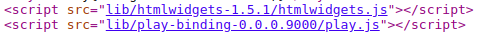

# (PART) Data Visualisation {-}

# HTML widgets {-}

In this chapter we cover the integration of JavaScript with R using the htmlwidgets package, which focuses on libraries that produce a visual output. It is primarily used for data visualisation but is not limited to it.

As in previous chapters we mainly learn by example and build multiple widgets. We first go through some basic principles that must be understood before we actually start writing code, we then write a simple widget that allows animating text, then move on to others to progressively include more data and features, finally we build up on the previous chapter to improve how HTML widgets work with shiny.

## How it works~ish {-}

Imagine there is no such package as HTML widgets to help create interactive visualisations from R: how would one attempt to go about it?

An interactive visualisation using JavaScript will require an html document, therefore it would probably have to be created first. Secondly, the visualisation that is yet to be created likely relies on external libraries, these would need to be imported in the document. The document should also include an html element (e.g.: `<div>`) to host said visualisation. Then data would have to be serialised in R and embedded into the document where it should be read by JavaScript code that uses it to create the visualisation. Finally all should be managed to work seamlessly across R markdown, shiny, and other settings.

Thankfully the HTML widgets package is there to handle most of this. Nonetheless, it is important to understand that these operations are undertaken (to so degree) by HTML widgets as it greatly helps use the package.

Must remember when building HTML widgets:

- Import dependencies
- Create an html element to hold visualisation
- Serialise R data to JSON
- Handle JSON data to produce visualisation

## Scaffold

With some understanding, albeit limited, of how HTML widgets work one is ready to "scaffold" a widget and explore how it works. The way one sets up such a package is stunningly simple. Below we create a package named "playground" as this will only be used to tour HTML widgets.

```r
create_package("playground")
```

Then, from the root of the package created, we scaffold widget which we call "play".

```r
htmlwidgets::scaffoldWidget("play")
```

This function puts together the minimalistic structure necessary to implement an HTML widget and opens `play.R`, `play.js` and `play.yaml`, named after our widget, these files form the core an htmlwidgets package. The R file contains core functions of the R API, namely the `play` function which creates the widget itself, and the `render*` and `*output` functions to handle the widget in the shiny server and UI respectively. The `.js` file contains JavaScript functions that actually generate the visual output. 

```r
devtools::document()
devtools::load_all()
```

I might be hard to believe, but at this stage one already has a fully functioning widget ready to use after documenting, and building the package. Indeed, the `play.R` file that that was created contains a function named "play" ẁhich takes, amongst other arguments, a message.  

```r
play(message = "This is a widget!")
```


Notice that the message is displayed in the RStudio "Viewer," which indicates that it is indeed an HTML being displayed, the  button located in the top right of the "Viewer" will open the message in your default browser. This will prove very useful to look under the hood of the widgets for debugging.

## Deconstruct & Retrace

With a plain HTML widget package one can start exploring how it works. Let's start by retracing the path taken by the message written in R to its seemingly magical appearance in the RStudio viewer. The `play` function previously used, takes the `message`, wraps it into a list which is then used in `htmlwidgets::createWidget`. Essentially, the `createWidget`, which actually creates the widget, serialises the list to a JSON object so it can be used in JavaScript.

```r
# forward options using x
x = list(
  message = message
)
```

Wrapping a string in a list might seem unnecessary but one will of course add variables when building a more complex widget, starting with a list makes to add them later on. 

The source code of the widget can be accessed from RStudio by opening the visualisation in your browser using the  button located in the top right of the "Viewer," and in the browser right clicking and selecting "View page source."


The first thing this shows is the element (`div`) created by the htmlwidgets package to hold the message, as well as the JSON object, also created by the htmlwidgets package, which contains, amongst other things, the `x` variable from the `play` function.

```html
<div id="htmlwidget-c21cca0e76e520b46fc7" style="width:960px;height:500px;" class="play html-widget"></div>
```

The `div` created bears a randomly generated `id` which one can define when creating the widget using `elementId` argument.

```r
play("This is another widget", elementId = "myViz")
```

This produces an HTML element with the specified `elementId` as HTML `id`.

```html
<div id="myViz" style="width:960px;height:500px;" class="play html-widget"></div>
```

You will also notice that this affect the `script` tag, the `data-for` attribute of which is should also read "myViz," it tells the script which widget the JSON it contains is to be used for.

<script type="application/json" data-for="myViz">{"x":{"message":"This is a widget!"},"evals":[],"jsHooks":[]}</script>

This use of id may be not obvious at first, but one needs to be able to handle multiple widgets in a single R markdown document or shiny application, distinguishing between which widget relies on which data, which needs resizing, etc. 



This imports the `htmlwidgets.js` library as well as `play.js`, were the visualisation depending on external libraries they would appear alongside those. Peaking inside the `play.js` file located at `inst/htmlwidgets/play.js` reveals the code below.

```js
// play.js
HTMLWidgets.widget({

  name: 'play',

  type: 'output',

  factory: function(el, width, height) {

    // TODO: define shared variables for this instance

    return {

      renderValue: function(x) {

        // TODO: code to render the widget, e.g.
        el.innerText = x.message;

      },

      resize: function(width, height) {

        // TODO: code to re-render the widget with a new size

      }

    };
  }
});
```
