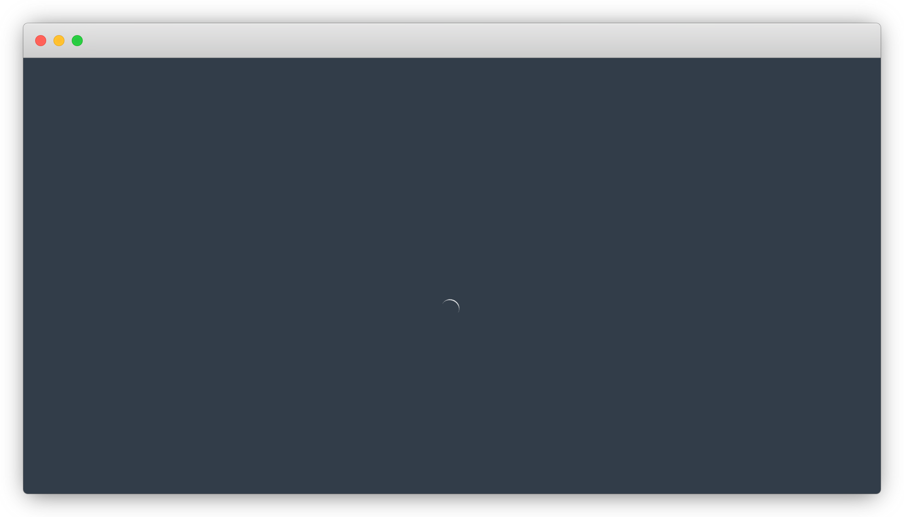

\mainmatter

# (PART) Basics & Roadmap {-}

# Introduction

This book starts with a rationale for integrating JavaScript with R and supports it with examples, namely packages that use JavaScript and are available on CRAN. Then, we list the various ways in which one might go about making both languages work together. In the next chapter, we go over prerequisites and a review of concepts fundamental to fully understand the more advanced topics residing in the forthcoming chapters. 

## Rationale {-}

Why blend two languages seemingly so far removed from each other? Well, precisely because they are fundamentally different languages that each have their strengths and weaknesses, combining the two allows making the most of their consolidated advantages and circumvent their respective limitations to produce software altogether better for it. 

Nevertheless, a fair reason to use JavaScript might simply be that the thing one wants to achieve in R has already been realised in JavaScript. Why reinvent the wheel when the solution already exists and that it can be made accessible from R? The R package [lawn](https://github.com/ropensci/lawn) [@R-lawn] by Ropensci integrates [turf.js](http://turfjs.org/), a brilliant library for geo-spatial analysis. JavaScript is by no means required to make those computations, they could be rewritten solely in R but that would be vastly more laborious than wrapping the JavaScript API in R as done by the package lawn.

```{r, warning=FALSE}
library(lawn)

lawn_count(lawn_data$polygons_count, lawn_data$points_count, "population")
```

Another great reason is that JavaScript can do things that R cannot, e.g.: run in the browser. Therefore one cannot natively create interactive visualisations with R. [Plotly](https://plotly-r.com/) [@R-plotly] by Carson Sievert packages the [plotly JavaScript library](https://plot.ly/) to let one create interactive visualisations solely from R code.

```{r, warning=FALSE, message=FALSE, error=FALSE}
library(plotly)

plot_ly(diamonds, x = ~cut, color = ~clarity)
```

Finally, JavaScript can work together with R to improve how we communicate insights. One of the many ways in which Shiny stands out is that it lets one create web applications solely from R code with no knowledge of HTML, CSS, or JavaScript but that does not mean they can't extend Shiny, quite the contrary. The [waiter package](http://waiter.john-coene.com/) [@R-waiter] integrates a variety of JavaScript libraries to display loading screens in Shiny applications.

```r
library(shiny)
library(waiter)

ui <- fluidPage(
  use_waiter(), # include dependencies
  actionButton("show", "Show loading for 3 seconds")
)

server <- function(input, output, session){
  # create a waiter
  w <- Waiter$new()

  # on button click
  observeEvent(input$show, {
    w$show()
    Sys.sleep(3)
    w$hide()
  })
}

shinyApp(ui, server)
```



Hopefully this makes a couple of great reasons and alluring examples to entice the reader to persevere with this book.

## Methods {-}

Though perhaps not obvious at first, all of the packages used as examples in the first section of this chapter interfaced with R very differently. As we'll discover, there many ways in which one can blend JavaScript with R, generally the way to go about it is dictated by the nature of what is to be achieved.

Let's list the methods available to us to blend JavaScript with R before covering them each in-depth in their own respective chapter later in the book.

### V8 {-}

[V8](https://github.com/jeroen/v8) by Jeroen Ooms is an R interface to Google's JavaScript engine. It will let you run JavaScript code directly from R and get the result back, it even comes with an interactive console. This is the way the lawn package used in a previous example internally interfaces with the turf.js library.

```{r}
library(V8)

ctx <- v8()

ctx$eval("2 + 2") # this is evaluated in JavaScript!
```

### htmlwidgets {-}

[htmlwidgets](http://www.htmlwidgets.org/) [@R-htmlwidgets] specialises in wrapping JavaScript libraries that generate visual outputs. This is what packages such as plotly, [DT](https://rstudio.github.io/DT/) [@R-DT], [highcharter](http://jkunst.com/highcharter/) [@R-highcharter], and many more use to provide interactive visualisation with R.

It is by far the most popular integration out there, at the time of writing this it has been downloaded nearly 10 million times from CRAN. It will therefore be covered extensively in later chapters.

### Shiny {-}

The Shiny framework allows creating applications accessible from web browsers where JavaScript natively runs, it follows that JavaScript can run _alongside_ such applications. Often overlooked though, the two can also work _hand-in-hand_ as one can pass data from the R server to the JavaScript front-end and vice versa. This is how the package waiter mentioned previously internally works with R.

### bubble {-}

[bubble](https://github.com/ColinFay/bubble) [@R-bubble] by Colin Fay is a more recent R package, still under heady development but very promising: it lets one run [node.js](https://nodejs.org/en/) code in R, comes with an interactive node REPL, the ability to install npm packages, and even an R markdown engine. It's similar to V8 in many ways.

```{r}
library(bubble)

n <- NodeSession$new() 

n$eval("2 + 2") # this is evaluated in node.js
```

## Methods Amiss {-}

Note that there are also two other prominent ways one can use JavaScript with R that are not covered in this book. The main reason being that they require great knowledge of specific JavaScript libraries, d3.js and React, and while these are themselves advanced uses of JavaScript, their integration with R via the packages listed below is rather straightforward.

### reactR {-}

[ReactR](https://react-r.github.io/reactR/) [@R-reactR] is an R package that emulates very well htmlwidgets but specifically for the [React framework](https://reactjs.org/). Unlike htmlwidgets it is not limited to visual outputs and also provides functions to build inputs, e.g.: a drop-down menu (like `shiny::selectInput`). The [reactable package](https://glin.github.io/reactable/) [@R-reactable] uses reactR to enable building interactive tables solely from R code.

```{r}
reactable::reactable(iris[1:5, ], showPagination = TRUE)
```

### r2d3 {-}

[r2d3](https://rstudio.github.io/r2d3/) [@R-r2d3] by RStudio is an R package designed specifically to work with [d3.js](https://d3js.org/). It is similar to htmlwidgets but works rather differently.

```{r}
# https://rstudio.github.io/r2d3/articles/gallery/chord/
r2d3::r2d3(
  data = matrix(round(runif(16, 1, 10000)), ncol = 4, nrow = 4), 
  script = "chord.js"
)
```
