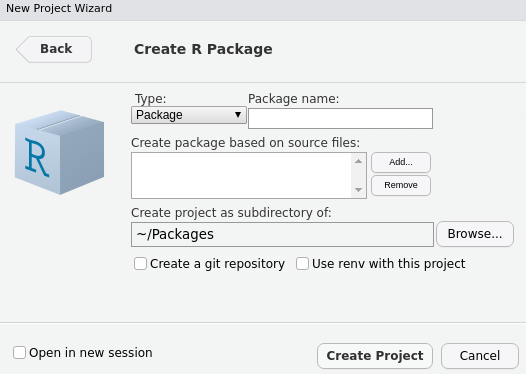
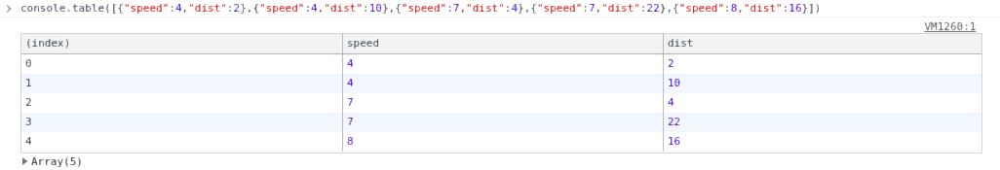
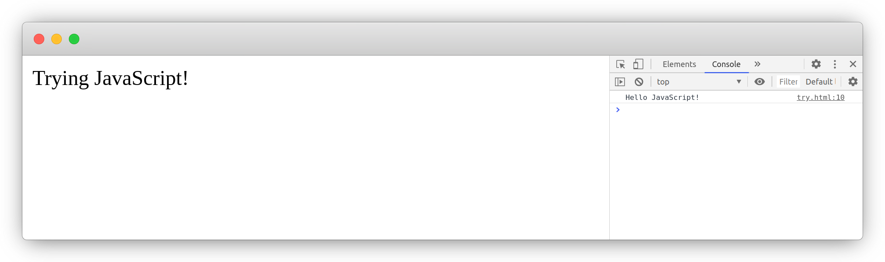

# Prerequisites {#prerequisites}

The code contained in the following pages is approachable to readers with basic knowledge of R. Still, familiarity with package development using [devtools](https://devtools.r-lib.org/) [@R-devtools], the [Shiny](https://shiny.rstudio.com/) framework [@R-shiny], the JSON data format, and JavaScript are essential. 

The reason for the former is that some of the ways one builds integrations with JavaScript naturally take the form of R packages. Also, R packages make sharing code, datasets, and anything else R-related extremely convenient, they come with a relatively strict structure, the ability to run unit tests, and much more. These have thus become a core feature of the R ecosystem and therefore, are used extensively in the book as we create several packages. The following section thus runs over the essentials of building a package to ensure everyone can keep up. 

Then we briefly go through the JSON data format as it will be used to a great extent to communicate between R and JavaScript. Since both Shiny and JavaScript run in the browser they make for axiomatic companions; we'll therefore use Shiny extensively. Finally, there is an obligatory short introduction to JavaScript.

It is highly recommended to use the freely available [RStudio IDE](https://rstudio.com/products/rstudio/) to follow along as it makes a lot of things easier down the line.

## R Package Development {#basics-pacakge-dev}

Developing packages used to be notoriously tricky but things have considerably changed in recent years, namely thanks to the devtools [@R-devtools], roxygen2 [@R-roxygen2] and more recent [usethis](https://usethis.r-lib.org/) [@R-usethis] packages. Devtools is short for "developer tools," it is specifically designed to help creating packages; setting up tests, running checks, building and installing packages, etc. The second provides an all too convenient way to generate the documentation of packages, and usethis, more broadly helps setting up projects, and automating repetitive tasks. Here, we only skim over the fundamentals, there is an entire book by Hadley Wickham called [R Packages](http://r-pkgs.had.co.nz/) solely dedicated to the topic.

Start by installing those packages from CRAN, the roxygen2 package does not need to be explicitly installed as it is a dependency of devtools.

```r
install.packages(c("devtools", "usethis"))
```

### Creating a Package {#basics-create-pkg}

There are multiple ways to create a package. One could manually create every file, use the RStudio IDE, or create it from the R console with the usethis [@R-usethis] package.

From the RStudio IDE go to `File > New Project > New Directory > R Package` then select "R package" and fill in the small form, namely name the package and specify the directory where it should be created. 

```{r rstudio-create-package, echo=FALSE, fig.cap='Package creation wizard'}

```

But it could be argued that it's actually more accessible from the R console with the usethis package. The `create_package` function takes as first argument the path to create the package. If you run it from RStudio a new project window should open.

```r
# creates a package named "test" in root of directory.
usethis::create_package("test")
```

```
✔ Creating 'test/'
✔ Setting active project to '/Packages/test'
✔ Creating 'R/'
✔ Writing 'DESCRIPTION'
Package: test
Title: What the Package Does (One Line, Title Case)
Version: 0.0.0.9000
Authors@R (parsed):
    * First Last <first.last@example.com> [aut, cre] (YOUR-ORCID-ID)
Description: What the package does (one paragraph).
License: `use_mit_license()`, `use_gpl3_license()` or friends to
    pick a license
Encoding: UTF-8
LazyData: true
Roxygen: list(markdown = TRUE)
RoxygenNote: 7.1.1.9000
✔ Writing 'NAMESPACE'
✔ Changing working directory to 'test/'
✔ Setting active project to '<no active project>'
```

### Metadata {#basics-metadata}

Every R package includes a `DESCRIPTION` file which includes metadata about the package. This includes a range of things like the license defining who can use the package, the name of the package, its dependencies, and more. Below is the default created by the usethis package with `usethis::create_package("test")`.

```
Package: test
Title: What the Package Does (One Line, Title Case)
Version: 0.0.0.9000
Authors@R: 
    person(given = "First",
           family = "Last",
           role = c("aut", "cre"),
           email = "first.last@example.com",
           comment = c(ORCID = "YOUR-ORCID-ID"))
Description: What the package does (one paragraph).
License: `use_mit_license()`, `use_gpl3_license()` or friends to
    pick a license
Encoding: UTF-8
LazyData: true
Roxygen: list(markdown = TRUE)
RoxygenNote: 7.1.1.9000
```

Much of this is outside the scope of the book. However, it is good to grasp how dependencies are specified. As packages are generally intended for sharing with others, it is vital to ensure users of the package meet the dependencies; otherwise, the package may not work in places. For instance, were we to create a package that relies on one or more functions from the stringr [@R-stringr] package we would need to ensure people who install the package have it installed on their machine or those functions will not work.

```r
# R/string.R
string_length <- function(string) {
  stringr::str_length(string)
}
```

```{block, type='rmdnote'}
Note that the function is preceded by its namespace with `::` (more on this later).
```

The `DESCRIPTION` file does this, it will make sure that the dependencies of the package are met by users who install it. We can specify such dependencies under `Imports` where we can list packages required separated by a comma.

```
Imports:
  stringr,
  dplyr
```

Then again, the usethis package also allows doing so consistently from the R console, which is great to avoid mishandling the `DESCRIPTION` file.

```r
# add stringr under Imports
usethis::use_package('stringr')
```

One can also specify another type of dependencies under `Suggests`, other packages that enhance the package but are not required to run it. These, unlike package under `Imports`, are not automatically installed if missing, which can greatly reduce overhead.

### R code {#basics-r-code}

An R package must follow a strict structure. R code must be placed in an `R/` directory so one should only find `.R` files in that directory. These files generally contain functions, methods, and R objects.

```r
# R/add.R
string_length <- function(strings) {
  stringr::str_length(strings)
}
```

### Documentation {#basics-documentation}

Documenting packages used to be notoriously complicated but thanks to the package roxygen2 it is no longer the case. The documentation of functions of the package (accessible with `?`) and datasets that comprise the package reside in separate files sitting in the `man/` directory. These are `.Rd` files that use a custom syntax resembling LaTex. The roxygen package eases the creation of these files by turning special comments and tags in `.R` files into said `.Rd` files. 

Special comments are a standard R comment `#` followed by an apostrophe `'`. The first sentence of the documentation is the title of the documentation file while the second is the description.

```r
#' Strings Length
#' 
#' Returns the number of characters in strings. 
string_length <- function(strings) {
  stringr::str_length(strings)
}
```

There are a plethora of roxygen2 tags to further document different sections, below we use two different tags to document the parameters and give an example. 

```r
#' Strings Length
#' 
#' Returns the number of characters in strings. 
#' 
#' @param strings A vector of character strings.
#' 
#' @example string_length(c("hello", "world"))
string_length <- function(strings) {
  stringr::str_length(strings)
}
```

As well as generating documentation, the roxygen2 package also allows populating the `NAMESPACE` file. This is an extensive and often confusing topic, but for this book, we'll content with the following: the `NAMESPACE` includes functions that are _imported_ and _exported_ by the package.

By default functions that are present in the R files in the `R/` directory are not exported: they are not accessible outside the package. Therefore the `string_length` function defined previously will not be made available to users of the package, only other function within the package will be able to call it. To export it we can use the `@export` tag. This will place the function as exported in the `NAMESPACE` file.

```r
#' Strings Length
#' 
#' Returns the number of characters in strings. 
#' 
#' @param strings A vector of character strings.
#' 
#' @example string_length(c("hello", "world"))
#' 
#' @export
string_length <- function(strings) {
  stringr::str_length(strings)
}
```

There are two ways to use external functions (functions from other R packages), as done thus far in the `string_length` function by using the namespace (package name) to call the function: `stringr::str_length`. Or by importing the function needed using a roxygen2 tag thereby removing the need for using the namespace. 

```r
#' Strings Length
#' 
#' Returns the number of characters in strings. 
#' 
#' @param strings A vector of character strings.
#' 
#' @example string_length(c("hello", "world"))
#' 
#' @importFrom stringr str_length
#' 
#' @export
string_length <- function(strings) {
  str_length(strings) # namespace removed
}
```

Above we import the function `str_length` from the `stringr` package using the `importFrom` roxygen2 tag. The first term following the tag is the name of the package wherefrom to import the functions, and the following terms are the name of the functions separated by spaces so one can import multiple functions from the same package with, e.g.: `@importFrom stringr str_length str_to_upper`. If the package uses very many functions from a single package one might also consider importing said package in its entirety with, e.g.: `@import stringr`.

Finally, one can actually generate the `.Rd` documentation files and populate the `NAMESPACE` with either the `devtools::document()` function or `roxygen2::roxygenise()`.

```{block, type='rmdnote'}
Remember to run `devtools::document()` after changing roxygen2 tags otherwise changes are not actually reflected in the `NAMESPACE` and documentation.
```

### Installed files {#basics-installed-files}

Here we tackle the topic of installed files as it will be relevant to much of what the book covers. Installed files are files that are downloaded and copied as-is when users install the package. This directory will therefore come in very handy to store JavaScript files that package will require. These files can be accessed with the `system.file` function which will look for a file from the root of the `inst/` directory.

```r
# return path to `inst/dependency.js` in `myPackage`
path <- system.file("dependency.js", package = "myPackage")
```

### Build, load, and install {#basics-build-load-install}

Finally, after generating the documentation of the package with `devtools::document()` one can install it locally with `devtools::install()`. This, however, can take a few seconds too many whilst developing a package as one iterates and regularly tries things; `devtools::load_all()` will not install the package but load all the functions and object in the global environment to let you run them.

There is some cyclical nature to developing packages:

1. Write some code
2. Run `devtools::document()` (if documentation tags have changed)
3. Run `devtools::load_all()`
4. Repeat

Note whilst this short guide will help you develop packages good enough for your system it will certainly not pass CRAN checks.

## JSON {#basics-json}

JSON (JavaScript Object Notation) is a prevalent data _interchange_ format with which we will work extensively throughout this book; it is thus crucial that we have a good understanding of it before we plunge into the nitty-gritty. As one might foresee, if we want two languages to work together, we must have a data format that can be understood by both---JSON lets us harmoniously pass data from one to the other. While it is natively supported in JavaScript, it can be graciously handled in R with the [jsonlite package](https://CRAN.R-project.org/package=jsonlite) [@R-jsonlite] it is the serialiser used internally by all the packages we shall explore in this book.

```{block, type='rmdnote'}
"To serialise" is just jargon for converting data to JSON.
```

### Serialising {#serialising}

JSON is to all intents and purposes the equivalent of lists in R; a flexible data format that can store pretty much anything--expect data.frames a structure that does not exist in JavaScript. Below we create a nested list and convert it to JSON with the help of jsonlite. We set `pretty` to `TRUE` to add indentation for cleaner printing, but this is an argument you should omit when writing production code, it will reduce the file size (fewer spaces = smaller file size). 

```{r}
# install.packages("jsonlite")
library(jsonlite)

lst <- list(
  a = 1,
  b = list(
    c = c("A", "B")
  ),
  d = 1:5
)

toJSON(lst, pretty = TRUE)
```

Looking closely at the list and JSON output above, one quickly sees the resemblance. Something seems odd though, the first value in the list (`a = 1`) was serialised to an array (vector) of length one (`"a": [1]`) where one would probably expect an integer instead, `1` not `[1]`. This is not a mistake; we often forget that there are no scalar types in R and that `a` is, in fact, a vector as we can observe below.

```{r}
x <- 1
length(x)
is.vector(x)
```

JavaScript, on the other hand, does have scalar types, more often than not we will want to convert the vectors of length one to scalar types rather than arrays of length one. To do so we need to use the `auto_unbox` argument in `jsonlite::toJSON`, we'll do this most of the time we have to convert data to JSON.

```{r}
toJSON(lst, pretty = TRUE, auto_unbox = TRUE)
```

As demonstrated above the vector of length one was "unboxed" into an integer, with `auto_unbox` set to `TRUE` jsonlite will properly convert such vectors into their appropriate type; integer, numeric, boolean, etc. Note that this only applies to vectors, lists of length one will be serialised to arrays of length one even with `auto_unbox` turned on: `list("hello")` will always be converted to `["hello"]`.

### Tabular Data {#basics-tabular}

If JSON is more or less the equivalent of lists in R one might wonder how jsonlite handles dataframes since they do not exist in JavaScript.

```{r}
# subset of built-in dataset
df <- cars[1:2, ]

toJSON(df, pretty = TRUE)
```

What jsonlite does internally is essentially turning the data.frame into a list _rowwise_ to produce a sub-list for every row then it serialises to JSON. This is generally how rectangular data is represented in lists, for instance, `purrr::transpose` does the same. Another great example is to use `console.table` in the JavaScript console (more on that later) to display the table JSON as a table.

```{r console-table, echo=FALSE, fig.cap='console.table output'}

```

We can reproduce this with the snippet below, we remove row names and use apply to turn every row into a list.

```{r}
row.names(df) <- NULL
df_list <- apply(df, 1, as.list)

toJSON(df_list, pretty = TRUE, auto_unbox = TRUE)
```

Jsonlite of course also enables reading data from JSON into R with the function `fromJSON`.

```{r}
json <- toJSON(df) # convert to JSON
fromJSON(json) # read from JSON
```

It's important to note that jsonlite did the conversion back to a data frame. Therefore the code below also returns a data frame even though the object we initially converted to JSON is a list.

```{r}
class(df_list)
json <- toJSON(df_list)
fromJSON(json)
```

Jsonlite provides many more options and functions that will let you tune how JSON data is read and written. Also, the jsonlite package does far more than what we detailed in this section. But at this juncture, this is an adequate understanding of things.

## JavaScript {#basics-javascript}

The book is not meant to teach one JavaScript, only to show how graciously it can work with R. Let us thus go through the very basics to ensure we know enough to get started with the coming chapters.

The easiest way to run JavaScript interactively is probably to create an HTML file (e.g.: `try.html`), write your code within a `<script>` tags and open the file in your web browser. The console output can be observed in the console of the browser, developer tools (more on that below).

```html
<!–– index.html ––>
<html>
  <head>
  </head>
  <body>
    <p id="content">Trying JavaScript!</p>
  </body>
  <script>
    // place your JavaScript code here
    console.log('Hello JavaScript!')
  </script>
</html>
```

```{r trying-js, echo=FALSE, fig.cap='Trying JavaScript'}

```

### Developer Tools {#basics-chrome-devtools}

Most of the JavaScript code written in this book is intended to be run in web browsers; it is thus vital that you have a great understanding of your web browser and its developer tools (devtools). In this section, we discuss those available in Google Chrome and Chromium but such tools, albeit somewhat different, also exist in Mozilla Firefox and Safari.

```{block, type='rmdnote'}
The RStudio IDE is built on Chromium, some of these tools will therefore also work in RStudio.
```

The easiest way to access the developer tools from the browser is by "inspecting:" right-click on an element on a webpage and select "inspect". This will open the developer tools either at the bottom or on the right of the page.

```{r chrome-devtools, echo=FALSE, fig.cap='Google Chrome Devtools'}
knitr::include_graphics("images/devtools.png")
```

The developer tools pane consists of several tabs but we will mainly use:

1. Elements: Presents the DOM Tree, the HTML document structure, great for inspecting the structure of the outputs generated from R.
2. Console: The JavaScript console where messages, errors, and other such things are logged. Essential for debugging.

### Variable Declaration and Scope {#basics-var-scope}

One significant way JavaScript differs from R is that variables must be declared using one of three keywords, `var`, `let`, or `const` which mainly affect the scope where the declared variable will be accessible.

```js
x = 1; // error
var x = 1; // works
```

One can declare a variable without assigning a value to it, to then do so later on. 

```js
var y; // declare 
y = [1,2,3]; // define it as array
y = 'string'; // change to character string
```

The `let` and `const` keywords were added in ES2015; the `const` is used to define a constant: a variable that once declared cannot be changed.

```js
const x = 1; // declare constant
x = 2; // error
```

Though this is probably only rarely done in R, one can produce something similar by locking the binding for a variable in its environment.

```{r, error=TRUE}
x <- 1 # declare x
lockBinding("x", env = .GlobalEnv) # make constant
x <- 2 # error
unlockBinding("x", env = .GlobalEnv) # unlock binding
x <- 2 # works
```

Notably, `const` is mainly protecting yourself (the developer) against yourself, if something important is defined and should not change later in the code use `const` to avoid accidentally reassigning something to it later in the project.

The `let` keyword is akin to declaring a variable with the `var` keyword, however, `let` (and `const`) will declare the variable in the "block scope." This in effect further narrows down the scope where the variable will be accessible, a block scope is generally the area within `if`, `switch` conditions or `for` and `while` loops: areas within curly brackets.

```js
if(true){
  let x = 1;
  var y = 1;
}

console.log(x) // error x does not exist
console.log(y) // works
```

In the above example, `x` is only accessible within the if statement as it is declared with `let`, `var` does not have block scope. 

While on the subject of scope, in R like in JavaScript, variables can be accessed from the parent environment (often referred to as "context" in the latter). One immense difference though is that while it is seen as bad practice in R, it is not in JavaScript where it is beneficial.

```{r}
# it works but don't do this in R
x <- 123
foo <- function(){
  print(x)
}
foo()
```

The above R code can be re-written in JavaScript. Note the slight variation in the function declaration.

```js
// this is perfectly fine
var x = 1;

function foo(){
  console.log(x); // print to console
}

foo();
```

```{block, type='rmdnote'}
Accessing variables from the parent environment (context) is useful in JavaScript but should not be done in R
```

### Document Object Model {#basics-object-model}

One concept which does not exist in R is that of the "DOM" which stands for Document Object Model; this is also often referred to as the DOM tree as it very much follows a tree-like structure.

```{r, echo=FALSE}
DiagrammeR::grViz("
graph {
  graph [rankdir = TD]

  node [shape=box]
  'document'
  '<html>'
  '<head>'
  '<body>'
  '<title>'
  '<h1>'
  '<div>'
  '<a>'

  'document' -- '<html>'
  '<html>' -- '<head>'
  '<html>' -- '<body>'
  '<head>' -- '<title>'
  '<body>' -- '<h1>'
  '<body>' -- '<div>'
  '<div>' -- '<a>'

}
", width="100%", height=250)
```

When a web page is loaded, the browser creates a Document Object Model of the web page which can be accessed in JavaScript from the `document` object. This lets the developer programmatically manipulate the page itself so one can, for instance, add an element (e.g., a button), change the text of another, and plenty more.

The JavaScript code below grabs the element where `id='content'` from the `document` with `getElementById` and replaces the text (`innerText`). Even though the page only contains "Trying JavaScript!" when the page is opened (loaded) in the web browser JavaScript runs the code and changes it: this happens very fast so the original text cannot be seen.

```html
 <!–– index.html ––>
<html>
  <head>
  </head>
  <body>
    <p id="content">Trying JavaScript!</p>
  </body>
  <script>
    var cnt = document.getElementById("content");
    cnt.innerText = "The text has changed";
  </script>
</html>
```

One final thing to note for future reference, though not limited to the ids or classes most such selection of elements from the DOM are done with those where the pound sign refers to an element's id (`#id`) and a dot relates to an element's class (`.class`), just like in CSS.

```html
 <!–– index.html ––>
<html>
  <head>
  </head>
  <body>
    <p id="content" class="stuff">Trying JavaScript!</p>
  </body>
  <script>
    // select by id
    var x = document.getElementById("content");
    var y = document.querySelector("#content");

    console.log(x == y); // true

    // select by class
    var z = document.querySelector(".stuff");
  </script>
</html>
```

Getting elements from the DOM is a very common operation in JavaScript. A class can be applied to multiple elements which is useful to select and apply actions to multiple elements. The id attribute must be unique (no two elements can bear the same id in the HTML document) is useful to retrieve a specific element. 

Interestingly some of that mechanism is used by shiny to retrieve and manipulate inputs, the argument `inputId` of shiny inputs effectively define the HTML `id` attribute of said input. Shiny can then internally make use of functions the likes of `getElementById` in order to get those inputs, set or update their values, etc.

```r
shiny::actionButton(inputId = "theId", label = "the label") 
```

```html
<button 
  id="theId" 
  type="button" 
  class="btn btn-default action-button">
  the label
</button>
```

This, of course, only scratches the surface of JavaScript; thus, this provides ample understanding of the language to keep up with the next chapters. Also, a somewhat interesting fact that will prove useful later in the book: the RStudio IDE is actually a browser, therefore, in the IDE, one can right-click and "inspect element" to view the rendered source code.

## Shiny {#basics-shiny}

It is assumed that the reader has basic knowledge of the shiny framework and already used it to build applications. However, there are some more obscure functionalities that one may not know, but that becomes essential when introducing JavaScript to applications. Chiefly, how to import external dependencies; JavaScript or otherwise.

There are two ways to import dependencies: using the htmltools [@R-htmltools] package to create a dependency object that shiny can understand or manually serving and importing the files with shiny.

### Serving Static Files {#basics-static-files}

Static files are files that are downloaded by the clients, in this case, web browsers accessing shiny applications, as-is, these generally include images, CSS (`.css`), and JavaScript (`.js`).

If you are familiar with R packages, static files are to shiny applications what the `inst` directory is to an R package; those files are installed as-is. They do not require further processing as opposed to the `src` folder, which contains files that need compiling, for instance.

There are numerous functions to launch a shiny application locally; the two most used probably are `shinyApp` and `runApp`. The RStudio IDE comes with a convenient "Run" button when writing a shiny application, which when clicked in fact uses the function `shiny::runApp` in the background, this function looks for said static files in the `www` directory and makes them available at the same path (`/www`). If you are building your applications outside of RStudio, you should either also use `shiny::runApp` or specify the directory which then allows using `shiny::shinyApp`. Note that this only applies locally, shiny server (community and pro) as well as [shinyapps.io](https://www.shinyapps.io/) use the same defaults as the RStudio IDE and `shiny::runApp`.

To ensure the code in this book can run regardless of the reader's machine or editor, the asset directory is always specified explicitly (when used). This is probably advised to steer clear of the potential headaches as, unlike the default, it'll work regardless of the environment. If you are using golem [@R-golem] to develop your application, then you should not worry about this as it specifies the directory internally.

Below we build a basic shiny application, however, before we define the ui and server we use the `shiny::addResourcePath` function to specify the location of the directory of static files that will be served by the server and thus accessible by the client. This function takes two arguments, first the `prefix`, which is the path (URL) at which the assets will be available, second the path to the directory of static assets.

We thus create the "assets" directory and a JavaScript file called `script.js` within it.

```r
# run from root of app (where app.R is located)
dir.create("assets")
writeLines("console.log('Hello JS!');", con = "assets/script.js")
```

We can now use the `shiny::addResourcePath` to point to this directory. Generally, the same name for the directory of static assets and prefix is used to avoid confusion; below we name them differently for the reader to clearly distinguish which is which.

```r
# app.R
library(shiny)

# serve the files
addResourcePath(
  # will be accessible at /files
  prefix = "files", 
  # path to the assets directory
  directoryPath = "assets"
)

ui <- fluidPage(
  h1("R and JavaScript")
)

server <- function(input, output){}

shinyApp(ui, server)
```

If you then run the application and open it at the `/files/script.js` path (e.g.: `127.0.0.1:3000/files/script.js`) you should see the content of the JavaScript file (`console.log('Hello JS!')`), commenting the `addResourcePath` line will have a "Not Found" error displayed on the page instead.

```{block, type='rmdnote'}
All files in your asset directory will be served online and accessible to anyone: do not place sensitive files in it.
```

Though one may create multiple such directories and correspondingly use `addResourcePath` to specify multiple paths and prefixes, one will routinely specify a single one, named "assets" or "static," which contains multiple subdirectories, one for each type of static file to obtain a directory that looks something like the tree below. This is, however, an unwritten convention which is by no means forced upon the developer: do as you wish.

```
assets/
├── js/
│    └── script.js
├── css/
│    └── style.css
└── img/
     └── pic.png
```

At this stage, we have made the JavaScript file we created accessible by the clients, but we still have to source this file in the `ui` as currently this file is, though served, not used by the application. Were one creating a static HTML page one would use the `script` to `src` the file in the `head` of the page.

```html
<html>
  <head>
    <!–– source the JavaScript file ––>
    <script src="path/to/script.js"></script>
  </head>
  <body>
    <p id="content">Trying JavaScript!</p>
  </body>
</html>
```

In shiny we write the UI in R and not in HTML (though this is also supported). Given the resemblance between the names of HTML tags and shiny UI functions, it is pretty straightforward, the html page above would look something like the shiny `ui` below. 

```r
library(shiny)

ui <- fluidPage(
  singleton(
    tags$head(
      tags$script(src = "path/to/script.js")
    )
  ),
  p(id = "content", "Trying JavaScript!")
)
```

The dependency is used in the `htmltools::singleton` function ensures that its content is _only imported in the document once._ 

Note that we use the `tags` object which comes from the shiny package and includes HTML tags that are not exported as standalone functions. For instance, you can create a `<div>` in shiny with the `div` function, but `tags$div` will also work. This can now be applied to the shiny application; the `path/to/script.js` should be changed to `files/script.js` where `files` is the prefix we defined in `addResourcePath`.

```r
# app.R
library(shiny)

# serve the files
addResourcePath(prefix = "files", directoryPath = "assets")

ui <- fluidPage(
  tags$head(
    tags$script(src = "files/script.js")
  ),
  h1("R and JavaScript")
)

server <- function(input, output){}

shinyApp(ui, server)
```

From the browser, inspecting page (right click > inspect > console tab) one should see `Hello JS!` in the console which means the application correctly ran the code in the JavaScript file.

### Htmltools {#basics-htmltools}

The htmltools package powers much of the shiny UI, most of the tags that comprise the UI are indeed imported by shiny from htmltools. For instance `shiny::actionButton` is just a light wrapper around htmltools `tags`.

```r
shiny::actionButton
```

```r
function (inputId, label, icon = NULL, width = NULL, ...) 
{
    value <- restoreInput(id = inputId, default = NULL)
    tags$button(
      id = inputId, style = if (!is.null(width)) 
      paste0("width: ", validateCssUnit(width), ";"),
      type = "button", class = "btn btn-default action-button", 
      `data-val` = value, list(validateIcon(icon), label), 
      ...
    )
}
```

As the name indicates, htmltools goes beyond the generation of HTML tags and provides broader tools to work with HTML from R; this includes working the dependencies. These may appear simple at first after all were one working with an HTML document in order to import HTML or CSS one could use HTML tags.

```html
 <!–– index.html ––>
<html>
  <head>
    <script src="path/to/script.js"></script>
    <link rel="stylesheet" href="path/to/styles.css">
  </head>
  <body></body>
</html>
```

However, it can quickly get out of hand when working with modules and packages. Imagine having to manage the generation of dependencies such as the above when multiple functions rely on a dependency but being a dependency; it should only be imported once? The unified framework htmltools helps immensely in dealing with these sorts of issues.

The htmltools package provides utilities to import dependencies and ensure these are only rendered once, as they should be. The way this works is by creating a dependency object that packages like Shiny and R markdown can understand and translate into HTML dependencies. This is handled with the `htmlDependency` function, which returns an object of class `html_dependency`.

```r
dependency <- htmltools::htmlDependency(
  name = "myDependency",
  version = "1.0.0",
  src = c(file = "path/to/directory"),
  script = "script.js",
  stylesheet = "styles.css"
)
```

About the above, the `src` argument points to the directory that contains the dependencies (`script` and `stylesheet`), this is done with a named vector where `file` indicates the path is a local directory and `href` indicates it is a remote server, generally a CDN. Note that one can also pass multiple `script` and `stylesheet` by using vectors, e.g.: `c("script.js", "anotherScript.js")`

```{block, type='rmdnote'}
CDN stands for Content Delivery Network, a geographically distributed group of servers that provide fast transfer of dependencies.
```

```r
# dependency to the latest jQuery
dependency <- htmltools::htmlDependency(
  name = "myDependency",
  version = "1.0.0",
  src = c(
    href = "https://cdn.jsdelivr.net/gh/jquery/jquery/dist/"
  ),
  script = "jquery.min.js"
)
```

Shiny, R markdown, and other packages where htmltools is relevant will then be able to translate an `html_dependency` object into actual HTML dependencies. The above would, for instance, generate the following HTML.

```html
<script src="https://cdn.jsdelivr.net/gh/jquery/jquery/dist/jquery.min.js"></script>
```

Notably, the `htmltools::htmlDependency` also takes a `package` argument which makes it such that the `src` path becomes relative to the package directory (the `inst` folder). Hence the snippet below imports a file located at `myPackage/inst/assets/script.js`; the ultimate full path will, of course, depend on where the package is installed on the users' machine.

```r
dependency <- htmltools::htmlDependency(
  name = "myDependency",
  version = "1.0.0",
  src = "assets",
  script = c(file = "script.js"),
  package = "myPackage" # user package
)
```

However, how does one use it in R markdown or shiny? Well merely placing it in the Shiny UI or an evaluated R markdown chunk will the job.

```r
# place it in the shiny UI
ui <- fluidPage(
  htmltools::htmlDependency(
    name = "myDependency",
    version = "1.0.0",
    src = "assets",
    script = c(file = "script.js"),
    package = "myPackage" # user package
  )
)
```

### Serving vs. htmltools {#basics-deps-pro-cons}

For multiple reasons, the best way to include dependencies is probably the former using htmltools. First, it will work with both shiny and rmarkdown [@R-rmarkdown] (whereas the other method previousl< described only works with shiny) reducing the cognitive load on the developer (you); learn to use this method and you will be able to import dependencies for many different output types. Moreover, it comes with neat features that will be explored later in the book, e.g., dynamic dependencies for interactive visualisations or shiny.

Also, using htmltools dependencies will allow other package developers to assess and access the dependencies you build quickly. The function `findDependencies` will accept another function from which it can extract the dependencies. The object it returns can then be used elsewhere making dependencies portable. Below we use this function to extract the dependencies of the `fluidPage` function from the shiny package.

```{r}
htmltools::findDependencies(
  shiny::fluidPage()
) 
```

Extracting dependencies from other packages will become useful later in the book as we try to assess and whether package we build can work together with other packages: making sure dependencies do not clash or importing dependencies from other packages.

Using `shiny::addResourcePath` has one advantage, its use is not limited to making CSS and JavaScript files available in Shiny, it can be used to serve other file types such as JSON or images that may also be needed in the application.

