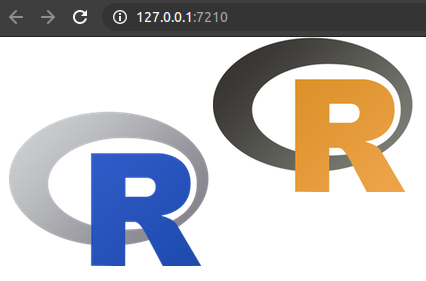

# Custom Outputs

In this chapter we create a custom shiny output, in practical terms, custom `render*` and `*Output` functions to use in Shiny. Note that this is destined for the curious who want to grasp some understanding of how these functions work under the hood as it is __often easier to create an htmlwidgets package__
We will demonstrate by creating a wrapper for [lena.js](https://github.com/davidsonfellipe/lena.js), a JavaScript library to apply filters to images. Note that this is just for the purpose of demonstrating how to create custom outputs, there are much easier ways to apply such filters ina shiny application (e.g.: CSS). 

## Inner-workings {-}

At the core, this consists in creating a `lena`, `renderLena` and `lenaOutput` functions (analogous to `plot`, `renderPlot`, `plotOutput`) which are linked by an "output binding" in JavaScript. The latter function essentially creates an HTML element (e.g.: `<div>`) with its dependencies attached, the former `render*` rather straightforward, unlike previous examples, the data does not need to be explicitly sent to the front-end using `session$sendCustomMessage` as this is handled by shiny itself under the hood.

Previous work with shiny and JavaScript covered in this book had no dedicated "output" element that were placed in the shiny UI, therefore one had to use a function solely dedicated to importing the dependencies (e.g.: `usejBox`). However, since this is not the case here the dependencies can be attached together with the output.

Finally, the two R functions are "bound" JavaScript-side with an "output binding" that renders the data from the `render*` function with its `*output`.

## Discover Lena.js

Let us take a look at an example of lena.js. The library reads the original image and outputs the filtered image in a `<canvas>`. There are many filters to chose from.

```html
<!DOCTYPE html>
<html xmlns="http://www.w3.org/1999/xhtml" lang="" xml:lang="">

<head>
  <!-- Import library -->
  <script src="lena.js"></script>
</head>

<body>
  <!-- Image to apply filter -->
  

  <!-- div to hold visualisation -->
  <canvas id="lena"></canvas>

  <!-- Script to create visualisation -->
  <script>
    // Get the image
    var originalImage = document.getElementById("original-image");

    // The canvas where the processed image will be rendered (With filter)
    var filteredImageCanvas = document.getElementById("lena");

    // Filter to apply, in this case the red filter
    var filter = LenaJS["red"];

    // Apply the filter
    LenaJS.filterImage(filteredImageCanvas, filter, originalImage);
  </script>
</body>

</html>
```


Therefore, there should be a `lenaOutput` function that creates the `<canvas>`, a `renderLena` function that sends the output of `lena` which itself accepts the id of the image to filter as well as the filter to apply. Finally, there will be a "output binding" which will include the JavaScript code included in the `<script>` tags above.

## Setup {-}

Start by creating a package called "lena."

```r
usethis::create_package("lena")
```

Then, from the root of the package, create the `inst` directory and `assets` subdirectory then download and place the `lena.js` dependency within it.

```r
dir.create("inst/assets", recursive = TRUE)

url <- paste0(
  "https://raw.githubusercontent.com/davidsonfellipe/",
  "lena.js/master/dist/lena.min.js"
)
download.file(url, "inst/assets/lena.min.js")
```

We also need to create a JavaScript file that will include the custom JavaScript code that will eventually generate the custom output.

```r
file.create("inst/assets/custom.js")
```

At this point one should have a package directory looking like the tree below.

```
.
├── DESCRIPTION
├── NAMESPACE
├── R
├── inst
│   └── assets
│       ├── custom.js
│       └── lena.min.js
└── man
```

## Output {-}

We can then create the `lenaOutput` function. This function should return an HTML tag which bears an `id`, or a `data-input-id` attribute (more on that later) and a `class`. The first is to be used by the user of the function in Shiny just like any other such outputs. For instance, `plotOutput` creates a `<div>` the `id` of which is actually the `id` used in the `plotOutput` function.

```r
# the id is used as id to the element
shiny::plotOutput(id = "myPlotId")
```

```{r, echo=FALSE}
cat(as.character(shiny::plotOutput("myPlotId")))
```

The `class` is used JavaScript-side to "find" the outputs in the DOM (document object model) and generate the output. The function `lenaOutput` could thus be as shown below, the `id` is passed along to the `<canvas>` which is created with a `lena` class that will be used in the output binding to find that element and generate the output within that very canvas.

```r
#' @export
lenaOutput <- function(id){
  tags$canvas(id = id, class = "lena")
}
```

The dependencies should be added to the above, since this function must be placed in the UI for anything to work we can have the dependencies piggyback on the output element. This works using the htmltools package. The function `htmltools::htmlDependency` is used to create a dependency that is then attached with `htmltools::attachDependencies`. While the former creates an object that shiny can understand and translate into `<script>` or `<style>` tags, the former attaches them to the output object and ensures dependencies are not imported multiple times (e.g.: when `lenaOutput` is used more than once).

```r
#' @export
lenaOutput <- function(id){
  el <- shiny::tags$canvas(id = id, class = "lena")

  path <- system.file("assets", package = "lena")

  deps <- list(
    htmltools::htmlDependency(
      name = "lena",
      version = "0.2.0",
      src = c(file = path),
      script = c("lena.min.js", "custom.js")
    )
  )

  htmltools::attachDependencies(el, deps)

}
```

## Render {-}

Onto coding the server-side functions, we first define a function called "lena" which takes two arguments and return them as a list (which will eventually be used in JavaScript). First, the id of the image to apply the filter to and second the name of the filter to apply. Again, were we not creating a custom output we could use `session$sendCustomMessage` to send that list of options JavaScript directly. Here we do not as it will be indirectly handled by the `render` function we are creating next. 

```r
#' @export
lena <- function(img_id, filter = "red"){
  list(img_id = img_id, filter = filter)
}
```

The function `renderLena` should accept an expression, like other such `render*` function. For instance in the example below the `renderPlot` function does accept an expression which uses, amongst other functions, `plot`.

```r
output$myPlot <- renderPlot({
  # this is an expression
  cars %>% 
    head() %>% 
    plot()
})
```

The function `renderLena` takes an expression and other arguments that are passed to `shiny::exprToFunction` this does pretty much what it says on the tin: it returns a function from an expression (unless that expression is a function, in which case it returns the expression). This function must be further wrapped in another as the render function must itself return a function.

```r
#' @export
renderLena <- function(expr, env = parent.frame(), quoted = FALSE) {
  # Convert the expression + environment into a function
  func <- shiny::exprToFunction(expr, env, quoted)

  function(){
    func()
  }
}
```

This covers all R-related code, what's yet missing is the JavaScript binding.

## JavaScript Binding {-}

Here we create an "output binding," it tells Shiny how to find the component and how to interact with it. An output binding is initialised from `Shiny.OutputBinding`. Below we initialise a new binding.

```js
// custom.js
var lenaBinding = new Shiny.OutputBinding();
```

Then, this must be "extended" by specifying a number of methods, a very necessary one being `find`. The first is used to look for the output HTML element in the document (`scope`), and return them as an array (`HTMLcollection`). Other methods all take an el argument; that value will always be an element that was returned from `find`. A very straightforward way to accomplish this is to use jQuery’s find method to identify elements with the `lena` class used in `lenaOutput`. You are by no means forced to use a CSS class to identify the elements but there is no reason not to.

```js
// custom.js
var lenaBinding = new Shiny.OutputBinding();

$.extend(lenaBinding, {
  find: function(scope) {
    return $(scope).find(".lena");
  }
});
```

One might then want to use the `getId`, a method to return the `id` of the element, by default, as can be seen in the [source code](https://github.com/rstudio/shiny/blob/master/srcjs/output_binding.js) (below), shiny looks for the id as the `data-input-id` attribute and if that is not found it looks for the element's `id`.

```js
// getId default
this.getId = function(el) {
  return el['data-input-id'] || el.id;
}
```

Since we use the element id the default will work and this can be skipped entirely. Next, one needs to implement the `renderValue` function which is the very function that generates the output based on data used in `lena` and sent to the front-end with `renderLena`. The `renderValue` accepts two arguments, first `el` the element where the output should be generated, this is effectively the output of `lenaOutput` which the binding found using `find` and `getId`. Second, `data`, this is the output of `lena` sent by `renderLena`.
 
```js
// custom.js
var lenaBinding = new Shiny.OutputBinding();

$.extend(lenaBinding, {
  find: function(scope) {
    return $(scope).find(".lena");
  },
  renderValue: function(el, data) {

    $(document).ready(function(){
      // Get the image
      var originalImage = document.getElementById(data.img_id);
      // The canvas where the processed image will be rendered (With filter)
      var filteredImageCanvas = document.getElementById(el.id);

      // Filter to apply, in this case the red filter
      var filter = LenaJS[data.filter];

      // Apply the filter
      LenaJS.filterImage(filteredImageCanvas, filter, originalImage);
    });
  
  }
});
``` 

Finally, the output binding is registered with shiny. Note that it uses a unique string identifier, the [documentation](https://shiny.rstudio.com/articles/building-outputs.html) states:

> At the moment it is unused but future features may depend on it.

```js
// custom.js
var lenaBinding = new Shiny.OutputBinding();

$.extend(lenaBinding, {
  find: function(scope) {
    return $(scope).find(".lena");
  },
  renderValue: function(el, data) {

    $(document).ready(function(){
      // Get the image
      var originalImage = document.getElementById(data.img_id);
      // The canvas where the processed image will be rendered (With filter)
      var filteredImageCanvas = document.getElementById(el.id);

      // Filter to apply, in this case the red filter
      var filter = LenaJS[data.filter];

      // Apply the filter
      LenaJS.filterImage(filteredImageCanvas, filter, originalImage);
    });
  
  }
});

Shiny.outputBindings.register(lenaBinding, "lenaPackage.lenaBinding");
```

## Test

In order to test the package, an image needs to be downloaded in order to test it otherwise a Cross-Origin Resource Sharing (CORS) error will occur. Below we create a directory for the static files and download the R logo to test lena.

```r
dir.create("www")
download.file("https://www.r-project.org/Rlogo.png", "www/r-logo.png")
```

After running `devtools::document` and `devtools::install` one is ready to test the package.

```r
library(lena)
library(shiny)

# serve static files
shiny::addResourcePath("www", "www")

ui <- fluidPage(
  # original logo
  tags$img(src = "www/r-logo.png", id = "r-logo"),
  # custom output
  lenaOutput("filtered")
)

server <- function(input, output){

  output$filtered <- renderLena({
    lena(img_id = "r-logo", filter = "invert")
  })

}

shinyApp(ui, server)
```



As mentioned at the start of this chapter, this was really intended as a learning experience. There are great limitations to the package created, namely it cannot be used outside of shiny (when it should). As will be demonstrated in the following chapters, using htmlwidgets with lena would be far easier.
