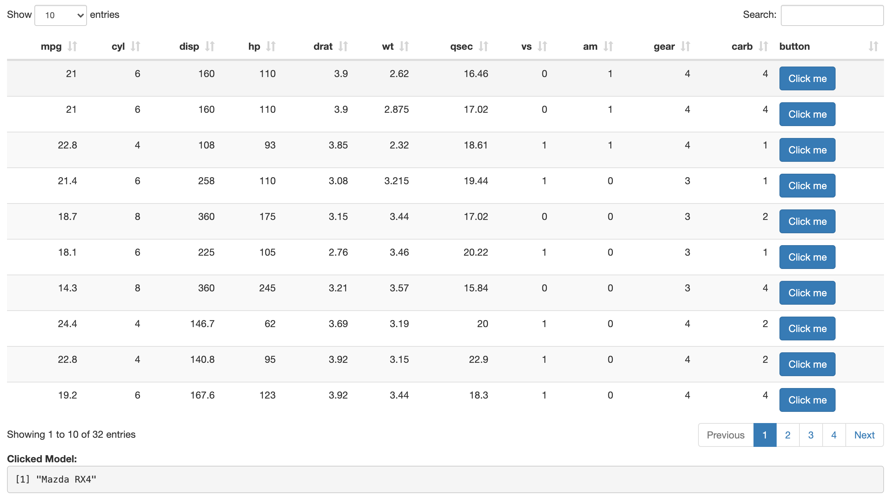

# Tips & Tricks

While previous chapters on working with Shiny made use of external libraries and built packages that brought new functionalities previously not available in shiny, one does not have to go to this length to take advantage of the learnings contained in those pages. 

## Table Buttons {-}

For instance, using what was learned previously one can place buttons inside a shiny table and observe server-side which is clicked. Starting with a basic application that only includes a basic table to which we ultimately want to add a column containing a button on each row. Here we achieve this by having each button set a different value (e.g.: an id) to an input using `shiny.setInputValue` but one could very well create different input names for each button.

```r
library(DT)
library(shiny)

ui <- fluidPage(
  DTOutput("table")
)

server <- function(input, output) {

  output$table <- renderDT({
    datatable(
      mtcars, 
      escape = FALSE, 
      selection = "none", 
      rownames = FALSE, 
      style = "bootstrap"
    )
  })

}

shinyApp(ui, server)
```

Note that in the above we pass some parameters to `datatable` not all are necessary at the exception of `escape` which is set to `FALSE` as we will ultimately place HTML code the table and we need to render rather than show said code as a  string.

We start by creating the on-click functions as R character strings for each row of the `mtcars` dataset. This is the function that will be triggered when buttons are clicked. This should look familiar, we use `Shiny.setInputValue` to define an input named `click` which is set to a different value for every row of the table.

```r
library(DT)
library(shiny)

ui <- fluidPage(
  DTOutput("table")
)

server <- function(input, output) {

  output$table <- renderDT({
    onclick <- paste0("Shiny.setInputValue('click', '", rownames(mtcars), "')")
    datatable(
      mtcars, 
      escape = FALSE, 
      selection = "none", 
      rownames = FALSE, 
      style = "bootstrap"
    )
  })

}

shinyApp(ui, server)
```

Next we create the buttons for each row and set the JavaScript functions previously created as the `onClick` attributes. The JavaScript code passed to the `onClick` attribute will be executed every time the button is clicked. 

```r
library(DT)
library(shiny)

ui <- fluidPage(
  DTOutput("table")
)

server <- function(input, output) {

  output$table <- renderDT({
    onclick <- paste0("Shiny.setInputValue('click', '", rownames(mtcars), "')")
    button <- paste0("<a class='btn btn-primary' onClick=\"", onclick, "\">Click me</a>")
    mtcars$button <- button
    datatable(
      mtcars, 
      escape = FALSE, 
      selection = "none", 
      rownames = FALSE, 
      style = "bootstrap"
    )
  })

}

shinyApp(ui, server)
```

We can then observe the `click` input and, to demonstrate, render it's value in the UI.

```r
library(DT)
library(shiny)

ui <- fluidPage(
  br(),
  DTOutput("table"),
  strong("Clicked Model:"),
  verbatimTextOutput("model")
)

server <- function(input, output) {

  output$table <- renderDT({
    onclick <- paste0("Shiny.setInputValue('click', '", rownames(mtcars), "')")
    button <- paste0("<a class='btn btn-primary' onClick=\"", onclick, "\">Click me</a>")
    mtcars$button <- button
    datatable(
      mtcars, 
      escape = FALSE, 
      selection = "none", 
      rownames = FALSE, 
      style = "bootstrap"
    )
  })

  output$model <- renderPrint({
    print(input$click)
  })
}

shinyApp(ui, server)
```


