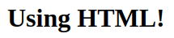
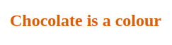

# Your First Widget

The previous chapter gave some indication of how widgets work but this is overall probably still shrouded in mystery. This chapter aims at demystifying what remains confusing. This is done by building a very basic widget with the aim of rummaging through its components to observe how they interact and ultimately grasp a greater understanding of how such interactive outputs are actually produced. 

## The Scaffold {-}

Though one could probably create widgets outside of an R package, it would only make things more complicated, htmlwidgets naturally take the form of R packages and are stunningly simple to create. Below we create a package named "playground" which will be used to mess around and explore.

```r
create_package("playground")
```

Then, from the root of the package created, we scaffold a widget which we call "play".

```r
htmlwidgets::scaffoldWidget("play")
```

This function puts together the minimalistic structure necessary to implement an HTML widget and opens `play.R`, `play.js` and `play.yaml` in the RStudio IDE or the default text editor. These files are named after the widget and will form the core of the package. The R file contains core functions of the R API, namely the `play` function which creates the widget itself, and the `render*` and `*output` functions that handle the widget in the shiny server and UI respectively. The `.js` file contains JavaScript functions that actually generate the visual output. 

```r
devtools::document()
devtools::load_all()
```

It might be hard to believe, but at this stage one already has a fully functioning widget ready to use after documenting, and building the package. Indeed, the `play.R` file that that was created contains a function named "play" ẁhich takes, amongst other arguments, a message.  

```r
play(message = "This is a widget!")
```


This displays the message in the RStudio "Viewer," or the your default browser which indicates that the function does indeed create an HTML output. One can use the the  button located in the top right of the RStudio "Viewer" to open the message in web browser which can prove very useful to look under the hood of the widgets for debugging.

## Deconstruct the Output {-}

With an out-of-the-box HTML widget package one can start exploring the internals to understand how it works. Let's start by retracing the path taken by the message written in R to its seemingly magical appearance in HTML. The `play` function previously used, takes the `message` wraps it into a list which is then used in `htmlwidgets::createWidget`.

```r
# forward options using x
x = list(
  message = message
)
```

Wrapping a string in a list might seem unnecessary but one will eventually add variables when building a more complex widget, starting with a list makes it easier to add them later on. 

To investigate the widget we should look under the hood; the source code of the created (and rendered) output can be accessed in different ways, 1) by right-clicking on the message displayed in the RStudio Viewer and selecting "Inspect element," or 2) by opening the visualisation in your browser using the  button located in the top right of the "Viewer," and in the browser right clicking on the message to select "Inspect." The latter is advised as web browsers such as Chrome or Firefox provide much friendlier interfaces for such functionalities as well as shortcuts to inspect or view the source code of a page.

Below is a part of the `<body>` of the output of `play("This is a widget!")` obtained with the method described in the previous paragraph.

```html
<div id="htmlwidget_container">
  <div id="htmlwidget-c21cca0e76e520b46fc7" style="width:960px;height:500px;" class="play html-widget">This is a widget!</div>
</div>
<script type="application/json" data-for="htmlwidget-c21cca0e76e520b46fc7">{"x":{"message":"This is a widget!"},"evals":[],"jsHooks":[]}</script>
```

One thing the source code of the rendered output reveals is the element (`div`) created by the htmlwidgets package to hold the message (the class name is identical to that of the widget (`play`), as well as, below it, in the `<script>` tag, the JSON object which includes the `x` variable used in the `play` function. The `div` created bears a randomly generated `id` which one can define when creating the widget using the `elementId` argument.

```r
# specify the id
play("This is another widget", elementId = "myViz")
```

```html
<!-- div bears id specified in R -->
<div id="myViz" style="width:960px;height:500px;" class="play html-widget">This is another widget</div>
```

You will also notice that this affects the `script` tag below it, the `data-for` attribute of which is also set to "myViz," this indicates that it is used to tie the JSON data to a `div`, essential for htmlwidgets to manage multiple visualisation in R markdown or Shiny for instance. Then again, this happens in the background without the developer (you) having to worry about it.

```html
<script type="application/json" data-for="myViz">{"x":{"message":"This is a widget!"},"evals":[],"jsHooks":[]}</script>
```

Inspecting the output also shows the dependencies imported, these are placed within the `head` HTML tags at the top of the page. 

```html
<script src="lib/htmlwidgets-1.5.1/htmlwidgets.js"></script>
<script src="lib/play-binding-0.0.0.9000/play.js"></script>
```

This effectively imports the `htmlwidgets.js` library as well as the `play.js` file, and were the visualisation depending on external libraries they would appear alongside those. 

## JavaScript Renderer {-}

Peaking inside the `play.js` file located at `inst/htmlwidgets/play.js` reveals the code below:

```js
// play.js
HTMLWidgets.widget({

  name: 'play',

  type: 'output',

  factory: function(el, width, height) {

    // TODO: define shared variables for this instance

    return {

      renderValue: function(x) {

        // TODO: code to render the widget, e.g.
        el.innerText = x.message;

      },

      resize: function(width, height) {

        // TODO: code to re-render the widget with a new size

      }

    };
  }
});
```

However convoluted this may appear at first do not let that intimate you. The `factory` function returns two functions, `resize`, and `renderValue`. The first is used to dynamically resize the output, it is not relevant to this widget is thus tackled later in this book. Let us focus on `renderValue`, the function that actually renders the output. It takes an object `x` from which is accesses the "message" variable that it uses as text for object `el` (`el.innerText`). The object `x` passed to this function is actually the list of the same name that was build in the R function `play`! While in R one would access the `message` in list `x` with `x$message` in JavaScript to access the `message` in the JSON `x` one writes `x.message`, only changing the dollar sign to a dot. Let's show this perhaps more clearly by printing the content of `x`.

```js
console.log(x);
el.innerText = x.message;
```

We place `console.log` to print the content of `x` in the console, reload the package with `devtools::load_all` and use the function `play` again then explore the console from the browser (inspect and go to the "console" tab).


This displays the JSON object containing the message: it looks eerily similar to the list that was created in R (`x = list(message = "This is a widget!")`). What one should take away from this is that data that needs to be communicated from R to the JavaScript function should be placed in the R list `x`. This list is serialised to JSON and placed in the HTML output in a `script` tag with a `data-for` attribute. This attribute indicates which widget the data is destined for. This effectively enables htmlwidgets to match the serialised data with the output elements: data in `<script data-for='viz'>` is to be used to create a visualisation in `<div id='viz'>`.

Before we move on to other things one should also grasp a better understanding of the `el` object, which can also be logged in the console.

```js
console.log(x);
console.log(el);
el.innerText = x.message;
```


This displays the HTML element created by htmlwidgets that is meant to hold the visualisation, or in this case, the message. If you are familiar with JavaScript, this is the element that would be returned by `document.getElementById`. This object allows manipulating the element in pretty much any way imaginable, change its position, its colour, its size, or, as done here, to insert some text in its place. What's more one can access attributes of the object just like a JSON array. Therefore one can log the `id` of the element.

```js
// print the id of the element
console.log(el.id);
el.innerText = x.message;
```

Making the modifications above and reloading the package, one can create a widget given a specific id and see it displayed in the console, e.g.: `play("hello", elementId = "see-you-in-the-console")`.

In an attempt to become more at ease with this setup let us change something and play with the widget. Out-of-the-box htmlwidgets uses `innerText`, which does very much what it says on the tin, it places text inside an element. JavaScript comes with another function akin to `innerText`, `innerHTML`. While the former only allows inserting text the former lets one insert any HTML.

```js
el.innerHTML = x.message;
```

After changing the `play.js` file as above, and re-loading the package, one can use arbitrary HTML as messages.

```r
play("<h1>Using HTML!</h1>")
```



That makes for a great improvement which opens the door to many possibilities. However, the interface this provides is unintuitive. Albeit similar, R users are more familiar with shiny and htmltools [@R-htmltools] tags than HTML tags, e.g.: `<h1></h1>` translates to `h1()` in R. The package should allow users to use those instead of forcing them to collapse HTML content in a string. Fortunately, there is a very easy way to obtain the HTML from those functions: convert it to a character string.

```{r}
html <- shiny::h1("HTML tag")

class(html)

# returns string
as.character(html)
```

Implementing this in the `play` function will look like this.

```r
# forward options using x
x = list(
  message = as.character(message)
)
```

Reloading the package with `devtools::load_all` lets one use shiny tags as the message.

```r
play(shiny::h2("Chocolate is a colour", style = "color:chocolate;"))
```



This hopefully provides some understanding of how htmlwidgets work internally and thereby helps building such packages. To recapitulate, an HTML document is created in which div is placed and given a certain id, this id is also used in a script tag that contains JSON data passed from R so that a JavaScript function we define can read that data in and use it to generate a visual output in a div. However, as much as this section covered, the topic of JavaScript dependencies was not touched, this is approached in the following section where we build another, more interesting widget, which uses an external dependency.
