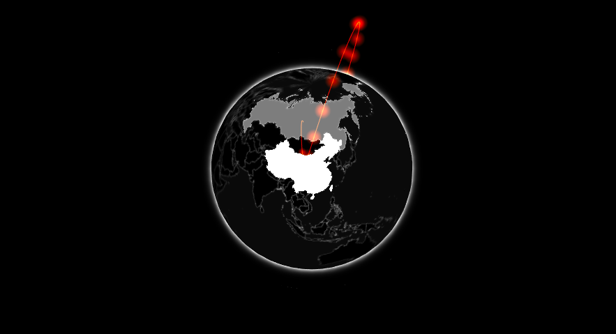

# The Full Monty

With a first widget built one can jump onto another one: [gio.js](https://giojs.org/), a library to draw arcs between countries on a 3 dimensional globe. This will include many more functionalities such packages can comprise.


Then again, the first order of business when looking to integrate a library is to look at the documentation to understand what is should be reproduced in R.

```html
<!DOCTYPE html>
<html xmlns="http://www.w3.org/1999/xhtml" lang="" xml:lang="">

<head>
  <!-- Import libraries -->
  <script src="three.min.js"></script>
  <script src="gio.min.js"></script>
</head>

<body>
  <!-- div to hold visualisation -->
  <div id="globe" style="width: 200px; height: 200px"></div>

  <!-- Script to create visualsiation -->
  <script>
    var container = document.getElementById("globe");
    var controller = new GIO.Controller(container);
    controller.addData(data);
    controller.init();
  </script>
</body>

</html>
```

Gio.js has itself a dependency, [three.js](https://threejs.org/), which needs to be imported before gio.js, other than that not much differs from libraries previously explored in this chapter.

```r
usethis::create_package("gio")
htmlwidgets::scaffoldWidget("gio")
```

## Dependencies {-}

Handling the dependencies does differ much, we only need to download two libraries instead of one.

```r
# create directories for JS dependencies
dir.create("./inst/htmlwidgets/three", recursive = TRUE)
dir.create("./inst/htmlwidgets/gio", recursive = TRUE)

# download JS dependencies
three <- "https://cdnjs.cloudflare.com/ajax/libs/three.js/110/three.min.js"
gio <- "https://raw.githubusercontent.com/syt123450/giojs/master/build/gio.min.js"

download.file(three, "./inst/htmlwidgets/three/three.min.js")
download.file(gio, "./inst/htmlwidgets/gio/gio.min.js")
```

This should produce the following working directory.

```
.
├── DESCRIPTION
├── NAMESPACE
├── R
│   └── gio.R
└── inst
    └── htmlwidgets
        ├── gio
        │   └── gio.min.js
        ├── gio.js
        ├── gio.yaml
        └── three
            └── three.min.js
```

The libraries have been downloaded but the `gio.yml` file is yet to be edited. The order in which the libraries are listed matters; just as in HTML three.js needs to precede gio.js as the former depends on the latter and not vice versa.

```yml
dependencies:
  - name: three
    version: 110
    src: htmlwidgets/three
    script: three.min.js
  - name: gio
    version: 2.0
    src: htmlwidgets/gio
    script: gio.min.js
```

## JavaScript {-}

Let's copy the JavaScript code from the [Get Started section of gio.js](https://giojs.org/index.html) in the `gio.js` file's `renderValue` function. At this point the data format is not known so we comment the line which adds data to the visualisation.

```js
...
renderValue: function(x) {

  var container = document.getElementById("globe");
  var controller = new GIO.Controller(container);
  //controller.addData(data);
  controller.init();

}
...
```

One can document and load the package build it likely will not work as the code above attempts to place the visualisation in a `div` with `id = "globe"`. As for the previously written widget, this needs to be changed to `el.id` so the visualisation can correctly render in the HTML element generated by the widget.

```js
...
renderValue: function(x) {

  var container = document.getElementById(el.id);
  var controller = new GIO.Controller(container);
  //controller.addData(data);
  controller.init();

}
...
```

At this stage the widget should generate a visualisation.

```r
devtools::document()
devtools::load_all()
gio(message = "This required but not used")
```


Not too shabby!

## Working with Data {-}

An interesting start, now onto adding data. Let's take a look at the [documentation](https://giojs.org/html/docs/dataAdd.html) to see what data the library expects.

```json
[
  {
    "e": "CN",
    "i": "US",
    "v": 3300000
  },
  {
    "e": "CN",
    "i": "RU",
    "v": 10000
  }
]
```

The JSON data should constitutes of arrays that denote arcs to draw on the globe where each arc is defined by an exporting country (`e`), an importing country (`i`), and is given a value (`v`). The importing and exporting country, the source and target of the arc, are indicated by ISO alpha-2 country codes. We can read this JSON into R.

```{r}
# data.frame to test
arcs <- jsonlite::fromJSON(
  '[
    {
      "e": "CN",
      "i": "US",
      "v": 3300000
    },
    {
      "e": "CN",
      "i": "RU",
      "v": 10000
    }
  ]'
)

print(arcs)
```

Jsonlite automagically converts the JSON into a data frame where each row is an arc, which is great as R users tend to prefer rectangular data over lists: this probably what the package should use as input too. Let us make some changes to the `gio` function so it takes data as input.

```r
gio <- function(data, width = NULL, height = NULL, elementId = NULL) {

  # forward options using x
  x = list(
    data = data
  )

  # create widget
  htmlwidgets::createWidget(
    name = 'gio',
    x,
    width = width,
    height = height,
    package = 'gio',
    elementId = elementId
  )
}
```

Then tiny changes to `play.js` where we uncomment the line that line previously commented and use `x.data` passed from R.

```js
...
renderValue: function(x) {

  var container = document.getElementById(el.id);
  var controller = new GIO.Controller(container);
  controller.addData(x.data); // uncomment & use x.data
  controller.init();

}
...
```

We can now use the function with the data to plot arcs!

```r
devtools::document()
devtools::load_all()
gio(arcs)
```

Unfortunately, this breaks everything and we are presented with a blank screen. Using `console.log` or looking at the source code the rendered widget reveals the problem: the data isn't actually in the correct format!

```json
{"x":{"data":{"e":["CN","CN"],"i":["US","RU"],"v":[3300000,10000]}},"evals":[],"jsHooks":[]}
```

Htmlwidgets actually serialised the data frame column-wise (long) and not row-wise (wide).

## Transforming Data {-}

There are multiple ways to transform the data and ensure the serialised JSON is as the JavaScript expects it to be. 

### In JavaScript {-}

One can use JavaScript to transform the data, leaving everything as-is R side to further handle the data JavaScript side. The HTMLwidget JavaScript library (already imported by default) exports an object which provides a method, `dataframeToD3`, to transform the data from long to wide. 

```js
...
renderValue: function(x) {

  // long to wide
  x.data = HTMLWidgets.dataframeToD3(x.data);

  var container = document.getElementById(el.id);
  var controller = new GIO.Controller(container);
  controller.addData(x.data); 
  controller.init();

}
...
```

### In R {-}

Instead of serialising the data a certain way then correct in JavaScript as demonstrated previously, one can also modify, or even replace, htmlwidgets' default serialiser. Speaking of which, below is the default serializer.

```r
function (x, ..., dataframe = "columns", null = "null", na = "null", 
    auto_unbox = TRUE, digits = getOption("shiny.json.digits", 
        16), use_signif = TRUE, force = TRUE, POSIXt = "ISO8601", 
    UTC = TRUE, rownames = FALSE, keep_vec_names = TRUE, strict_atomic = TRUE) 
{
    if (strict_atomic) 
        x <- I(x)
    jsonlite::toJSON(x, dataframe = dataframe, null = null, na = na, 
        auto_unbox = auto_unbox, digits = digits, use_signif = use_signif, 
        force = force, POSIXt = POSIXt, UTC = UTC, rownames = rownames, 
        keep_vec_names = keep_vec_names, json_verbatim = TRUE, 
        ...)
}
```

The problem we face is caused by the `dataframe` argument which is set to `columns` whereas we need it set to `rows`. This can be done by passing the arguments to the serialiser is a list as `TOJSON_ARGS` attribute of the object `x` that is serialised. We could thus change the `gio` function to reflect the aforementioned change. 

```r
gio <- function(data, width = NULL, height = NULL, elementId = NULL) {

  # forward options using x
  x = list(
    data = data
  )

  # serialise data.frames to wide (not long as default)
  attr(x, 'TOJSON_ARGS') <- list(dataframe = "rows")

  # create widget
  htmlwidgets::createWidget(
    name = 'gio',
    x,
    width = width,
    height = height,
    package = 'gio',
    elementId = elementId
  )
}
```

The above may seem confusing at first as one rarely encounters the `attr` replacement function.

```{r}
attr(cars, "hello") <- "attributes" # set 
attr(cars, "hello") # get 
```

Otherwise one can completely override the serializer, also by setting an attribute, `TOJSON_FUNC`, to the function which should be used to serialise the data. Below the serialiser is changed to using jsonify [@R-jsonify] which by default serialises data frames to wide, unlike htmlwidgets' serialiser, thereby also fixing the issue.


```r
gio <- function(data, width = NULL, height = NULL, elementId = NULL) {

  # forward options using x
  x = list(
    data = data
  )

  # replace serialiser
  attr(x, 'TOJSON_FUNC') <- gio_serialiser

  # create widget
  htmlwidgets::createWidget(
    name = 'gio',
    x,
    width = width,
    height = height,
    package = 'gio',
    elementId = elementId
  )
}

gio_serialiser <- function(x){
  jsonify::to_json(x, unbox = TRUE)
}
```

Alternatively, one can also leave all serialisers unchanged and instead format the data in R prior to the serialisation, changing the dataframe to a row-wise list.

```r
# forward options using x
x = list(
  data = apply(data, 1, as.list)
)
```

### Pros & Cons {-}

There are pros and cons to each methods. The preferable method is probably to change the arguments that cause issue, this is the method used in the remaining of the book. Replacing the serialiser in its entirety should not be necessary, only do this once you are very familiar with serialisation and truly see a need for it. Transforming the data in JavaScript has one drawback, `HTMLWidgets.dataframeToD3` cannot be applied to the entire `x` object but the subsets that hold the data frame which tends to lead to clunky code as one uses said function in various places and has to add if statements to make sure data is present, etc. This will become more evident as we progress.



## On Print {-}

Let's add the option to style the globe, gio.js provides [themes](https://giojs.org/html/docs/colorStyle.html) but they are currently not applicable from R. As a matter of fact, gio.js provides dozens of customisation options that should be integrated into the package. These probably should be split across functions, just like they are in gio.js, rather than all grouped into a single function. This may first appear as difficult to implement, how, when, how would one use another function given the function `gio` generates the visualisation? The `gio` function creates everything needed for the visualisation to be generated but does not actually render anything, it returns an object of class "htmlwidget" which itself renders the visualisation on print (literally `htmlwidget.print` method).

```r
g <- gio(arcs) # nothing renders
g # visualisation renders
```

Therefore, one can use functions on the object returned by `gio` to further modify that object.

```r
str(arcs)

## List of 8
##  $ x            :List of 1
##   ..$ data:'data.frame':        2 obs. of  3 variables:
##   .. ..$ e: chr [1:2] "CN" "CN"
##   .. ..$ i: chr [1:2] "US" "RU"
##   .. ..$ v: int [1:2] 3300000 10000
##   ..- attr(*, "TOJSON_ARGS")=List of 1
##   .. ..$ dataframe: chr "rows"
##  $ width        : NULL
##  $ height       : NULL
##  $ sizingPolicy :List of 6
##   ..$ defaultWidth : NULL
##   ..$ defaultHeight: NULL
##   ..$ padding      : NULL
##   ..$ viewer       :List of 6
##   .. ..$ defaultWidth : NULL
##   .. ..$ defaultHeight: NULL
##   .. ..$ padding      : NULL
##   .. ..$ fill         : logi TRUE
##   .. ..$ suppress     : logi FALSE
##   .. ..$ paneHeight   : NULL
##   ..$ browser      :List of 5
##   .. ..$ defaultWidth : NULL
##   .. ..$ defaultHeight: NULL
##   .. ..$ padding      : NULL
##   .. ..$ fill         : logi FALSE
##   .. ..$ external     : logi FALSE
##   ..$ knitr        :List of 3
##   .. ..$ defaultWidth : NULL
##   .. ..$ defaultHeight: NULL
##   .. ..$ figure       : logi TRUE
##  $ dependencies : NULL
##  $ elementId    : NULL
##  $ preRenderHook: NULL
##  $ jsHooks      : list()
##  - attr(*, "class")= chr [1:2] "gio" "htmlwidget"
##  - attr(*, "package")= chr "gio"
```

## JavaScript Functions {-}