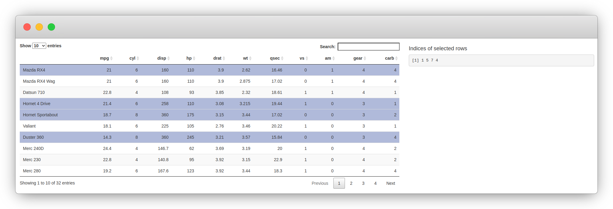
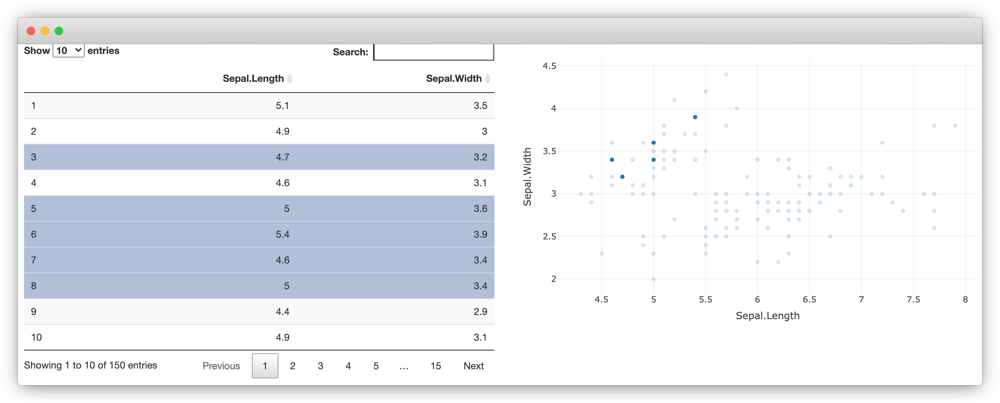

# (PART) Data Visualisation {-}

# Introduction to Widgets {#widgets-intro-intro}

```{r include=FALSE}
source("utils.R")
```

This part of the book explores the integration of JavaScript with R using the htmlwidgets package which focuses on libraries that produce a visual output, it is often used for data visualisation but is not limited to it.

As in future parts of this book, we mainly learn through examples, building multiple widgets of increasing complexity as we progress through the chapters. Before writing the first widget, we explore existing R packages that allow creating interactive data visualisations as this gives a first glimpse at we build in this part of the book. Then we explore JavaScript libraries that make great candidates for htmlwidgets and attempt to understand how they work to grasp what is expected from the developer in order to integrate them with R. Finally, we build upon the previous chapter to improve how htmlwidgets work with shiny.

The htmlwidgets package originates from the rCharts [@R-rCharts] package created in 2012 by Ramnath Vaidyanathan. It brought together a plethora of data visualisation JavaScript libraries, datamaps, highcharts, morris.js, and many more. Though no longer maintained rCharts ultimately paved the way towards a framework for interactive visualisations in R: two years later, in 2014, Ramnath and other prominent R users start working on htmlwidgets.

The objective of this chapter is to explore existing widgets available on CRAN, discover how they work, whilst focusing on their prominent features as we will learn how to implement those in our very own widget in the coming chapters.

## Plotly package {#widgets-plotly}

The plotly [@R-plotly] R package is probably one of the first and the most popular widget built thus far; it has been downloaded from CRAN 4.9 million times at the time of writing this. 

Plotly.js is a substantial library that provides over 40 chart types, including 3D charts, statistical graphs, and maps, all of which are available from the R interface, there is so much depth to plotly that there is an entire [book](https://plotly-r.com/) on the topic.

```{r, eval=FALSE}
library(plotly)

plot_ly(cars, x = ~speed, y = ~dist) %>% 
  add_markers()
```

```{r plotly-scatter-diagram, message = FALSE, warning = FALSE, fig.pos = "H", warning=FALSE, error=FALSE, echo=FALSE, fig.cap='plotly scatter plot'}
library(plotly)

p <- plot_ly(cars, x = ~speed, y = ~dist) %>% 
  add_markers()

include_widget(p, "03-plotly-scatter.png")
```

Plotly also has the ability to translate static ggplot2 [@R-ggplot2] charts to interactive plotly charts with the `ggplotly` function.

```{r, eval=FALSE}
p <- ggplot(diamonds, aes(x = log(carat), y = log(price))) + 
  geom_hex(bins = 100)
ggplotly(p)
```

```{r plotly-ggplotly-diagram, fig.pos = "H", echo=FALSE, fig.cap='Interactive ggplot2 with plotly'}
p <- ggplot(diamonds, aes(x = log(carat), y = log(price))) + 
  geom_hex(bins = 100)

include_widget(ggplotly(p), "03-ggplotly.png")
```

All plotly charts are initialised with the `plot_ly` function and work nicely with the magrittr [@R-magrittr] pipe `%>%`. This implies that (almost) every function expects a plotly object (the output of `plot_ly`) and returns a modified version of that object. The pipe makes code easier to read and more concise.

```{r}
p <- plot_ly(cars, x = ~speed, y = ~dist) 
p <- add_markers(p)
```

Plotly implements geoms in a similar fashion as ggplot2, functions that start in `add_` add a layer to the plot (e.g.: `add_lines`, `add_bars`).

```{r, eval=FALSE}
plot_ly(mtcars, x = ~disp) %>% 
  add_markers(y = ~mpg, text = rownames(mtcars)) %>% 
  add_lines(y = ~fitted(loess(mpg ~ disp)))
```

```{r plotly-layers-diagram, fig.pos = "H", echo=FALSE, fig.cap='Multiple layers with plotly'}
p <- plot_ly(mtcars, x = ~disp) %>% 
  add_markers(y = ~mpg, text = rownames(mtcars)) %>% 
  add_lines(y = ~fitted(loess(mpg ~ disp)))

include_widget(p, "03-plotly-multiple.png")
```

## DT package {#widgets-intro-dt}

The DT package [@R-DT] is a wrapper for the [DataTables](https://datatables.net/) jQuery plug-in which allows creating interactive tables from R `data.frame` objects.

```{r, eval=FALSE}
DT::datatable(cars)
```

```{r plotly-dt-diagram, fig.pos = "H", echo=FALSE, fig.cap='Interactive table with DT'}
d <- DT::datatable(cars)
include_widget(d, "03-DT.png")
```

DT has grown very popular amongst shiny developers as it allows capturing server-side many of the users' interactions with the table, such as the selected row.

```r
library(DT)
library(shiny)

ui <- fluidPage(
  fluidRow(
    column(8, DTOutput("myTable")),
    column(
      4,
      h4("Indices of selected rows"), 
      verbatimTextOutput("selected")
    )
  )
)

server <- function(input, output) {

  output$myTable <- renderDT({
    datatable(mtcars)
  })

  output$selected <- renderPrint({
    input$myTable_rows_selected
  })

}

shinyApp(ui, server)
```

```{r dt-example, fig.pos="H", echo=FALSE, fig.cap='DT package example'}

```

## Crosstalk {#widgets-intro-crosstalk}

DT and plotly both fully support the crosstalk package [@R-crosstalk], a package to enable two widgets to communicate. In the example below, we use crosstalk to create a "shared dataset" that can be used to create 1) a table with DT, and 2) a scatter plot with plotly. Rows selected in the table are highlighted in the plot and vice versa.

The `bscols` function is just a convenience function that makes it easy to put the visualisation and table side-by-side.

```r
library(DT)
library(plotly)
library(crosstalk)

sd <- SharedData$new(iris[, c("Sepal.Length", "Sepal.Width")])

bscols(
  device = "lg",
  datatable(sd, width = "100%"),
  plot_ly(sd, x = ~Sepal.Length, y = ~Sepal.Width)
)
```

```{r dt-example-crosstalk, fig.pos="H", echo=FALSE, fig.cap='DT and plotly with crosstalk'}

```

## Wrap-up {#widgets-intro-conclude}

These are only two examples of widgets and how they can work together. But we hope this makes a compelling case for building such software as, in the remaining of this chapter, we learn how to build them, integrate them with crosstalk, shiny, and much more.
