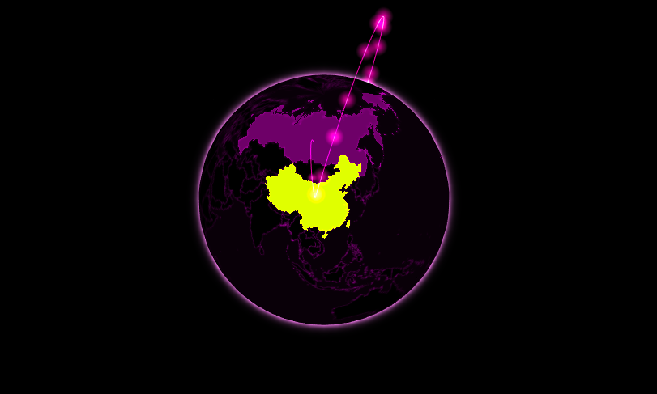

# The Full Monty {#widgets-full}

```{r include=FALSE}
source("utils.R")
```

With a first widget built, one can jump onto another one: [gio.js](https://giojs.org/), a library to draw arcs between countries on a three-dimensional globe. This will include many more functionalities such packages can comprise.

Then again, the first order of business when looking to integrate a library is to look at the documentation to understand what should be reproduced in R.

```html
<!DOCTYPE html>
<html xmlns="http://www.w3.org/1999/xhtml" lang="" xml:lang="">

<head>
  <!-- Import libraries -->
  <script src="three.min.js"></script>
  <script src="gio.min.js"></script>
</head>

<body>
  <!-- div to hold visualisation -->
  <div id="globe" style="width: 200px; height: 200px"></div>

  <!-- Script to create visualisation -->
  <script>
    var container = document.getElementById("globe");
    var controller = new GIO.Controller(container);
    controller.addData(data);
    controller.init();
  </script>
</body>

</html>
```

```{r gio-example, fig.pos="H", echo=FALSE, fig.cap='Gio.js example'}
knitr::include_graphics("images/gio-example.png")
```

Gio.js has itself a dependency, [three.js](https://threejs.org/), which needs to be imported before gio.js, other than that not much differs from libraries previously explored in this chapter.

```r
usethis::create_package("gio")
htmlwidgets::scaffoldWidget("gio")
```

## Dependencies {#widgets-full-deps}

Handling the dependencies does not differ much, we create the directories within the `inst` path and download the dependencies within them.

```r
# create directories for JS dependencies
dir.create("./inst/htmlwidgets/three", recursive = TRUE)
dir.create("./inst/htmlwidgets/gio", recursive = TRUE)

# download JS dependencies
three <- paste0(
  "https://cdnjs.cloudflare.com/ajax/",
  "libs/three.js/110/three.min.js"
)
gio <- paste0(
  "https://raw.githubusercontent.com/",
  "syt123450/giojs/master/build/gio.min.js"
)

download.file(three, "./inst/htmlwidgets/three/three.min.js")
download.file(gio, "./inst/htmlwidgets/gio/gio.min.js")
```

This should produce the following working directory.

```
.
├── DESCRIPTION
├── NAMESPACE
├── R
│   └── gio.R
└── inst
    └── htmlwidgets
        ├── gio
        │   └── gio.min.js
        ├── gio.js
        ├── gio.yaml
        └── three
            └── three.min.js
```

The libraries have been downloaded, but the `gio.yml` file is yet to be edited. The order in which the libraries are listed matters. Just as in HTML, three.js needs to precede gio.js as the latter depends on the former and not vice versa.

```yml
dependencies:
  - name: three
    version: 110
    src: htmlwidgets/three
    script: three.min.js
  - name: gio
    version: 2.0
    src: htmlwidgets/gio
    script: gio.min.js
```

## JavaScript {#widgets-full-js}

Let's copy the JavaScript code from the [Get Started section of gio.js](https://giojs.org/index.html) in the `gio.js` file's `renderValue` function. At this point, the data format is not known, so we comment the line, which adds data to the visualisation.

```js
// gio.js
HTMLWidgets.widget({

  name: 'gio',

  type: 'output',

  factory: function(el, width, height) {

    // TODO: define shared variables for this instance

    return {

      renderValue: function(x) {

        var container = document.getElementById("globe");
        var controller = new GIO.Controller(container);
        //controller.addData(data);
        controller.init();

      },

      resize: function(width, height) {

        // TODO: code to re-render the widget with a new size

      }

    };
  }
});
```

One can document and load the package, but it will not work as the code above attempts to place the visualisation in a `div` with `id = "globe"`. As for the previously-written widget, this needs to be changed to `el.id`.

```js
// gio.js
renderValue: function(x) {

  var container = document.getElementById(el.id);
  var controller = new GIO.Controller(container);
  //controller.addData(data);
  controller.init();

}
```

At this stage, the widget should generate a visualisation.

```r
devtools::document()
devtools::load_all()
gio(message = "This required but not used")
```

```{r gio-init, fig.pos="H", echo=FALSE, fig.cap='Gio output without data'}
knitr::include_graphics("images/gio-init.png")
```

Not too shabby given how little work was put into this! Before we move on, let us optimise something. In the JavaScript code, we retrieve the `container` using `el.id`, but this in effect is very inefficient: `el` is identical to `container`.

```js
// gio.js
renderValue: function(x) {

  var controller = new GIO.Controller(el);
  //controller.addData(data);
  controller.init();

}
```

## Working with Data {#widgets-full-data}

An exciting start, now onto adding data. Let us take a look at the [documentation](https://giojs.org/html/docs/dataAdd.html) to see what data the library expects.

```json
[
  {
    "e": "CN",
    "i": "US",
    "v": 3300000
  },
  {
    "e": "CN",
    "i": "RU",
    "v": 10000
  }
]
```

The JSON data should constitute arrays that denote arcs to draw on the globe where each arc is defined by an exporting country (`e`), an importing country (`i`), and is given a value (`v`). The importing and exporting country, the source and target of the arc, are indicated by ISO alpha-2 country codes. We can read this JSON into R.

```{r}
# data.frame to test
arcs <- jsonlite::fromJSON(
  '[
    {
      "e": "CN",
      "i": "US",
      "v": 3300000
    },
    {
      "e": "CN",
      "i": "RU",
      "v": 10000
    }
  ]'
)

print(arcs)
```

Jsonlite automagically converts the JSON into a data frame where each row is an arc, which is excellent as R users tend to prefer rectangular data over lists: this is probably what the package should use as input too. Let us make some changes to the `gio` function, so it takes data as input.

```r
gio <- function(data, width = NULL, height = NULL, elementId = NULL) {

  # forward options using x
  x = list(
    data = data
  )

  # create widget
  htmlwidgets::createWidget(
    name = 'gio',
    x,
    width = width,
    height = height,
    package = 'gio',
    elementId = elementId
  )
}
```

This must be reflected in the `play.js` file, where we uncomment the line previously commented and use `x.data` passed from R.

```js
// gio.js
renderValue: function(x) {

  var controller = new GIO.Controller(el);
  controller.addData(x.data); // uncomment & use x.data
  controller.init();

}
```

We can now use the function with the data to plot arcs!

```r
devtools::document()
devtools::load_all()
gio(arcs)
```

Unfortunately, this breaks everything, and we are presented with a blank screen. Using `console.log` or looking at the source code the rendered widget reveals the problem: the data is not actually in the correct format!

```json
{
  "x":{
    "data":{
      "e":["CN","CN"],
      "i":["US","RU"],
      "v":[3300000,10000]
    }
  },
  "evals":[],
  "jsHooks":[]
}
```

Htmlwidgets serialised the data frame column-wise (long), where each array is a column, whereas gio.js expect the data to be wide (row-wise serialisation), where each array is an arc (row).

```{r}
# column-wise
jsonlite::toJSON(arcs, dataframe = "columns")
# row-wise
jsonlite::toJSON(arcs, dataframe = "rows")
```

As mentioned previously, the convention has it that rectangular data (data frames) are serialised row-wise. That is likely to be a recurring problem for many widgets.

## Transforming Data {#widgets-full-transform-data}

There are multiple ways to transform the data and ensure the serialised JSON is as the JavaScript library expects it to be. The following sections explore those various methods before settling on a specific one for the gio package.

### Using JavaScript {#widgets-full-transform-data-js}

JavaScript can be used to transform the data, thereby leaving the serialiser as-is only to reshape it into the client. The htmlwidget JavaScript library (already imported by default) exports an object, which provides a method, `dataframeToD3`, to transform the data from long to wide. 

```js
// gio.js
renderValue: function(x) {

  // long to wide
  x.data = HTMLWidgets.dataframeToD3(x.data);

  var controller = new GIO.Controller(el);
  controller.addData(x.data); 
  controller.init();

}
```

### Modify Serialiser {#widgets-full-transform-data-modify}

Instead of serialising the data a certain way then correct it in JavaScript as demonstrated previously, one can also modify, or even replace the htmlwidgets default serialiser. Speaking of which, below is the default serializer used by htmlwidgets.

```r
function (x, ..., dataframe = "columns", null = "null", 
na = "null", auto_unbox = TRUE, use_signif = TRUE, 
  digits = getOption("shiny.json.digits", 16), force = TRUE,
  POSIXt = "ISO8601", UTC = TRUE, rownames = FALSE, 
  keep_vec_names = TRUE, strict_atomic = TRUE) 
{
  if (strict_atomic) 
      x <- I(x)
  jsonlite::toJSON(x, dataframe = dataframe, null = null, na = na, 
    auto_unbox = auto_unbox, digits = digits, force = force, 
    use_signif = use_signif, POSIXt = POSIXt, UTC = UTC, 
    rownames = rownames, keep_vec_names = keep_vec_names, 
    json_verbatim = TRUE, ...)
}
```

The problem at hand is caused by the `data.frame` argument, which is set to `columns` where it should be set `rows` (for row-wise). Arguments are passed to the serialiser indirectly, in the form of a list set as `TOJSON_ARGS` attribute to the object `x` that is serialised. We could thus change the `gio` function to reflect the aforementioned change. 

```r
gio <- function(data, width = NULL, height = NULL, 
  elementId = NULL) {

  # forward options using x
  x = list(
    data = data
  )

  # serialise data.frames to wide (not long as default)
  attr(x, 'TOJSON_ARGS') <- list(dataframe = "rows")

  # create widget
  htmlwidgets::createWidget(
    name = 'gio',
    x,
    width = width,
    height = height,
    package = 'gio',
    elementId = elementId
  )
}
```

The above may appear confusing at first as one rarely encounters the `attr` replacement function.

```{r}
attr(cars, "hello") <- "world" # set 
attr(cars, "hello") # get 
```

Other arguments can be placed in the same list; they will ultimately reach the serialiser to modify its output.

### Replace Serialiser {#widgets-full-transform-data-replace}

Otherwise, the serialiser can also be replaced in its entirety, also by setting an attribute, `TOJSON_FUNC`, to the `x` object. Below the serialiser is changed to jsonify [@R-jsonify], which by default serialises data frames to wide, unlike htmlwidgets' serialiser, thereby also fixing the issue.


```r
gio <- function(data, width = NULL, height = NULL, 
  elementId = NULL) {

  # forward options using x
  x = list(
    data = data
  )

  # replace serialiser
  attr(x, 'TOJSON_FUNC') <- gio_serialiser

  # create widget
  htmlwidgets::createWidget(
    name = 'gio',
    x,
    width = width,
    height = height,
    package = 'gio',
    elementId = elementId
  )
}

# serialiser
gio_serialiser <- function(x){
  jsonify::to_json(x, unbox = TRUE)
}
```

### Modify the Data {#widgets-full-transform-data-modify-data}

Alternatively, one can also leave all serialisers-related options unchanged and instead format the data in R prior to the serialisation, changing the dataframe to a row-wise list.

```r
x = list(
  data = apply(data, 1, as.list)
)
```

The above would make it such that the serialiser no longer has to interpret how the data should be serialised (row-wise or column-wise), the data now being a list will be serialised correctly.

### Pros and Cons {#widgets-full-transform-data-conclusion}

There are pros and cons to each method. The preferable method is probably to alter the default serialiser __only where needed__; this is the method used in the remainder of the book. Replacing the serialiser in its entirety should not be necessary, only do this once you are very familiar with serialisation and truly see a need for it. Moreover, htmlwidgets' serialiser extends jsonlite to allow converting JavaScript code, which will come in handy later on. Transforming the data in JavaScript has one drawback, `HTMLWidgets.dataframeToD3` cannot be applied to the entire `x` object, it will only work on the subsets that hold the column-wise data (`x.data`), which tends to lead to clunky code as one uses said function in various places.

```{r gio-data, fig.pos="H", echo=FALSE, fig.cap='Gio output with correct serialisation'}
knitr::include_graphics("images/gio-data.png")
```

## On Print Method {#widgets-full-on-print}

Let us add the option to style the globe: gio.js provides multiple [themes](https://giojs.org/html/docs/colorStyle.html) but they are currently not applicable from R. As a matter of fact, gio.js provides dozens of customisation options that should be available in the package as well. These, however, probably should be split across different functions, just like they are in gio.js, rather than all be accessible from a single function containing hundreds of arguments. This begs the question, when would one use another function given the function `gio` generates the visualisation? As it happens `gio` itself (or rather the function `htmlwidgets::createWidget` it contains) does not render the output; it returns an object of class "htmlwidget," which renders the visualisation on print (literally `htmlwidget.print` method).

```r
g <- gio(arcs) # nothing renders
g # visualisation renders
```

Therefore, one can use functions on the object returned by `gio`, which contains, amongst other things, the `x` list to which we can make changes, append data, or do any other operation that standard R lists allow. 

```r
print(g$x)

## $data
##    e  i       v
## 1 CN US 3300000
## 2 CN RU   10000
## 
## attr(,"TOJSON_ARGS")
## attr(,"TOJSON_ARGS")$dataframe
## [1] "rows"
```

This clarified, the function to change the style of the visualisation can be added to the package. It would take as input the output of `gio` and append the style (name of theme) to the `x` list; this would then be used in JavaScript to change the look of the visualisation.

```r
#' @export
gio_style <- function(g, style = "magic"){
  g$x$style <- style
  return(g)
}
```

The style is applied using the `setStyle` method on the controller before the visualisation is created, before the `init` method is called, using the style passed from R: `x.style`.

```js
// gio.js
renderValue: function(x) {

  var controller = new GIO.Controller(el);
  controller.addData(x.data); 

  controller.setStyle(x.style); // set style

  controller.init();

}
```

We can now run `devtools::load_all` to export the newly written function and load the functions in the environment with `devtools::load_all`.

```r
g1 <- gio(arcs)
g2 <- gio_style(g1, "juicyCake")

g2
```

```{r gio-style, fig.pos="H", echo=FALSE, fig.cap='Gio with a new theme'}

```

This is great but can be greatly improved upon with the magrittr pipe [@R-magrittr], it would allow effortlessly passing the output of each function to the next to obtain an API akin to that of plotly or highcharter.

```r
library(magrittr)

gio(arcs) %>% 
  gio_style("juicyCake")
```

The pipe drastically improves the API that gio provides its users and thus probably should be exported by the package; the usethis package provides a function to do so easily.

```r
# export the pipe
usethis::use_pipe()
```

This closes this chapter but is not the last we see of gio.js; we shall use it as an example in the next chapters as we extend its functionalities and polish certain aspects such as sizing and security.
