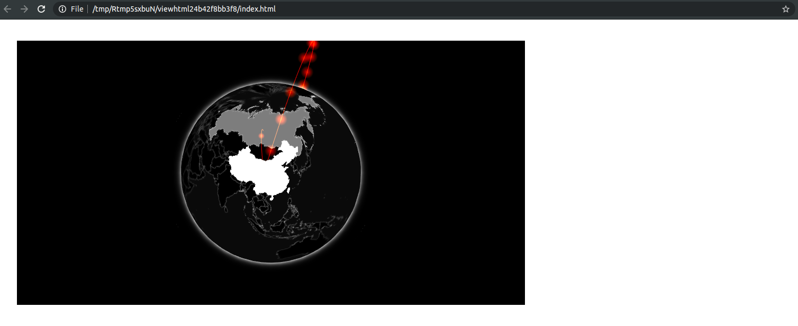
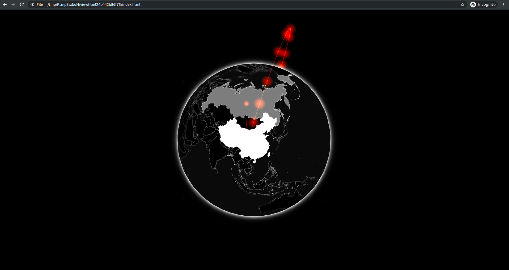

# Advanced Topics {#widgets-adv}

In the previous chapter, we put together an attractive, fully functioning widget, but it lacks polish and does not use all the features htmlwidgets provides, this chapter explores those. We look into handling the size of widgets to ensure they are responsive as well as discuss potential security concerns and how to address them. Finally, we show how to pass JavaScript code from R to JavaScript and how to add HTML content before and after the widget.

## Shared Variables {#widgets-adv-shared}

Up until now, the topic of shared variables had been omitted as it was not relevant. However, it will be from here onwards. Indeed we are about to discover how to manipulate the widget further; changing the data, resizing, and more. This will generally involve the JavaScript instance of the visualisation, the object named `controller` in the gio package, which, being defined in the `renderValue` function, is not accessible outside of it. To make it accessible outside of `renderValue` requires a tiny but consequential change without which resizing the widget will not be doable, for instance.

The `controller` variable has to be declared outside of the `renderValue` function, inside the `factory`. This was in fact indicated from the onset by the following comment: `// TODO: define shared variables for this instance` (generated by `htmlwidgets::scaffoldWidget`). Any variable declared as shown below will be accessible by all functions declared in the `factory`; `renderValue`, but also `resize` and others yet to be added.

```js
HTMLWidgets.widget({

  name: 'gio',

  type: 'output',

  factory: function(el, width, height) {

    // TODO: define shared variables for this instance
    var controller;

    return {

      renderValue: function(x) {

        controller = new GIO.Controller(el); // declared outside
        
        // add data
        controller.addData(x.data);

        // define style
        controller.setStyle(x.style);

        // render
        controller.init();

      },

      resize: function(width, height) {

        // TODO: code to re-render the widget with a new size

      }

    };
  }
});
```

### Sizing {#widgets-adv-sizing}

The `gio` function of the package we developed in the previous chapter has arguments to specify the dimensions of the visualisation (width and height). However, think how rarely (if ever) one specifies these parameters when using plotly, highcharter or leaflet. Indeed HTML visualisations should be responsive and fit the container they are placed in---not to be confused though; these are two different things. This enables creating visualisations that look great on large desktop screens as well as the smaller mobile phones or iPad screens. Pre-defining the dimensions of the visualisation (e.g.: `400px`), breaks all responsiveness as the width is no longer relative to its container. Using a relative width like `100%` ensures the visualisation always fits in the container edge to edge and enables responsiveness.

```r
arcs <- jsonlite::fromJSON(
  '[
    {
      "e": "CN",
      "i": "US",
      "v": 3300000
    },
    {
      "e": "CN",
      "i": "RU",
      "v": 10000
    }
  ]'
)

gio(arcs)
```

```{r gio-size-issue, echo=FALSE, fig.cap='Gio with no sizing management'}

```

When this is not specified htmlwidgets sets the width of the visualisation to 400 pixels.

```r
gio(arcs, width = 500) # 500 pixels wide
gio(arcs, width = "100%") # fits width
```

These options are destined for the user of the package; the next section details how the developer can define default sizing behaviour.

### Sizing Policy {#widgets-adv-sizing-policy}

One can specify a sizing policy when creating the widget, the sizing policy will dictate default dimensions and padding in different contexts:

- Global defaults
- RStudio viewer
- Web browser
- R markdown

It is often enough to specify general defaults as widgets are rarely expected to behave differently with respect to size depending on the context but it can be useful in some cases.

Below we modify the sizing policy of gio via the `sizingPolicy` argument of the `createWidget` function. The function `htmlwidgets::sizingPolicy` has many arguments; we set the default width to 100% to ensure the visualisation fills its container entirely regardless of where it is rendered. We also remove all padding by setting it to 0 and set `browser.fill` to `TRUE`, so it automatically resizes the visualisation to fit the entire browser page.

```r
# create widget
htmlwidgets::createWidget(
  name = 'gio',
  x,
  width = width,
  height = height,
  package = 'gio',
  elementId = elementId,
  sizingPolicy = htmlwidgets::sizingPolicy(
    defaultWidth = "100%",
    padding = 0,
    browser.fill = TRUE
  )
)
```

```{r gio-fit, echo=FALSE, fig.cap='Gio with sizing policy'}

```

## Resizing {#widgets-adv-resizing}

In the first widget built in this book (`playground`), we deconstructed the JavaScript `factory` function but omitted the `resize` function. The `resize` function does what it says on the tin: it is called when the widget is resized. What this function will contain entirely depends on the JavaScript library one is working with. Some are very easy to resize other less so, that is for the developer to discover in the documentation of the library. Some libraries, like gio, do not even require using a resizing function and handle that automatically under the hood; resize the width of the RStudio viewer or web browser, and gio.js resizes too. This said, there is a function to force gio to resize, though it is not in the official documentation it can be found in the source code: `resizeUpdate` is a method of the controller and does not take any argument. 

```js
...
resize: function(width, height) {
  controller.resizeUpdate();
}
...
```

```{r gio-small, echo=FALSE, fig.cap='Gio resized'}
knitr::include_graphics("images/gio-small.png")
```

To give the reader a better idea of what these tend to look like below are the ways plotly, highcharts, and chart.js do it.

__Plotly__

```js
Plotly.relayout('chartid', {width: width, height: height});
```

__Highcharts__

```js
chart.setSize(width, height);
```

__Chart.js__

```js
chart.resize();
```

Note that the `width` and `height` used in the functions above are obtained from the `resize` function itself (see arguments).

That is one of the reasons for ensuring the instance of the visualisation (`controller` in this case) is shared (declared in `factory`), if declared in the `renderValue` function then the `resize` function cannot access that object and thus cannot run the function required to resize the widget.

## Pre Render Hooks & Security {#widgets-adv-prerender}

The `createWidget` function also comes with a `preRenderHook` argument which accepts a function that is run just before the rendering of the widget (in R, not JavaScript), this function should accept the entire widget object as input and should return a modified widget object. That was not used in any of the widgets previously built but is extremely useful. It can be used to make checks on the object to ensure all is correct, or remove variables that should only be used internally, and much more.

Currently, `gio` takes the data frame `data` and serialises it in its entirety which will cause security concerns as all the data used in the widget is visible in the source code of the output. What if the data used for the visualisation contained an additional column with sensitive information? We ought to ensure gio only serialises the data necessary to produce the visualisation.

```r
# add a variable that should not be shared
arcs$secret_id <- 1:2
```

We create a `render_gio` function which accepts the entire widget, filters only the column necessary from the data and returns the widget. This function is then passed to the argument `preRenderHook` of the `htmlwidgets::createWidget` call. This way, only the columns `e`, `v`, and `i` of the data are kept thus the `secret_id` column will not be exposed publicly.

```r
# preRenderHook function
render_gio <- function(g){
  # only keep relevant variables
  g$x$data <- g$x$data[,c("e", "v", "i")]
  return(g)
}

# create widget
htmlwidgets::createWidget(
  name = 'gio',
  x,
  width = width,
  height = height,
  package = 'gio',
  elementId = elementId,
  sizingPolicy = htmlwidgets::sizingPolicy(
    defaultWidth = "100%",
    padding = 0,
    browser.fill = TRUE
  ),
  preRenderHook = render_gio # pass renderer
)
```

Moreover, security aside, this can also improve performances as only the data relevant to the visualisation is serialised and subsequently loaded by the client. Without the modification above, were one to use `gio` on a dataset with 100 columns all would have been serialised, thereby significantly impacting performances both of the R process rendering the output and the web browser viewing the visualisation.

## JavaScript Code {#widgets-adv-js}

As mentioned in a previous chapter, JavaScript code cannot be serialised to JSON.

```{r}
# serialised as string
jsonlite::toJSON("var x = 3;")
```

Nonetheless, it is doable with htmlwidgets' serialiser (and only that one). The function `htmlwidgets::JS` can be used to mark a character vector so that it will be treated as JavaScript code when evaluated in the browser.

```{r}
htmlwidgets::JS("var x = 3;")  
```

This can be useful where the library requires the use of callback functions, for instance.

```{block, type='rmdnote'}
Replacing the serialiser will break this feature.
```

## Prepend & Append Content {#widgets-adv-prepend-append}

There is the ability to append or prepend HTML content to the widget (shiny, htmltools tags, or a list of those). For instance, we could use `htmlwidgets::prependContent` to allow displaying a title to the visualisation, as shown below.

```r
#' @export
gio_title <- function(g, title){
  title <- htmltools::h3(title)
  htmlwidgets::prependContent(g, title)
}
```

```r
gio(arcs) %>% 
  gio_title("Gio.js htmlwidget!")
```

```{r gio-title, echo=FALSE, fig.cap='Gio output with title'}
knitr::include_graphics("images/gio-title.png")
```

While the `prependContent` function places the content above the visualisation, the `appendContent` function places it below, as they accept any valid htmltools or shiny tag they can also be used for conditional CSS styling for instance. 

```{block, type='rmdnote'}
`prependContent` and `appendContent` do not work in shiny.
```

## Dependencies {#widgets-adv-dependencies}

Thus far, this book has only covered one of two ways dependencies can be included in htmlwidgets. Though the one covered, using the `.yml` file will likely be necessary for every widget it has one drawback: all dependencies listed in the file are always included with the output. Dependencies can significantly affect the load time of the output (be it a standalone visualisation, an R markdown document, or a shiny application) as these files may be large. Most large visualisation libraries will therefore allow bundling those dependencies in separate files. For instance, ECharts.js provides a way to customise the bundle to only include dependencies for charts that one wants to draw (e.g., bar chart, or boxplot), Highcharts also allows splitting dependencies so one can load those needed for maps, stock charts, and more, separately. It is thus good practice to do the same in widgets, so only the required dependencies are loaded, e.g.: when the user produces a map, only the dependency for that map is loaded. It is used in the leaflet package to load map tiles, for instance.

The Google Chrome network tab shows the information on resources downloaded by the browser (including dependencies) including how long it takes. It is advisable to take a look at it to ensure no dependency drags load time.

```{r htmlwidgets-performances, echo=FALSE, fig.cap='Google Chrome network tab'}
knitr::include_graphics("images/htmlwidgets-performances.png")
```

To demonstrate, we will add a function in gio to optionally include [stats.js](https://github.com/mrdoob/stats.js/), a JavaScript performance monitor which displays information such as the number of frames per second (FPS) rendered, or the number of milliseconds needed to render the visualisation. Gio.js natively supports stats.js, but the dependency needs to be imported, and that option needs to be enabled on the `controller` as shown in the [documentation](https://giojs.org/html/docs/interfaceStats.html).

```js
// enable stats
controller.enableStats();
```

In htmlwidgets those additional dependencies can be specified via the `dependencies` argument in the `htmlwidgets::createWidget` function or they can be appended to the output of that function.

```r
# create gio object
g <- gio::gio(arcs)

is.null(g$dependencies)
```

```
[1] TRUE
```

As shown above, the object created by `gio` includes dependencies, currently `NULL` as no such extra dependency is specified. One can therefore append those to that object in a fashion similar to what the `gio_style` function does.

From the root of the gio package, we create a new directory for the stats.js dependency and download the latest version from Github.

```r
dir.create("htmlwidgets/stats")
url <- paste0(
  "https://raw.githubusercontent.com/mrdoob/",
  "stats.js/master/build/stats.min.js"
)
download.file(url, destfile = "htmlwidgets/stats/stats.min.js")
```

First we use the `system.file` function to retrieve _the path to the directory_ which contains the dependency (`stats.min.js`). It's important that it is the path to the directory and not the file itself.

```r
# stats.R
gio_stats <- function(g){

  # create dependency
  path <- system.file("htmlwidgets/stats", package = "gio")

  return(g)

}
```

Then we use the htmltools package to create a dependency, the `htmltools::htmlDependency` function returns an object of class `html_dependency` which htmlwidgets can understand and subsequently insert in the output. On the `src` parameter, since we reference a dependency from the filesystem we name the character string `file` but we could use the CDN (web-hosted file) and name it `href` instead.

```r
# stats.R
gio_stats <- function(g){

  # create dependency
  path <- system.file("htmlwidgets/stats", package = "gio")
  dep <- htmltools::htmlDependency(
    name = "stats",
    version = "17",
    src = c(file = path),
    script = "stats.min.js"
  )

  return(g)

}
```

The dependency then needs to be appended to the htmlwidgets object.

```r
# stats.R
gio_stats <- function(g){

  # create dependency
  path <- system.file("htmlwidgets/stats", package = "gio")
  dep <- htmltools::htmlDependency(
    name = "stats",
    version = "17",
    src = c(file = path),
    script = "stats.min.js"
  )

  # append dependency
  g$dependencies <- append(g$dependencies, list(dep))

  return(g)

}
```

Finally, we pass an additional variable in the list of options (`x`) which we will use JavaScript-side to check whether stats.js must be enabled.

```r
#' @export
gio_stats <- function(g){

  # create dependency
  path <- system.file("htmlwidgets/stats", package = "gio")
  dep <- htmltools::htmlDependency(
    name = "stats",
    version = "17",
    src = c(file = path),
    script = "stats.min.js"
  )

  # append dependency to gio.js
  g$dependencies <- append(g$dependencies, list(dep))

  # add stats variable
  g$x$stats <- TRUE

  return(g)
}
```

Then it is a matter of using the `stats` variable added to `x` in the JavaScript `renderValue` function to determine whether the stats feature should be enabled.

```js
// gio.js
if(x.stats)
  controller.enableStats();

controller.init();
```

Then the package can be documented to export the newly created function and loaded in the environment to test the feature.

```r
# create gio object
arcs %>% 
  gio() %>% 
  gio_stats()
```

```{r gio-stats, echo=FALSE, fig.cap='Gio with stats output'}

```

In brief, it is better to only place the hard dependencies in the `.yml` file; dependencies that are necessary to produce the visualisation and use dynamic dependencies where ever possible. Perhaps one can think of it as the difference between `Imports` and `Suggests` in an R package `DESCRIPTION` file.

## Compatibility {#widgets-adv-compatibility}

One issue that might arise is that of compatibility between widgets. What if someone else builds another htmlwidget for gio.js which uses a different version of the library and that a user decides to use both packages in a shiny app or R markdown document? Something is likely to fail as two different versions of gio.js are imported, and that one overrides the other. For instance, the package echarts4r [@R-echarts4r] allows working with leaflet but including the dependencies could clash with the leaflet package itself. Therefore it uses the dependencies from the leaflet package instead.

The htmlwidgets package comes with a function to extract the dependencies from a widget, so they can be reused in another. The function `htmlwidgets::getDependency` returns a list of objects of class `html_dependency` which can therefore be used in other widgets as demonstrated in the previous section.

```r
# get dependencies of the gio package
htmlwidgets::getDependency("gio")[2:3]
```

```
#> [[1]]
#> List of 10
#>  $ name      : chr "three"
#>  $ version   : chr "110"
#>  $ src       :List of 1
#>   ..$ file: chr "/home/usr/gio/htmlwidgets/three"
#>  $ meta      : NULL
#>  $ script    : chr "three.min.js"
#>  $ stylesheet: NULL
#>  $ head      : NULL
#>  $ attachment: NULL
#>  $ package   : NULL
#>  $ all_files : logi TRUE
#>  - attr(*, "class")= chr "html_dependency"
#> 
#> [[2]]
#> List of 10
#>  $ name      : chr "gio"
#>  $ version   : chr "2"
#>  $ src       :List of 1
#>   ..$ file: chr "/home/usr/gio/htmlwidgets/gio"
#>  $ meta      : NULL
#>  $ script    : chr "gio.min.js"
#>  $ stylesheet: NULL
#>  $ head      : NULL
#>  $ attachment: NULL
#>  $ package   : NULL
#>  $ all_files : logi TRUE
#>  - attr(*, "class")= chr "html_dependency"
```

## Unit Tests {#widgets-adv-unit-tests}

The best way to write unit tests for htmlwidgets is to test the object created by `htmlwidgets::createWidget`. Below we provide an example using testthat[@R-testthat], running `expect*` functions on the output of `gio`.

```r
library(gio)
library(testthat)

test_that("gio has correct data", {
  g <- gio(arcs)

  # internally stored as data.frame
  expect_is(g$x$data, "data.frame")

  # gio does not work without data
  expect_error(gio())
})
```

## Performances {#widgets-adv-performances}

A few hints have already been given to ensure one does not drain the browser, consider assessing the performances of the widget as it is being built. Always try and imagine what happens under the hood of the htmlwidget as you build it; it often reveals potential bottlenecks and solutions.

Remember that data passed to `htmlwidgets::createWidget` is 1) loaded into R, 2) serialised to JSON, 3) embedded into the HTML output, 4) read back in with JavaScript, which adds some overhead considering it might be read into JavaScript directly. This will not be a problem for most visualisations but might become one when that data is large. Indeed, there are sometimes more efficient ways to load data into web browsers where it is needed for the visualisation.

Consider for instance, geographic features (topoJSON and GeoJSON), why load them into R if it is to then re-serialise it to JSON?

Also, keep the previous remark in mind when repeatedly serialising identical data objects, GeoJSON is again a good example. A map used twice or more should only be serialised once or better not at all. Consider providing other ways for the developer to make potentially large data files accessible to the browser.

Below is an example of a function that could be used within R markdown or shiny UI to load data in the front-end and bypass serialisation. Additionally, the function makes use of AJAX (Asynchronous JavaScript And XML) to asynchronously load the data, thereby further reducing load time.

```r
# this would placed in the shiny UI
load_json_from_ui <- function(path_to_json){
  script <- paste0("
    $.ajax({ 
        url: '", path_to_json, "', 
        dataType: 'json', 
        async: true,
        success: function(data){ 
          console.log(data);
          window.globalData = data;
        } 
      });"
    )
  shiny::tags$script(
    script
  )
}
```

Using the above the data loaded would be accessible from the htmlwidgets JavaScript (e.g.: `gio.js`) with `window.globalData`. The `window` object is akin to the `document` object, while the latter pertains to the Document Object Model (DOM) and represents the page, the former pertains to the Browser Object Model (BOM) and represents the browser window. While `var x;` will only be accessible within the script where it is declared, `window.x` will be accessible anywhere.

Note this means the data is read from the web browser, and therefore the data must be accessible to the web browser, the `path_to_json` must thus be a served static file, e.g.: `www` directory in shiny.
