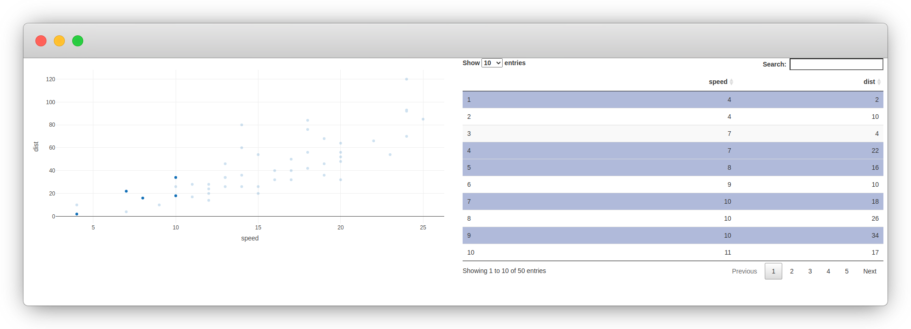

# Crosstalk

Crosstalk[@R-crosstalk] is fantastic add-on for htmlwidgets.

>  It extends htmlwidgets with a set of classes, functions, and conventions for implementing cross-widget interactions (currently, linked brushing and filtering). -- [Official crosstalk website](https://rstudio.github.io/crosstalk/index.html)

The package allows users to create "shared datasets" that will respond to filtering and selections when used in htmlwidgets, akin to crossfilter for d3.js. So one can create a shared dataset to use in two different visualisations so that selecting a point in one scatter plot also highlights it in another.

However crosstalk datasets will not be supported by widgets out of the box, some work needs to be done in order to bring support to it, therefore not all htmlwidgets will support such datasets.

## Crosstalk candidates

Crosstalk is will not work well with every widget and every dataset, in some cases it might not even be a good idea to support it.

```{block, type='rmdnote'}
The application of crosstalk to the gio package is instructive but limited and somewhat faulty.
```

## Crosstalk example

Both the plotly and DT packages support crosstalk, we can use those to produce a scatter plot with the former and a table with the latter so that selection of data in one widget is reflected in the other.

The shared dataset is created with the `SharedData` R6 class, this dataset is then used as one would use a standard dataframe in plotly and DT. The `bscols` function is just a helper to create columns from html elements (using bootstrap). It's ideal for examples but one should not have to use it in R markdown or Shiny---crosstalk will work without `bscols`.

```r
library(DT)
library(plotly)
library(crosstalk)

shared <- SharedData$new(cars)

bscols(
  plot_ly(shared, x = ~speed, y=~dist),
  datatable(shared, width = "100%")
)
```



## Crosstalk with gio

```r
gio <- function(data, width = NULL, height = NULL, elementId = NULL) {

  # defaults to NULL
  key <- NULL
  group <- NULL

  if (is.SharedData(data)) {
    key <- data$key()
    group <- data$groupName()
    data <- data$origData()
  }

  # forward options using x
  x = list(
    data = data,
    style = "default",
    crosstalk = list(
      key = key,
      group = group
    )
  )

  attr(x, 'TOJSON_ARGS') <- list(dataframe = "rows")

  # create widget
  htmlwidgets::createWidget(
    name = 'gio',
    x,
    width = width,
    height = height,
    package = 'gio',
    elementId = elementId,
    sizingPolicy = htmlwidgets::sizingPolicy(
      padding = 0,
      browser.fill = TRUE,
      defaultWidth = "100%"
    ),
    preRenderHook = render_gio
  )
}
```

```js
HTMLWidgets.widget({

  name: 'gio',

  type: 'output',

  factory: function(el, width, height) {

    // TODO: define shared variables for this instance
    var controller;
    var sel_handle = new crosstalk.SelectionHandle();

    sel_handle.on("change", function(e) {
      console.log(e);
      if (e.sender !== sel_handle) {
        //controller.switchCountry(e.value);
      }
      controller.switchCountry(e.value);
    });

    return {

      renderValue: function(x) {

        el.innerHTML = '';
        controller = new GIO.Controller(el);

        // group
        sel_handle.setGroup(x.crosstalk.group);
        
        // add data
        controller.addData(x.data);

        controller.setStyle(x.style);

        // callback
        controller.onCountryPicked( callback );

        function callback (selectedCountry, relatedCountries) {
          console.log(selectedCountry);
          Shiny.setInputValue(el.id + '_selected', selectedCountry);
          Shiny.setInputValue(el.id + '_related:gio.related.countries', relatedCountries);
        }

        // use stats
        if(x.stats)
          controller.enableStats();

        // render
        controller.init();

      },

      resize: function(width, height) {

        // TODO: code to re-render the widget with a new size
        controller.resizeUpdate()

      },

      getGlobe: function(){
        return controller;
      }

    };
  }
});
```

```r
library(DT)
library(gio)
library(crosstalk)

url <- paste0(
  "https://raw.githubusercontent.com/JohnCoene/",
  "javascript-for-r/master/data/countries.json"
)
arcs <- jsonlite::fromJSON(url)

# Wrap data frame in SharedData
sd <- SharedData$new(arcs, key = arcs$e)

# Use SharedData like a dataframe with Crosstalk-enabled widgets
bscols(
  gio(sd),
  datatable(sd, width="100%", selection = "single")
)
```
