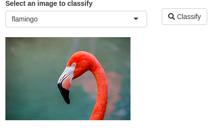
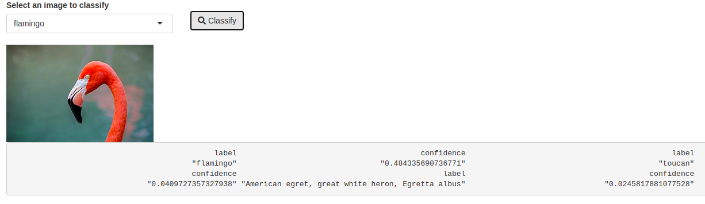
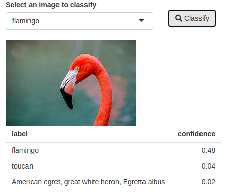

# Image Classifier

In this example we bring [ml5.js](https://learn.ml5js.org/) to R using Shiny, more specifically its classifier using [mobileNet](https://arxiv.org/abs/1704.04861). Using shiny and JavaScript the model can run in the client's browser and the result can be sent back to the server. This means the model uses the client's computing power to run the prediction rather than the server, thereby alleviating computation on the server and bypassing limitations on concurrent users.

Then again the journey starts by exploring ml5.js and the classifier we are going to use. One starts by instantiating an image classifer, specifying the model to use (ml5.js comes with a few out of the box and allows using custom models), then the classifier is used on an image present in the DOM.

```html
<!DOCTYPE html>
<html xmlns="http://www.w3.org/1999/xhtml" lang="" xml:lang="">

<head>
  <!-- Import library -->
  <script src="https://unpkg.com/ml5@0.4.3/dist/ml5.min.js"></script>
</head>

<body>
  <!-- image to classify -->
  

  <!-- Script to run classifer -->
  <script>
    // Initialize the Image Classifier method with MobileNet
    const classifier = ml5.imageClassifier('MobileNet', modelLoaded);

    // When the model is loaded
    function modelLoaded() {
      console.log('Model Loaded!');
    }

    // Make a prediction with a selected image
    classifier.classify(document.getElementById('dog'), (err, results) => {
      console.log(results);
    });
  </script>
</body>

</html>
```

In shiny, we would need to pass the id of the image (`dog` above) to be sent from the server and the callback function to return the results to R. The projects starts from an empty directory, before creating actual application let us create the directory of static files that will contain the JavaScript file (`classify.js`) and the images to classify. Feel free download whichever images you want, below we download images of birds from Wikipedia.

```r
# static files
dir.create("www")
file.create("www/classify.js")

# flamingo
fl <- paste0(
  "https://upload.wikimedia.org/wikipedia/commons/thumb/7/72/American_flamingo",
  "_%28Phoenicopterus_ruber%29.JPG/256px-American_flamingo_%28Phoenicopterus_ruber%29.JPG"
)

# lorikeet
lo <- paste0(
  "https://upload.wikimedia.org/wikipedia/commons/thumb/c/c2/Rainbow_lorikeet.jpg/",
  "256px-Rainbow_lorikeet.jpg"
)

# download
download.file(fl, destfile = "www/flamingo.jpg")
download.file(lo, destfile = "www/lorikeet.jpg")
```

Once images are downloaded we can build the basic skeleton of the app. We import ml5.js from the CDN, create a select input to switch between the two images of birds that were downloaded and use `renderUI` to dynamically render the selected image. Finally, we create a button to trigger the classification, though it currently sends an empty list to a message handler that we are yet to create.

```r
library("shiny")

addResourcePath("www", "www")

ui <- fluidPage(
  tags$head(
    tags$script(src = "https://unpkg.com/ml5@0.4.3/dist/ml5.min.js")
  ),
  fluidRow(
    column(
      2,
      selectInput(
        "select", "Select an image to classify",
        choices = c("lorikeet", "flamingo")
      )
    ),
    column(
      2, br(), actionButton("classify", "Classify", icon = icon("search"))
    )
  ),
  uiOutput("img")
)

server <- function(input, output, session){

  output$img <- renderUI({
    path <- paste0("www/", input$select, ".jpg")
    tags$img(src = path, id = "bird")
  })

  observeEvent(input$classify, {
    session$sendCustomMessage('classify', list())
  })

}

shinyApp(ui, server)
```



With this in place one can start thinking about the JavaScript, when the "classify" button is clicked the classification must be triggered in the client and the result sent back. To do so we need to define the message handler called "classify" to which the data is sent.

```js
// classify.js

// Initialize 
const classifier = ml5.imageClassifier('MobileNet', modelLoaded);

function modelLoaded() {
  console.log('Model Loaded!');
}

Shiny.addCustomMessageHandler('classify', function(data){
  // Make a prediction with a selected image
  classifier.classify(document.getElementById("bird"), (err, results) => {
    Shiny.setInputValue("classification", results);
  });
});
```

A few things to note on the above. The classifier is created outside of the message handler as this only has to be done once and not every time the "classify" button is clicked. While the message handler accepts the `data` objects it does not make use of it, which is fine, the argument must nonetheless be specified. In the aforementioned callback function the input "classification" is defined.

```r
library("shiny")

addResourcePath("www", "www")

ui <- fluidPage(
  tags$head(
    tags$script(src = "https://unpkg.com/ml5@0.4.3/dist/ml5.min.js"),
    tags$script(src = "www/classify.js")
  ),
  fluidRow(
    column(
      2,
      selectInput(
        "select", "Select an image to classify",
        choices = c("lorikeet", "flamingo")
      )
    ),
    column(
      2, br(), actionButton("classify", "Classify", icon = icon("search"))
    )
  ),
  uiOutput("img"),
  verbatimTextOutput("results") # print output
)

server <- function(input, output, session){

  output$img <- renderUI({
    path <- paste0("www/", input$select, ".jpg")
    tags$img(src = path, id = "bird")
  })

  observeEvent(input$classify, {
    session$sendCustomMessage('classify', list())
  })

  # render classification
  output$results <- renderPrint({
    input$classification
  })

}

shinyApp(ui, server)
```



This returns three results, the label (classification) and the confidence, which could be improved, we ought to build an input handler to transform that into a readable table. Below we add the input handler and register it with shiny. Do not forget to use it in the message handler in JavaScript like so: `Shiny.setInputValue("classification:class", results);`.

```r
library("shiny")

addResourcePath("www", "www")

# create handler
handler <- function(data, ...){
  purrr::map_dfr(data, as.data.frame)
}

# register handler
shiny::registerInputHandler("class", handler)

ui <- fluidPage(
  tags$head(
    tags$script(src = "https://unpkg.com/ml5@0.4.3/dist/ml5.min.js"),
    tags$script(src = "www/classify.js")
  ),
  fluidRow(
    column(
      2,
      selectInput(
        "select", "Select an image to classify",
        choices = c("lorikeet", "flamingo")
      )
    ),
    column(
      2, br(), actionButton("classify", "Classify", icon = icon("search"))
    )
  ),
  uiOutput("img"),
  verbatimTextOutput("results")
)

server <- function(input, output, session){

  output$img <- renderUI({
    path <- paste0("www/", input$select, ".jpg")
    tags$img(src = path, id = "bird")
  })

  observeEvent(input$classify, {
    session$sendCustomMessage('classify', list())
  })

  output$results <- renderPrint({
    input$classification
  })

}

shinyApp(ui, server)
```


