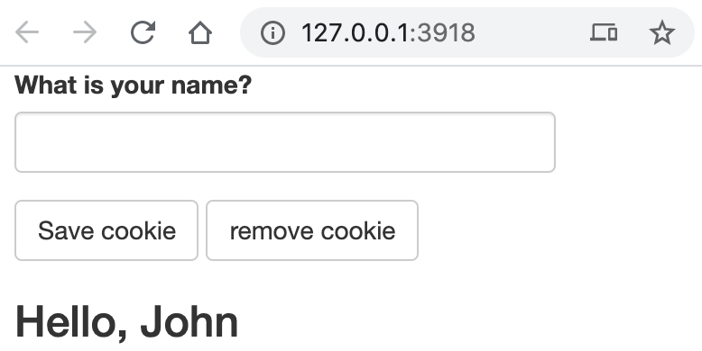

# Cookies

In this example we scout yet another great example of how JavaScript can enhance shiny applications. We use an HTTP cookie, a small piece of data sent from a website and stored on the user's web browser, to track users returning to a shiny application.

The application will prompt the user to input their name, this will be stored in a cookie so that on their next visit they are welcomed to the app with a personalised message. Cookies are natively supported by web browsers and JavaScript, there is, however, a great library which eases greatly how those cookies are handled: [js-cookie](https://github.com/js-cookie/js-cookie).

## Discover js-cookie {-}

The library is at its core very straightforward, it exports a `Cookie` object from which one can access the `set`, `get`, and `remove` methods. There is also the possibility to pass additional options when defining the cookie, such as how long it is valid for, but we won't explore these here.

```js
// set a cookie
Cookies.set('name', 'value')

// get cookies
Cookies.get();

// remove a cookie
Cookies.remove('name');
```

## Setup {-}

Then again, it starts with the creation of a directory where we'll place a JavaScript file containing the message handlers, we won't download the dependency and use the CDN instead.

```r
dir.create("www")
file.create("www/script.js")
```

We then lay down the skeleton of the application which features a text input to capture the name of the user, a button to save the cookie, another to remove it and finally a dynamic output that will display the personalised message.

```r
library(shiny)

addResourcePath("www", "www")

ui <- fluidPage(
  tags$head(
    tags$script(
      src = "https://cdn.jsdelivr.net/npm/js-cookie@rc/dist/js.cookie.min.js"
    ),
    tags$script(src = "www/script.js")
  ),
  textInput("name_set", "What is your name?"),
  actionButton("save", "Save cookie"),
  actionButton("remove", "remove cookie"),
  uiOutput("name_get")
)

server <- function(input, output, session){

}

shinyApp(ui, server)
```

## JavaScript {-}

First we define a JavaScript function that retrieves the cookies that it sets as `cookies` input. The reason we do so is simply because we will have to execute this in multiple places, this will become clearer in just a second.

```js
// script.js
function getCookies(){
  var res = Cookies.get();
  Shiny.setInputValue('cookies', res);
}
```

Then we define the message handlers, we define two distinct such handlers, one that sets the cookie and another that removes it. Note that both of then run the `getCookies` function defined previously. The reason this is done is that we need the input to be updated with the new values after it is set and after it is removed. Otherwise setting or removing the cookie will leave the actual input value untouched.

```js
// script.js
Shiny.addCustomMessageHandler('cookie-set', function(msg){
  Cookies.set(msg.name, msg.value);
  getCookies();
})

Shiny.addCustomMessageHandler('cookie-remove', function(msg){
  Cookies.remove(msg.name);
  getCookies();
})
```

One more thing needs to be implemented JavaScript-side, the point of using the cookie is so that when users comes back to the shiny app, even days later, they do not need to re-enter their name. So when the app is launched the input value must be defined. There are probably a few ways to do so, below we set the input value when the shiny session connects which will occur when the app is fired up.

```js
// script.js
$(document).on('shiny:connected', function(ev){
  getCookies();
})
```

## R Code {-}

Then it's a matter a completing the shiny server which was left empty. We add an `observeEvent` on the save button where we check that a name has actually been typed in the text box before saving the cookie. There is another similar observer on the remove button. The `renderUI` expression checks that the cookie has been set and displays a message accordingly.

```r
library(shiny)

addResourcePath("www", "www")

ui <- fluidPage(
  tags$head(
    tags$script(
      src = "https://cdn.jsdelivr.net/npm/js-cookie@rc/dist/js.cookie.min.js"
    ),
    tags$script(src = "www/script.js")
  ),
  textInput("name_set", "What is your name?"),
  actionButton("save", "Save cookie"),
  actionButton("remove", "remove cookie"),
  uiOutput("name_get")
)

server <- function(input, output, session){

  # save
  observeEvent(input$save, {
    if(input$name_set != "")
      session$sendCustomMessage("cookie-set", list(name = "name", value = input$name_set))
  })

  # delete
  observeEvent(input$remove, {
    session$sendCustomMessage("cookie-remove", list(name = "name"))
  })

  # output if cookie is specified
  output$name_get <- renderUI({
    if(!is.null(input$cookies$name))
      h3("Hello,", input$cookies$name)
    else
      h3("Who are you?")
  })

}

shinyApp(ui, server)
```



Run the application and save your name. You can then refresh the application and the welcome message will display your name. You can even kill the server entirely and re-run the app, the welcome message will still display!

