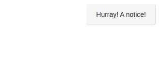
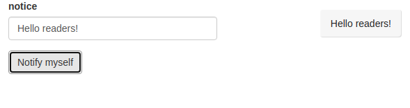
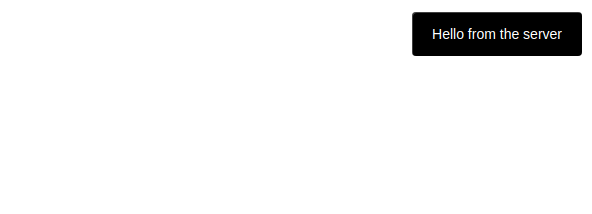
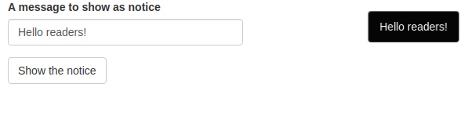

# (PART) Web Development with Shiny {-}

# Bidirectional Communication {#shiny-intro}

Shiny is the web framework of choice for the R programming language. Since JavaScript and Shiny both run in web browsers it follows that they can run alongside one another as one can include JavaScript in such applications. Yet, often disregarded is the ability for Shiny's R server to communicate to the front-end and vice versa. This collection of chapters aims to show precisely how this works. In this first part, we brush up on the essentials so we understand how to include JavaScript in shiny applications.

Then again, the goal is not to write a lot of convoluted JavaScript, on the contrary, with little knowledge of the language the aim is to write as little as possible but demonstrate to the reader that it is often enough to greatly improve the user experience of shiny applications.

## Websocket & Shiny {#shiny-intro-websocket}

Shiny applications have two components the user interface (UI) and the server function. These two components communicate via a websocket: a persistent connection that allows passing messages between the server and clients connecting to it. In the R server this connection is managed by shiny using the httpuv [@R-httpuv] and websocket [@R-websocket] packages, while in clients connecting to the server this connection is managed with JavaScript.  

```{r, echo=FALSE, fig.align='center', out.width="100%", fig.dim=c(3, 6)}
DiagrammeR::grViz("
digraph{
  node [shape=record fontsize=10];

  w1 [label=Websocket];
  w2 [label=Websocket];
  w3 [label=Websocket];
  w4 [label=Websocket];

  b1 [label='Browser' color=gold];
  b2 [label='Browser' color=gold];
  b3 [label='Browser' color=gold];
  b4 [label='Browser' color=gold];

  s [label='R server' color=royalBlue];

  s -> w1 -> b1 [dir=both color=dimGray arrowsize=.3];
  s -> w2 -> b2 [dir=both color=dimGray arrowsize=.3];
  s -> w3 -> b3 [dir=both color=dimGray arrowsize=.3];
  s -> w4 -> b4 [dir=both color=dimGray arrowsize=.3];

}
")
```

With that in mind we can put together a shiny applications which though simple exploits bi-directional communication. The application takes a text input, sends the value of the input to the R server which sends it back to the UI.

```r
library(shiny)

ui <- fluidPage(
  textInput("nameInput", "Your name"),
  textOutput("nameOutput")
)

server <- function(input, output) {
  output$nameOutput <- renderText({
    input$nameInput
  })
}

shinyApp(ui, server)
```

Drawing a diagram of the communication between the UI and the server reveals that thought this is a simple application a lot is happening.

```{r, echo=FALSE, fig.align='center', out.width="100%", fig.dim=c(3, 6)}
DiagrammeR::grViz("
digraph {
  graph[rankdir=LR fontsize = 10]
  node[shape=record fontsize = 9]

  subgraph cluster_0 {
    textInput
    textOutput
    label='User Interface'
    color=gold
  }

  subgraph cluster_1 {
    'input list'
    renderOutput
    label='R server'
    color=royalBlue
  }

  textInput -> 'input list' [xlabel=websocket fontsize = 8]
  'input list' -> renderOutput
  renderOutput -> textOutput [label=websocket fontsize = 8]
}
")
```

Communicating between the R server and the user interface requires JavaScript and thus makes a reasonable chunk of this part of the book on web development with shiny.

## Alerts, an example {#shiny-intro-example}

Let's exploit an external library to demonstrate how this works: [jBox](https://github.com/StephanWagner/jBox) allows displaying "notices," similar to vanilla JavaScript alerts, but much better looking and with additional functionalities.

The grand scheme is to build an application that displays a notification at the click of an `actionButton` and "tells" the server when that notification is closed. Though the introduction of this book includes best practices on how to include dependencies and JavaScript files much of that will be disregarded in this section (and only in this section) so it does not get in the way of explaining bidirectional communication through the websocket in shiny.

Moreover, the jBox library comes with numerous features to display tooltips, modals, notices, and more, which would make for too long a chapter; only notices shall be covered here. Let's first take a look at the code that generates a jBox notice.

### Explore {#shiny-intro-explore}

Below we build an extremely basic example that features jBox in HTML, it includes the dependencies and a short script that displays a notification when the page is loaded.

```html
<!DOCTYPE html>
<html xmlns="http://www.w3.org/1999/xhtml" lang="" xml:lang="">
<head>
<script 
  src="https://code.jquery.com/jquery-3.5.1.min.js">
  </script>
<script 
  src="https://cdn.jsdelivr.net/gh/StephanWagner/jBox@v1.2.0/dist/jBox.all.min.js">
</script>
<link 
  href="https://cdn.jsdelivr.net/gh/StephanWagner/jBox@v1.2.0/dist/jBox.all.min.css" 
  rel="stylesheet">
</head>

<body>
  <!-- Script to show a notification -->
  <script>
    new jBox('Notice', {
      content: 'Hurray! A notice!'
    });
  </script>
</body>
</html>
```

The very first thing one should do is to recreate this basic example in shiny so that when the app is loaded the notification appear, we will make this work with the bidirectional websocket communication afterwards. The "j" in jBox stands for jQuery which is already a dependency of shiny itself, there is therefore no need to import it, on the contrary one should not in order to avoid clashes. 

```r
library(shiny)

ui <- fluidPage(
  tags$head(
    tags$script(
      src = paste0(
        "https://cdn.jsdelivr.net/gh/StephanWagner/",
        "jBox@v1.2.0/dist/jBox.all.min.js"
      )
    ),
    tags$link(
      rel = "stylesheet",
      href = paste0(
        "https://cdn.jsdelivr.net/gh/StephanWagner/",
        "jBox@v1.2.0/dist/jBox.all.min.css"
      )
    )
  ),
  tags$script("
    new jBox('Notice', {
      content: 'Hurray! A notice!'
    });"
  )
)

server <- function(input, output) {}

shinyApp(ui, server)
```

```{r, echo=FALSE, fig.cap='A basic jBox notice'}

```

The application above essentially reproduces the basic HTML example that was shared; the dependencies are imported and a script displays a notification. Since all of that takes place in the front-end the body of the server function is empty.

### From R to JavaScript {#shiny-intro-r-to-js}

Now that we have a simple notice displayed in the application we can tie it with the R server; the alert should display a message sent by the R server, this would enable more dynamic messages such as displaying a message taken from a database or a user input. As might be expected there are two functions required to do so, an R function and its JavaScript complementary: one to send the data from the server and another to catch said data in the client and display the notice. 

Let us start by writing the R code to send the data, thankfully very little is required of the developer. One can send data from the R server to the client from the `session` object using the `sendCustomMessage` method. Note that being a method of the `session` object implies that this message will only be sent to said session: only the client connected to that session will receive the message.

The `sendCustomMessage` method takes two arguments, first an identifier (`type`), second the actual data to send to JavaScript (`message`). The identifier passed first will be necessary JavaScript-side to "catch" that message and show the notice.

```r
server <- function(input, output, session){
  # set the identifier to send-notice
  session$sendCustomMessage(
    type = "send-notice", message = "Hi there!"
  )
}
```

So while the above sends the message to JavaScript through the websocket nothing is yet to be done with that message once it arrives in the client. We can add a "handler" for the identifier we defined (`send-notice`) which will do something with the message we sent from the server. This is done with the `addCustomMessageHandler` method from the `Shiny` object where the first argument is the identifier and the second is the function that handles the message, a function that takes a single argument: the data sent from the server. 

Below we add the handler for messages of type `send-notice`, the handler itself is a function that accepts the messages that was sent from the server and uses it to generate the notice via jBox.

```r
tags$script(
  "Shiny.addCustomMessageHandler(
    type = 'send-notice', function(message) {
      new jBox('Notice', {
        content: message
      });
  });"
)
```

This effectively enables passing a message that is taken from a database for instance, or as shown below from a user input, to the front-end which generates a notice.

```r
library(shiny)

ui <- fluidPage(
  tags$head(
    tags$script(
      src = paste0(
        "https://cdn.jsdelivr.net/gh/StephanWagner/",
        "jBox@v1.2.0/dist/jBox.all.min.js"
      )
    ),
    tags$link(
      rel = "stylesheet",
      href = paste0(
        "https://cdn.jsdelivr.net/gh/StephanWagner/",
        "jBox@v1.2.0/dist/jBox.all.min.css"
      )
    )
  ),
  textInput("msg", "notice"),
  actionButton("notify", "Notify myself"),
  tags$script(
    "Shiny.addCustomMessageHandler(
      type = 'send-notice', function(message) {
        new jBox('Notice', {
          content: message
        });
    });"
  )
)

server <- function(input, output, session) {

  observeEvent(input$notify, {
    session$sendCustomMessage(
      type = "send-notice", message = input$msg
    )
  })

}

shinyApp(ui, server)
```

```{r, echo=FALSE, fig.cap='[A notice triggered by the server'}

```

In the application above, notice the path that the message follows: it goes from the client (user input) to the server (`observeEvent`) which sends (`sendCustomMessage`) it back to the client. 

```{r, echo=FALSE, fig.align='center', out.width="100%", fig.dim=c(3, 6)}
DiagrammeR::grViz("
digraph{
  graph [rankdir=LR]
  node [shape=record fontsize=10];

  subgraph cluster_0 {
    textInput
    handler [label='message handler']
    notice [label = 'show notice']
    label='Client'
    color=gold
  }

  subgraph cluster_1 {
    send[label='sendCustomMessage']
    label='Server'
    color=royalBlue
  }

  textInput -> send [label='value'];
  send -> handler [label='message'];
  handler -> notice;

}
")
```

This might be considered suboptimal by some as it is not necessary to use the server as intermediary (in this example at least). Though there is some truth to this the above will work perfectly fine---and the aim here is to make JavaScript work with R---not alongside it, the websocket is very efficient and this will not have much overhead at all.


### Serialisation {#shiny-intro-serialise}

Let's delve deeper into the data that is sent from the server to the front-end to understand how we can further customise the notice displayed, e.g.: change the colour.

```js
new jBox('Notice', {
  content: 'Hurray! A notice!',
  color: 'red'
});
```

The jBox notice is configured using a JSON object containing the options that define said notice to display (example above), including but not limited to the message. The most straightforward way to make all those options accessible to the server is to construct that list of options server-side before sending it to the the front-end. For instance the JSON of options displayed above would look like the R list below.

```{r}
options <- list(
  content = 'Hurray! A notice!',
  color = 'red'
)
jsonlite::toJSON(options, pretty = TRUE, auto_unbox = TRUE)
```

Therefore one could construct this list server-side and use it in jBox straight away, doing so means the JavaScript code can be simplified to `new jBox('Notice', message);`.

```r
library(shiny)

ui <- fluidPage(
  tags$head(
    tags$script(
      src = paste0(
        "https://cdn.jsdelivr.net/gh/StephanWagner/",
        "jBox@v1.2.0/dist/jBox.all.min.js"
      )
    ),
    tags$link(
      rel = "stylesheet",
      href = paste0(
        "https://cdn.jsdelivr.net/gh/StephanWagner/",
        "jBox@v1.2.0/dist/jBox.all.min.css"
      )
    ),
    tags$script("Shiny.addCustomMessageHandler(
      type = 'send-notice', function(message) {
        // use notice send from the server
        new jBox('Notice', message);
    });")
  )
)

server <- function(input, output, session){
  # define notice options
  notice = list(
    content = 'Hello from the server',
    color = 'black'
  )
  # send the notice
  session$sendCustomMessage(type = "send-notice", message = notice)
}

shinyApp(ui, server)
```

```{r, echo=FALSE, fig.cap='Customised jBox notice'}

```

### JavaScript to R {#shiny-intro-js2r}

Thus far we have covered how to pass data from the R server to JavaScript in order to display a notification but we have yet to make the data travel the other way: from JavaScript to R. In this example we would like to send data from JavaScript to R when the notice is closed (either by itself or the user).

One very common way that such feedback is enabled in JavaScript is through events and callback functions which are triggered upon an action being performed by the user (like the click of a button) or when other interesting things happen in the code. jBox provides numerous such [events](https://stephanwagner.me/jBox/options#events) so functions can be used when a modal is created or when a notice is closed for instance.

The concept of the callback function is not totally foreign to R albeit rarely used. For instance, shiny comes with this feature, `shiny::onStop` and `shiny::onStart`. These allow having functions run when the application starts or exits, very useful to clean up and close database connections when the app exits.

```r
server <- function(input, output){
  shiny::onStop(
    # callback function fired when app is closed
    function(){
      cat("App has been closed")
    }
  )
}
```

In jBox, these callback functions are included in the JSON of options, below the `onClose` event is fired when the notice is closed.

```js
{
  content: 'Alert!',
  onClose: function(){
    // Fired when closed 
    console.log('Alert is closed');
  }
}
```

This raises one issue, one cannot truly serialise to executable code. The attempt below serialises the function to a string that _will not_ be evaluated in JavaScript, just like `"function(x){ x + 1 }"` is not evaluated in R: it's not a function, it's a string.

```{r}
# try to serialise an R function
jsonlite::toJSON("function(x){x + 1}", auto_unbox = TRUE)
```

One solution is to append the callback function to the object of options JavaScript-side.

```r
tags$script("Shiny.addCustomMessageHandler(
  type = 'send-alert', function(message) {
    // append callback
    message.onClose = function(){
      // TODO send data back to R
    }
    new jBox('Notice', message);
});")
```

Placing a function inside a JSON object is common in JavaScript, in contrast with R where though it works is rarely if ever done (reference class/R6 are somewhat similar). The above JavaScript code to append the callback function could look something like the snippet below in R.

```{r}
message <- list(content = "hello")
message$onClose <- function(msg){
  print(msg)
}
message$onClose("Closing!")
```

This explains how the event is used in jBox (and many other libraries) but the body of the callback used previously is empty and therefore will not do anything: we need it to send data back to the R server so it can be notified when the notice is closed. 

This can be done by defining a simplified shiny input. While the book will eventually cover fully-fledged shiny inputs that can be registered, updated, and more, there is also a simplified version of the latter which allows sending reactive input values to the server where it can be used just like any other inputs (`input$id`). The value of the input can be defined using the `setInputValue` method which takes the `id` of the input and the `value` to give it.

Below place `Shiny.setInputValue('notice_close', true)` in the body of the function so the input `input$notice_close` will be set to `TRUE` when the notice closes.

```r
tags$script("Shiny.addCustomMessageHandler(
  type = 'send-alert', function(message) {
    // append callback
    message.onClose = function(){
      Shiny.setInputValue('notice_close', true);
    }
    new jBox('Notice', message);
});")
```

However Shiny internally optimises how those values are set. First, if the input is set to the same value then Shiny ignores it. This is fine if you are interested in the actual value of the input but will not work as expected if the input is to be used as event. Indeed if you want to use this input in an `observe`, `observeEvent`, or `eventReactive`, you want it to be triggered every time the input changes, regardless of whether that value is the same as before. The second optimisation Shiny does is when the input is set to multiple different values before these have been processed then only the most recent value will actually be sent to the server. 

One can opt-out of these optimisations using the `priority: "event"` option when setting the input value which is what we shall do here. We are not interested in the actual value of that input `TRUE`, we want to make sure the server gets notified every time a notification closes and given the optimisations it will not since. The first time the event will be fired the input will be set from `NULL` to `TRUE` but every subsequent notification that close will not fired that event since the value will not change (it's always sending `TRUE` to the server). 

```r
tags$script("Shiny.addCustomMessageHandler(
  type = 'send-alert', function(message) {
    // append callback
    message.onClose = function(){
      Shiny.setInputValue('notice_close', true, {priority: 'event'});
    }
    new jBox('Notice', message);
});")
```

That done it can be incorporated into the application built thus far. Something interesting could be done server-side but to keep things brief and simple we merely print the value of the input to the R console.

```r
library(shiny)

ui <- fluidPage(
  tags$head(
    tags$script(
      src = paste0(
        "https://cdn.jsdelivr.net/gh/StephanWagner/",
        "jBox@v1.2.0/dist/jBox.all.min.js"
      )
    ),
    tags$link(
      rel = "stylesheet",
      href = paste0(
        "https://cdn.jsdelivr.net/gh/StephanWagner/",
        "jBox@v1.2.0/dist/jBox.all.min.css"
      )
    ),
    tags$script(
      "Shiny.addCustomMessageHandler(
        type = 'send-notice', function(message) {
          message.onClose = function(){
            Shiny.setInputValue('notice_close', true, {priority: 'event'});
          }
          new jBox('Notice', message);
      });"
    )
  ),
  textInput("msg", "A message to show as notice"),
  actionButton("show", "Show the notice")
)

server <- function(input, output, session){

  observeEvent(input$show, {
    # define notice options
    notice = list(
      content = input$msg,
      color = 'black'
    )

    # send the notice
    session$sendCustomMessage(
      type = "send-notice", message = notice
    )
  })

  # print the output of the notice_close event (when fired)
  observeEvent(input$notice_close, {
    print(input$notice_close)
  })
}

shinyApp(ui, server)
```

```
#> [1] TRUE
```

```{r, echo=FALSE, fig.cap='jBox final application'}

```

In the next chapter we will build another application that makes use of bidirectional communication but also introduces a few more concepts to improve how such communication takes place and allows passing more complex messages from R to JavaScript and vice versa. 
