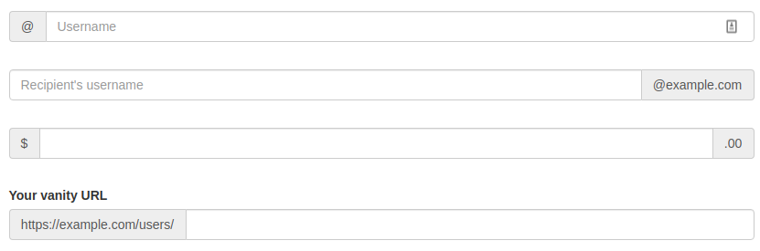

# Custom Input

Shiny comes with a variety of inputs ranging from buttons to text fields, these inputs send data from the client to the R server. Custom inputs are in fact no different than from shiny's out-of-the-box inputs, they work very much the same way.

To explain and demonstrate how to build such a custom input we shall build a somewhat more sophisticated of shiny's `textInput` using Bootstrap 3 input group addons which allow placing content before or after the text field.



## Custom Inputs Inner-workings

Shiny inputs consist of a single R function, e.g.: `selectInput` which generates the HTML.

```r
shiny::textInput("theId", "The label")   
```

```html
<div class="form-group shiny-input-container">
  <label class="control-label" for="theId">The label</label>
  <input id="theId" type="text" class="form-control" value=""/>
</div>
```

## Generate HTML Input
