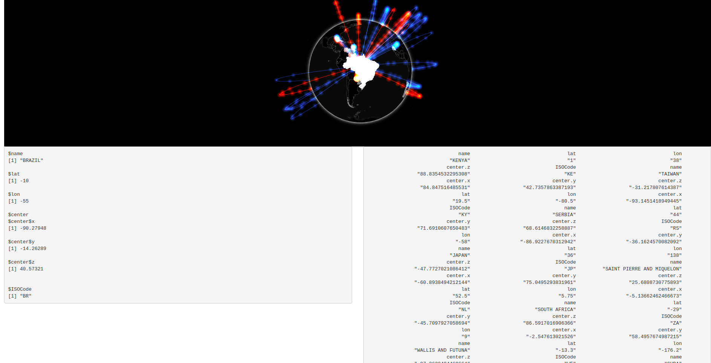
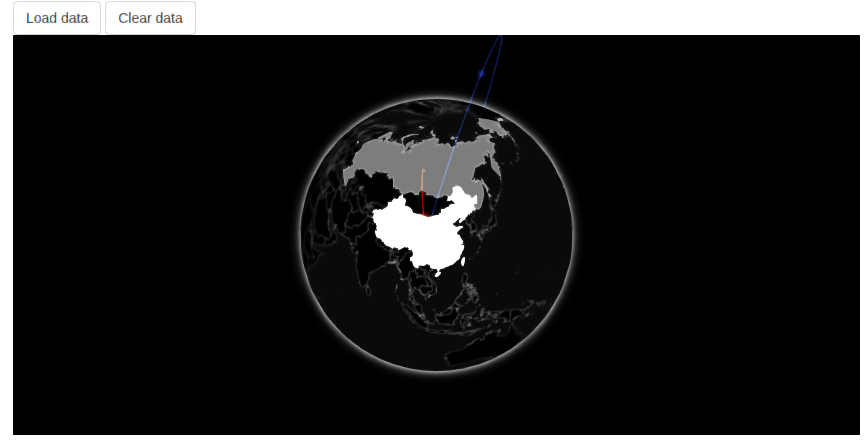

# Widgets with Shiny

We have seen how to make JavaScript and R communicate in shiny applications by passing data from the server to the client and back. This chapter explores how to apply that to htmlwidgets so they can provide additional functionalities when used in Shiny applications. 

To demonstrate how to integrate these functionalities in widgets we shall implement them in the previously built gio package.

## JavaScript to R 

JavaScript visualisation libraries will often include callbacks or events that are triggered when the user interacts with the visualisation so one can have arbitrary code run when, for example, a user clicks a point on a scatter plot, or when the user clicks the legend of a chart. Gio.js provides a callback that is fired when a country is selected on the globe, this callback function accepts two objects, one containing data on the country selected and another containing data on the related countries (the arcs coming and leaving the selected country). These could send back to the R server where they could be used for many things like fetching more data on the selected country from a database, or use that information to generate a shiny UI element like displaying the flag of the selected country, and much, much more.

The [documentation of gio.js](https://giojs.org/html/docs/callbackPicked.html) gives the following example callback function.

```js
// define callback function
function callback (selectedCountry, relatedCountries) {
  sel_handle.set([selectedCountry.ISOCode])
  console.log(selectedCountry);
  console.log(relatedCountries);
}

// use callback function
controller.onCountryPicked(callback);
```

This defines a function named `callback` which takes the two aforementioned objects and logs them in the JavaScript console. Then the function is passed to the `controller` which will run it every time a country is picked (selected). This can be incorporated into the widget where instead of logging the data in the console it could be used to define two different shiny inputs. 

```js
// gio.js
// define callback function
function callback (selectedCountry, relatedCountries) {
  sel_handle.set([selectedCountry.ISOCode])
  Shiny.setInputValue('selected', selectedCountry);
  Shiny.setInputValue('related', relatedCountries);
}
```

However, this will generate an issue experienced in a previous chapter; multiple gio visualisations in a single shiny application would be defining the values of a single input. This can be remedied to by using the id of the visualisation to dynamically generate the input name.

```js
renderValue: function(x) {

  var controller = new GIO.Controller(el);
  controller.addData(x.data);
  controller.setStyle(x.style);

  // callback
  function callback (selectedCountry, relatedCountries) {
    sel_handle.set([selectedCountry.ISOCode])
    Shiny.setInputValue(el.id + '_selected', selectedCountry);
    Shiny.setInputValue(el.id + '_related', relatedCountries);
  }

  controller.onCountryPicked(callback);

  // render
  controller.init();

}
```

The package can then be installed with `devtools::install` so we can test these inputs in a shiny application.

```r
library(gio)
library(shiny)

# large sample data
url <- paste0(
  "https://raw.githubusercontent.com/JohnCoene/",
  "javascript-for-r/master/data/countries.json"
)
arcs <- jsonlite::fromJSON(url)

ui <- fluidPage(
  gioOutput("globe"),
  fluidRow(
    column(6, verbatimTextOutput("selectedCountry")),
    column(6, verbatimTextOutput("relatedCountries"))
  )
)

server <- function(input, output){

  output$globe <- renderGio({
    gio(arcs)
  })

  output$selectedCountry <- renderPrint({
    print(input$globe_selected)
  })

  output$relatedCountries <- renderPrint({
    print(input$globe_related)
  })

}

shinyApp(ui, server)
```



One thing to note before moving on, the data is sent from the client to the server whether the inputs are used or not, though this likely will not negatively impact gio it can reduce performances if the callback function is triggered too frequently. For instance an input value set when the user hovers a scatter plot might lead to the event being fired very frequently and too much data being sent to the server, slowing things down and providing a poor experience.

Therefore one might consider making the capture of such event optional so the web browser is not strained unless explicitly asked by the developer of the application. This could be implemented with a simple function that sets a simple logical variable in the `x` object that is used in JavaScript to check whether to implement the callback function.

```r
#' @export
gio_capture_events <- function(g) {
  g$x$capture_events <- TRUE
  return(g)
}
```

Then this could be used in JavaScript with an if statement.

```js
if(x.capture_events)
  controller.onCountryPicked(callback);
```

One might also consider not sending back all the data. For instance, gio returns the coordinates of the selected country where from arcs connect; this is might be considered unnecessary. The code below only sets the input to the ISO code of the country selected.

```js
function callback (selectedCountry, relatedCountries) {
  Shiny.setInputValue(el.id + '_selected', selectedCountry.ISOCode);
}
```

## Input Handler 

While input handlers were explored previously we found limited use for them as these were set to simple boolean values for which a preprocessor made little sense. It can be useful in this case as the inputs return more substantial data. Namely the input returning data on the related countries, it is converted from JSON to a list but could be reshaped to a data frame of arcs (looking like `gio`'s input data).

Below we create a handler that is going to loop over the list (over each arc) and return a data frame.

```r
# handler.R
related_countries_handler <- function(x, session, inputname){
  purrr::map_dfr(x, as.data.frame)
}
```

Then the handler must be registered with shiny, since handlers can only be registered once a good place to put it this is in the `.onLoad` function of the package.

```r
# zzz.R
related_countries_handler <- function(x, session, inputname){
  purrr::map_dfr(x, as.data.frame)
}

.onLoad <- function(libname, pkgname) {
  shiny::registerInputHandler("gio.related.countries", related_countries_handler)
}
```

Finally, we can reinstall the package with `devtools::install` and create shiny application to observe the change. Below we use a large example dataset and, since the input now returns a data frame, we can display the input value in a table.

```r
library(DT)
library(gio)
library(shiny)

# large sample data
url <- paste0(
  "https://raw.githubusercontent.com/JohnCoene/",
  "javascript-for-r/master/data/countries.json"
)
arcs <- jsonlite::fromJSON(url)

ui <- fluidPage(
  gioOutput("globe"),
  DTOutput("relatedCountries")
)

server <- function(input, output){

  output$globe <- renderGio({
    gio(arcs)
  })

  output$relatedCountries <- renderDT({
    datatable(input$globe_related)
  })

}

shinyApp(ui, server)
```


## R to JavaScript 

This book previously explored how to send data from the shiny server to the front-end, this section applies this to htmlwidgets. Currently, using gio in shiny consists of generating the globe with the `renderGio` and complimentary `gioOutput` functions. This generates the entire visualisation, it creates the HTML element where it places the globe, draws the arcs based on the data, sets the style, etc.

Now imagine that only one of those aspects needs changing, say the data, or the style, given the functions currently at hand one would have to redraw the entire visualisation, only this time changing the data or the style. This is inelegant and not efficient, most JavaScript visualisation libraries, including gio.js, will enable changing only certain aspects of the output without having to redraw it all from scratch.

Before we look into the implementation, let us create a shiny application which would benefit from such a feature. The shiny application below provides a drop-down menu to select between two datasets to draw on the globe, running it reveals an issue with gio though. Upon selecting a dataset with the drop down a second globe appears underneath the original one. This is because internally gio.js creates a new element (`<canvas>`) within the `<div>` created by `htmlwidgets` when running `init` regardless of whether one was already created. Therefore, every call to `init` creates a new `<canvas>` with a different globe. Note that most visualisation libraries _will not have that issue_, they will detect the existing output and override it instead.

```r
library(gio)
library(shiny)

arcs1 <- data.frame(
  e = c("US", "CN", "RU"),
  i = c("CN", "RU", "US"),
  v = c(100, 120, 130)
)

arcs2 <- data.frame(
  e = c("CN", "CN", "JP"),
  i = c("IN", "JP", "US"),
  v = c(100, 120, 130)
)

ui <- fluidPage(
  selectInput(
    "dataset", 
    "Select a dataset", 
    choices = c("First", "Second")
  ),
  gioOutput("globe")
)

server <- function(input, output){

  reactive_arcs <- reactive({
    if(input$dataset == "First") 
      return(arcs1)
    return(arcs2)
  })

  output$globe <- renderGio({
    gio(reactive_arcs())
  })

}

shinyApp(ui, server)
```


A solution to this is to ensure the container (`el`) is empty before generating the visualisation. Incidentally this can be executed with a JavaScript method previously used in this book: `innerHTML`.

```js
// gio.js
el.innerHTML = ''; // empty el
controller = new GIO.Controller(el);
```

Now, using the dropdown to switch between dataset does not generate a new visualisation.

We got sidetracked but this had to be fixed. Ideally, when the user selects a dataset from the dropdown the entire visualisation is not redrawn, only the underlying data (the arcs) changes. To do so, a new set of functions divorced from the ones currently at hand needs to be created. This separation will allow leaving the already created functions as-is, using `gio` and its corresponding `renderValue` JavaScript function to initialise a visualisation, and have a separate family of functions dedicated to working with different JavaScript functions which circumvent `renderValue` and directly change aspects of the visualisation, such as the underlying dataset.

This involves a few moving parts, thankfully some of them were already explored, just not in the context of htmlwidgets. The scheme is to send data from R to JavaScript using the formerly exploited `session$sendCustomMessage`, then in JavaScript fetch the instance of the visualisation (`controller` in the case of gio) to interact with it (`e.g.: controller.addData(data);`).

### Send Data 

Let's start by creating the R function used to send data to JavaScript. This is hopefully reminiscent of a previous chapter, this function sends a message to JavaScript where it is paired with "message handler" that does something with said message.

```r
#' @export
gio_send_data <- function(id, data, session = shiny::getDefaultReactiveDomain()){
  message <- list(id = id, data = data)
  session$sendCustomMessage("send-data", message)
}
```

The function takes the id of the visualisation the data is destined for, the data object itself, and a shiny session used to send the data. The id of the visualisation is sent as part of the message and will be used to retrieve the instance of the visualisation and subsequently apply the new dataset. Note that we give this message the `send-data` identifier, this will be needed when we write its handler.

There is one caveat that will make it such that the above will not work. To have gio.js work with data changes had to be made to the serialiser (using the `TOJSON_ARGS` attribute), this cannot be used here. The data being sent with Shiny via the session object the problem reoccurs: shiny, like htmlwidgets, serialises data frames column-wise and not row-wise. One can preview the way shiny serialises with `shiny:::toJSON` (three-colon).

```{r}
# preview shiny serialisation
shiny:::toJSON(arcs)
```

Unfortunately this serialiser cannot be changed, therefore we have to reformat the data to a list which resembles the JSON output desired, using `apply` to turn every row into a list will do the job in most cases.

```r
#' @export
gio_send_data <- function(id, data, session = shiny::getDefaultReactiveDomain()){
  message <- list(id = id, data = apply(data, 1, as.list))
  session$sendCustomMessage("send-data", message)
}
```

### Retrieve Widget Instance 

We will need to be able to access the instance of the visualisation (`controller`) outside of the function `factory`. This can be made accessible by adding a function (technically a method) that returns the `controller`. Below we create a function called `getGlobe` which returns the `controller`.

```js
HTMLWidgets.widget({

  name: 'gio',

  type: 'output',

  factory: function(el, width, height) {

    var controller;

    return {

      renderValue: function(x) {

        el.innerHTML = '';
        controller = new GIO.Controller(el);
        
        // add data
        controller.addData(x.data);

        controller.setStyle(x.style);

        // callback
        controller.onCountryPicked(callback);

        function callback (selectedCountry, relatedCountries) {
          Shiny.setInputValue(el.id + '_selected', selectedCountry);
          Shiny.setInputValue(el.id + '_related:gio.related.countries', relatedCountries);
        }

        // render
        controller.init();

      },

      resize: function(width, height) {

        controller.resizeUpdate()

      },

      // add getGlobe to retrieve controller
      getGlobe: function(){
        return controller;
      }

    };
  }
});
```

Then, anywhere in the `gio.js` file, we create a function which uses `HTMLWidgets.find` to retrieve the instance of the htmlwidgets, it takes a selector as input. We concatenate the pound sign to select the widget based its id (`#id`, `.class`). This in effect returns an object which includes all the functions returned by the `factory` function: `renderValue`, `resize`, and `getGlobe`. We can therefore use the `getGlobe` method available from that object to retrieve the actual `controller`.

```js
// gio.js
function get_gio(id){
  var widget = HTMLWidgets.find("#" + id);
  var globe = widget.getGlobe();
  return globe;
}
```

### Handle Data 

We can now turn the attention to actually applying the data sent from the R server to the visualisation: the "message handler." Registering the message handler is only relevant if shiny is running, therefore HTMLWidgets comes with a function to check whether that is the case which is useful to avoid needless errors. We can thus use it in an if statement in which all message handlers will be registered.

```js
// gio.js

// check if shiny running
if (HTMLWidgets.shinyMode){

  // send-data message handler
  Shiny.addCustomMessageHandler(type = 'send-data', function(message) {

  });

}
```

What the currently empty `send-alert` message handler should do is fetch the widget using the `id` sent from R with the `get_gio` function and then use the `addData` method to override the previously define arcs.

```js
// gio.js

// check if shiny running
if (HTMLWidgets.shinyMode){

  // send-data message handler
  Shiny.addCustomMessageHandler(type = 'send-data', function(message) {

    // retrieve controller
    var controller = get_gio(message.id);

    // add data
    controller.addData(message.data);

  });

}
```

We can then build a shiny application to test the new functionality.

```r
library(gio)
library(shiny)

# two phoney datasets
arcs1 <- data.frame(
  e = c("US", "CN", "RU"),
  i = c("CN", "RU", "US"),
  v = c(100, 120, 130)
)

arcs2 <- data.frame(
  e = c("CN", "CN", "JP"),
  i = c("IN", "JP", "US"),
  v = c(100, 120, 130)
)

ui <- fluidPage(
  selectInput(
    "dataset", 
    "Select a dataset", 
    choices = c("First", "Second")
  ),
  gioOutput("globe")
)

server <- function(input, output){

  reactive_arcs <- reactive({
    if(input$dataset == "First") 
      return(arcs1)
    return(arcs2)
  })

  output$globe <- renderGio({
    gio(arcs1)
  })

  observeEvent(input$dataset, {
    if(input$dataset == "First")
      data <- arcs1
    else
      data <- arcs2
    
    gio_send_data("globe", data)
  })

}

shinyApp(ui, server)
```

Switching dataset with the dropdown only changes the data, it makes for a much smoother animation, even the difference in the speed at which the effect is visible on the visualisation is perceivable.

## Proxy Function 

Before we add other similar functions we ought to pause and consider the API this provides the user. There are two points, every function such as `gio_send_data`, will need to accept the `id` and `session` arguments. It will be tedious to so every time, following the old "don't repeat yourself" adage we ought to abstract this further. 

This can be remedied to by introducing what is often referred to as a "proxy." A proxy is just a representation of the graph, or pragmatically, an object that contains the id of the visualisation and a shiny session. This object can subsequently be piped to other functions thereby providing not only a cleaner but also a more consistent API. 

```r
#' @export
gio_proxy <- function(id, session = shiny::getDefaultReactiveDomain()){
  list(id = id, session = session)
}
```

Above we create a function called `gio_proxy` which takes the `id` of the chart one wants to build a proxy off, as well as the shiny `session`, they are returned in the form of a list. Next, we should adapt the `gio_send_data` so that it accepts the output of `gioProxy` instead of the `id` and `session` as done previously. In order to allow chaining such functions we also make sure it returns the `proxy` object.

```r
#' @export
gio_send_data <- function(proxy, data){
  message <- list(id = proxy$id, data = apply(data, 1, as.list))
  proxy$session$sendCustomMessage("send-data", message)
  return(proxy)
}
```

## Clear Data 

In order to actively demonstrate the advantage of the "proxy" function as well as to hammer home how such functions work, we shall build another which removes all data from the globe. In JavaScript it's as simple as `controller.clearData();`.

The journey starts with the R code where we create a new function that sends a message to clear the data, the message only needs to contain the id of the visualisation from which data needs to be cleared, as before it will be used to retrieve the `controller` from which the `clearData` method is available. 

```r
#' @export
gio_clear_data <- function(proxy){
  message <- list(id = proxy$id)
  proxy$session$sendCustomMessage("clear-data", message)
  return(proxy)
}
```

Now onto the JavaScript code to catch that message and actually clear the data from the globe. That function is very similar to what was previously shown, the only difference is the name of the message handler and the method used on the controller.

```js
// gio.js
Shiny.addCustomMessageHandler(type = 'clear-data', function(message) {
  var controller = get_gio(message.id);
  controller.clearData();
});
```

Then one can build an application to test that new function. We build a shiny application with a button to add the data to the visualisation and another to clear data from it.

```r
library(gio)
library(shiny)

# phoney dataset
arcs <- data.frame(
  e = c("US", "CN", "RU"),
  i = c("CN", "RU", "US"),
  v = c(100, 120, 130)
)

ui <- fluidPage(
  actionButton("load", "Load data"),
  actionButton("clear", "Clear data"),
  gioOutput("globe")
)

server <- function(input, output){

  output$globe <- renderGio({
    gio(arcs)
  })

  observeEvent(input$load, {
    gio_proxy("globe") %>% 
      gio_send_data(arcs)
  })

  observeEvent(input$clear, {
    gio_proxy("globe") %>% 
      gio_clear_data()
  })

}

shinyApp(ui, server)
```



## Update 

The previous proxies defined worked for reasons unbeknownst to the author of this book. It will not work with all methods. The reason it will not work is one that is likely to occur with many other visualisation libraries. For instance, one can attempt to develop a function to dynamically change the style without having to redraw the entire globe, starting again with the R function.

```r
#' @export
gio_set_style <- function(proxy, style){
  message <- list(id = proxy$id, style = style)
  proxy$session$sendCustomMessage("set-style", message)
  return(proxy)
}
```

Then adding the JavaScript handler.

```js
Shiny.addCustomMessageHandler(type = 'set-style', function(message) {
  var controller = get_gio(message.id);
  controller.setStyle(message.style);
});
```

At this stage one can try the function in a shiny application but it will not work because most such methods that change underlying aspects of a visualisation will not be reflected in real time. Gio.js, and many other libraries, will require one to explicitly ask for an update so the changes take effect. This has multiple advantages, one can stack multiple visual changes to execute them at the same time, and one can manage the load on the front-end. 

```js
Shiny.addCustomMessageHandler(type = 'set-style', function(message) {
  var controller = get_gio(message.id);
  controller.setStyle(message.style);
  controller.update(); // force update the visualisation
});
```

This forces the chart to update, applying the new style. Below we write an application that provides a dropdown to switch between two styles.

```r
library(gio)
library(shiny)

# two phoney datasets
arcs <- data.frame(
  e = c("US", "CN", "RU"),
  i = c("CN", "RU", "US"),
  v = c(100, 120, 130)
)

ui <- fluidPage(
  selectInput(
    "style", 
    "Select a style", 
    choices = c("blueInk", "earlySpring")
  ),
  gioOutput("globe")
)

server <- function(input, output){
  output$globe <- renderGio({
    gio(arcs1)
  })

  observeEvent(input$style, {
    gio_proxy("globe") %>% 
      gio_set_style(input$style)
  })

}
shinyApp(ui, server)
```


