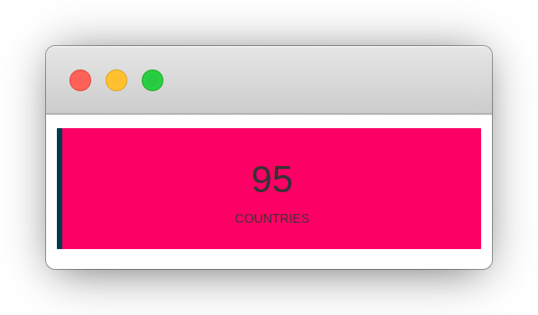

# Custom Outputs {#shiny-output}

In this chapter, we create a custom shiny output; in practical terms, this creates custom `render*` and `*Output` functions to use in Shiny. This will be demonstrated by creating something akin to the `valueBox` available in the shinydashboard [@R-shinydashboard] package. While similar to what shinydashboard provides this box will 1) be fully customisable and 2) available in any shiny application 3) have additional functionalities. 

The `valueBox` equivalent we shall build in this chapter is named "boxxy," and allows creating simple but colourful value boxes with animated numbers (by counting up to it) using [countUp.js](https://github.com/inorganik/countUp.js).

```r
library(shiny)

ui <- fluidPage(
  boxxyOutput("countries")
)

server <- function(input, output){
  output$countries <- renderBoxxy({
    boxxy("Countries", 95)
  })
}

shinyApp(ui, server)
```

```{r boxxy-example, fig.pos="H", echo=FALSE, fig.cap='Custom output example'}

```

## Inner-workings {#shiny-output-inner-workings}

At the core, this consists in creating three functions; `boxxy`, `renderBoxxy` and `boxxyOutput` (analogous to `plot`, `renderPlot`, `plotOutput`) which are linked by an "output binding" in JavaScript. 

The first function, `boxxy` will accept arguments that help define what is in the box. This function is generally useful to preprocess any of the arguments that are meant to produce the custom output. The `boxxyOutput` function essentially creates the scaffold of the HTML output (e.g.: `<div>`) as well as the dependencies. The `render*` function is perhaps more peculiar it should accept an expression and return a function.

Previous work with shiny and JavaScript covered in this book had no dedicated "output" element that were placed in the shiny UI. Therefore one had to use a function solely dedicated to importing the dependencies (e.g.: `usejBox`). However, since this is not the case here, the dependencies can be attached together with the output.

Finally, the two R functions are "bound" JavaScript-side with an "output binding" that renders the data from the `render*` function with its `*output`.

## Setup {#shiny-output-setup}

The custom output will be part of a shiny application, let us thus create the basic skeleton of an application and download the dependencies. Create a project in RStudio or an empty directory, then:

1. Create an `app.R` file that will hold the code for the application and `boxxy`, `boxxyOutput`, and `renderBoxxy` functions
2. Create an `assets` directory that will contain the CSS and JavaScript files.
3. Download the countUp.js dependency.
4. Create a `binding.js` JavaScript file for the JavaScript binding within the previously created `assets` directory.
5. Create a `styles.css` file in the `assets` directory.

```r
# application file
file.create("app.R")

# static file directory
dir.create("assets")

# countup dependency
url <- paste0(
  "https://cdn.jsdelivr.net/npm/",
  "countup@1.8.2/countUp.js"
)

download.file(url, "assets/countup.js")

# create binding file
file.create("assets/binding.js")

# CSS file
file.create("assets/styles.css")
```

This should produce the following directory structure.

```
.
├── app.R
└── assets
    ├── binding.js
    ├── countup.js
    └── styles.css
```

## Output R Function {#shiny-output-r-fun}

The `boxxy` function takes three arguments, a `title`, a `value` that will be animated and the background `color` to use for the box. The function, at this stage at least, does not preprocess the arguments and returns them as a named `list`.

```r
# app.R
library(shiny)

boxxy <- function(title, value, color = "#ef476f"){
  list(title = title, value = value, color = color)
}
```

## Generate Output HTML {#shiny-output-html}

The `boxxyOutput` function, like all such functions (`plotOutput`, `uiOutput`, etc.) takes an `id`. This function should return an HTML tag which bears an `id`, or a `data-input-id` attribute (more on that later) and a `class`. The `id` is to be defined by the user of the function in Shiny just like any other such outputs. For instance, `plotOutput` creates a `<div>` the `id` of which is actually the `id` used in the `plotOutput` function.

```r
# the id is used as id to the element
shiny::plotOutput(id = "myPlotId")
```

```html
<div 
  id="myPlotId" 
  class="shiny-plot-output" 
  style="width: 100% ; height: 400px">
</div>
```

The `class` is used JavaScript-side to "find" the outputs in the DOM (document object model) and generate the output. The function `boxxyOutput` could thus be as shown below, the `id` is passed along to the `<div>` which is created with a `boxxy` class that will be used in the output binding to find that element and generate the output within that very `<div>` using data that will be passed from the server.

```r
boxxyOutput <- function(id){
  # the HTML output
  shiny::tags$div(
    id = id, class = "boxxy"
  )
}
```

```{block, type='rmdnote'}
Make sure you use unique class names so they are not accidentally overridden by the user.
```

As shown the box should include a title and an animated value. These could be generated entirely in JavaScript but it's actually easier to create placeholders with htmltools tags, we generate dynamic ids for those so they can easily be referenced later on in JavaScript: `id-boxxy-value` for the value and `id-boxxy-title` for the title.

```r
boxxyOutput <- function(id){
  # the HTML output
  shiny::tags$div(
    id = id, class = "boxxy",
    h1(
      id = sprintf("%s-boxxy-value", id), 
      class = "boxxy-value"
    ),
    p(
      id = sprintf("%s-boxxy-title", id), 
      class = "boxxy-title"
    )
  )
}
```

Finally, we also used classes in the output so every element it comprises can be styled with ease.

```css
.boxxy{
  text-align: center;
  border-left: 6px solid #073b4c;
  padding: 1em;
}

.boxxy-title{
  text-transform: uppercase;
}

.boxxy-value{
  font-size: 3em;
}
```

The dependencies should be added to the above, since this function must be placed in the UI for anything to work the dependencies can piggyback on the output element. This works using the htmltools package. The function `htmltools::htmlDependency` is used to create a dependency that is then attached with `htmltools::attachDependencies`. While the former creates an object that shiny can understand and translate into `<script>` or `<style>` tags, the former attaches them to the output object and ensures dependencies are not imported multiple times (e.g.: when `boxxyOutput` is used more than once).

Notice the use of `normalizePath` to retrieve the full path to the `assets` directory as this will not work with a relative path (e.g.: `./assets`). The dependencies consist of the three files previously created and necessary to generate the output: `countup.js` the dependency that was downloaded as well as `binding.js` and `styles.css`. 

```r
boxxyOutput <- function(id){
  el <- tags$div(
    id = id, class = "boxxy",
    h1(
      id = sprintf("%s-boxxy-counter", id), 
      class = "boxxy-value"
    ),
    p(
      id = sprintf("%s-boxxy-title", id), 
      class = "boxxy-title"
    )
  )

  # get full path
  path <- normalizePath("assets")

  deps <- list(
    htmltools::htmlDependency(
      name = "boxxy",
      version = "1.0.0",
      src = c(file = path),
      script = c("countup.js", "binding.js"),
      stylesheet = "styles.css"
    )
  )

  htmltools::attachDependencies(el, deps)
}
```

Running the function reveals the HTML it generates at the exception of the dependencies which htmltools does not print to the console.

```r
boxxyOutput("myID")
```

```html
<div id="myID" class="boxxy">
  <h1 id="myID-boxxy-counter" class="boxxy-value"></h1>
  <p id="myID-boxxy-title" class="boxxy-title"></p>
</div>
```

## Output Renderer {#shiny-output-renderer}

The function `renderBoxxy` should accept an expression, like other such `render*` function. For instance in the example below the `renderPlot` function does accept an expression which uses, amongst other functions, `plot`.

```r
output$myPlot <- renderPlot({
  # this is an expression
  cars %>% 
    head() %>% 
    plot()
})
```

The function `renderBoxxy` takes an expression and other arguments that are passed to `shiny::exprToFunction` this does pretty much what it says on the tin: it returns a function from an expression (unless that expression is a function, in which case it returns the expression). This function must be further wrapped in another as render functions must return functions.

```r
renderBoxxy <- function(expr, env = parent.frame(), 
  quoted = FALSE) {
  # Convert the expression + environment into a function
  func <- shiny::exprToFunction(expr, env, quoted)

  function(){
    func()
  }
}
```

## JavaScript Output Binding {#shiny-output-binding}

Here we create an "output binding," it tells Shiny how to find the component and how to interact with it. An output binding is initialised from `Shiny.OutputBinding`. Below we initialise a new binding.

```js
// custom.js
var boxxyBinding = new Shiny.OutputBinding();
```

Then, this must be "extended" by specifying a number of methods, an essential one being `find`. It is used to look for the output HTML element in the document (`scope`), and return them as an array (`HTMLcollection`). Other methods all take an `el` argument; that value will always be an element that was returned from `find`. A very straightforward way to accomplish this is to use jQuery’s find method to identify elements with the `boxxy` class used in `boxxyOutput`. You are by no means forced to use a CSS class to identify the elements but there is no reason not to.

```js
// custom.js
var boxxyBinding = new Shiny.OutputBinding();

$.extend(boxxyBinding, {
  find: function(scope) {
    return $(scope).find(".boxxy");
  }
});
```

One might then want to use the `getId` method which returns the `id` of the element, by default, as can be seen in the [source code](https://github.com/rstudio/shiny/blob/master/srcjs/output_binding.js) (below), the binding returns the id as the `data-input-id` attribute, and if that is falsy it returns the element's `id`.

```js
// getId default
this.getId = function(el) {
  return el['data-input-id'] || el.id;
}
```

Since boxxy uses the element id the default will work and this can be skipped entirely. 

Next, one needs to implement the `renderValue` function which is the same function that generates the output based on data used in `boxxy` and sent to the front-end with `renderBoxxy`. The `renderValue` method accepts two arguments, first `el` the element where the output should be generated, this is effectively the output of `boxxyOutput` which the binding found using `find`, the second argument is `data` which is the data passed to `boxxy` and serialised via `renderBoxxy`. 

```{block, type='rmdnote'}
The `renderValue` is in effect very similar if not identical to the JavaScript function of the same name involved in creating htmlwidgets.
```

### Boxxy Title {#shiny-output-boxxy-title}

Let us now tackle the first of the three core aspect of the boxxy output: the title. The `title` should be placed in the previously created placeholder which bears the `id-boxxy-title`; precisely as was done with htmlwidgets previously we insert title (`data.title`) in the element with `innerText`. The dynamically generated id for the title is built in the same way it is in R, by concatenating the `id` with `-boxxy-title`

- In R `sprintf("%s-boxxy-title", id)`
- In JavaScript `el.id + '-boxxy-title'`

```js
var boxxyBinding = new Shiny.OutputBinding();

$.extend(boxxyBinding, {
  find: function(scope) {
    return $(scope).find(".boxxy");
  },
  renderValue: function(el, data) {

    // insert the title
    let title_id = el.id + '-boxxy-title';
    document.getElementById(title_id).innerText = data.title
  }
});
```

### Boxxy Value {#shiny-output-boxxy-value}

Though the custom output could be limited to a static value generated in a fashion similar to how the title is placed, we opted for a more fancy animated value using countUp.js. 

Initialise a new counter, specifying the id of the element where it should be created, then as second argument the starting value from which the counter should start and finally the value to count up to. Note that there is a fourth argument to pass a JSON of options which we do not use here.

```js
// place counter in elementId
// start at 0 and count up to 123
const counter = new CountUp('elementId', 0, 123);
counter.start();
```

The counter has to be generated in the `<h1>` placeholder bearing the `id-boxxy-value`, while the value to count up to is stored in `data.value` meaning the counter can be initialised with `new CountUp(el.id + '-boxxy-value', 0, data.value);`.

```js
var boxxyBinding = new Shiny.OutputBinding();

$.extend(boxxyBinding, {
  find: function(scope) {
    return $(scope).find(".boxxy");
  },
  renderValue: function(el, data) {

    // insert the title
    let title_id = el.id + '-boxxy-title';
    document.getElementById(title_id).innerText = data.title

    // counter start at 0
    let counter_id = el.id + '-boxxy-value';
    var counter = new CountUp(counter_id, 0, data.value);
    counter.start();
  }
});
```

### Boxxy Background Color {#shiny-output-boxxy-bg-color}

Then we can set the background color that was passed to `boxxy` (`data.color`).

```js
var boxxyBinding = new Shiny.OutputBinding();

$.extend(boxxyBinding, {
  find: function(scope) {
    return $(scope).find(".boxxy");
  },
  renderValue: function(el, data) {

    // insert the title
    let title_id = el.id + '-boxxy-title';
    document.getElementById(title_id).innerText = data.title

    // counter start at 0
    let counter_id = el.id + '-boxxy-value';
    var counter = new CountUp(counter_id, 0, data.value);
    counter.start();

    // background color 
    el.style.backgroundColor = data.color;
  }
});
```

### Register the Output Binding {#shiny-output-register}

Finally, the output binding must be registered with shiny. Note that it uses a unique string identifier, the [documentation](https://shiny.rstudio.com/articles/building-outputs.html) states:

> At the moment it is unused but future features may depend on it.

```js
var boxxyBinding = new Shiny.OutputBinding();

$.extend(boxxyBinding, {
  find: function(scope) {
    return $(scope).find(".boxxy");
  },
  renderValue: function(el, data) {

    // insert the title
    let title_id = el.id + '-boxxy-title';
    document.getElementById(title_id).innerText = data.title

    // counter start at 0
    let counter_id = el.id + '-boxxy-value';
    var counter = new CountUp(counter_id, 0, data.value);
    counter.start();

    // background color 
    el.style.backgroundColor = data.color;
  }
});

// register
Shiny.outputBindings.register(boxxyBinding, "john.boxxy");
```

Ensure that string uniquely identifies the binding to avoid future clash with other such bindings.

## Boxxy Usage {#shiny-output-usage}

With all of this in place one can use boxxy in a shiny application.

```r
library(shiny)

boxxy <- function(title, value, color = "black"){
  list(title = title, value = value, color = color)
}

boxxyOutput <- function(id){
  el <- shiny::tags$div(
    id = id, class = "boxxy",
    h1(id = sprintf("%s-boxxy-value", id), class = "boxxy-value"),
    p(id = sprintf("%s-boxxy-title", id), class = "boxxy-title")
  )

  path <- normalizePath("assets")

  deps <- list(
    htmltools::htmlDependency(
      name = "boxxy",
      version = "1.0.0",
      src = c(file = path),
      script = c("countup.js", "binding.js"),
      stylesheet = "styles.css"
    )
  )

  htmltools::attachDependencies(el, deps)
}

renderBoxxy <- function(expr, env = parent.frame(), 
  quoted = FALSE) {
  # Convert the expression + environment into a function
  func <- shiny::exprToFunction(expr, env, quoted)

  function(){
    func()
  }
}

ui <- fluidPage(
  h2("Custom outputs"),
  fluidRow(
    column(
      3, boxxyOutput("countries")
    ),
    column(
      3, boxxyOutput("employees")
    ),
    column(
      3, boxxyOutput("customers")
    ),
    column(
      3, boxxyOutput("subs")
    )
  )
)

server <- function(input, output){
  output$countries <- renderBoxxy({
    boxxy("Countries", 95, color = "#ef476f")
  })

  output$employees <- renderBoxxy({
    boxxy("Thing", 650, color = "#06d6a0")
  })

  output$customers <- renderBoxxy({
    boxxy("Customers", 13592, color = "#118ab2")
  })

  output$subs <- renderBoxxy({
    boxxy("Subscriptions", 16719, color = "#ffd166")
  })
}

shinyApp(ui, server)
```

```{r boxxy-custom, fig.pos="H", echo=FALSE, fig.cap='Shiny application with boxxy'}
knitr::include_graphics("images/custom-output-boxxy.png")
```

## Injecting Dependencies {#shiny-output-inject}

We could consider making the animation of the value rendered with `boxxy` optional; some users may not want to use it. You might already imagine how a new argument and a few if statements could very quickly do the job, but how would one handle the dependency? Indeed if users do not want to make use of the animation, the CountUp.js dependency should also be excluded so as to keep the output as light as possible.

The dependency is currently attached in the `boxxyOutput` function which does not take any argument, it could, but it would make for the rather messy and confusing interface as whatever additional argument that indicates whether the numbers should be animated would have to be specified twice, once in the `boxxyOutput` function, so it does not import the dependency as well as in the `boxxy` function in order to serialise that parameter, so the JavaScript binding does not run the animation function.

```r
# pseudo code
# do not do this
library(shiny)

ui <- fluidPage(
  boxxyOutput(
    "countries", 
    # do not import dependency
    animate = FALSE
  )
)

server <- function(input, output){
  output$countries <- renderBoxxy({
    # do not animate the numbers
    boxxy("Countries", 95, animate = FALSE)
  })
}

shinyApp(ui, server)
```

Thankfully there is a better way, combining htmltools and shiny to insert the dependency dynamically from JavaScript.

The `boxxy` function needs to take an additional argument `animate` which is passed to the output list. This will be used in the `render` function (and JavaScript binding) to render the dependency dynamically.

```r
boxxy <- function(title, value, color = "black", animate = TRUE){
  list(
    title = title, value = value, color = color, animate = animate
  )
}
```

The `boxxyOutput` function can be slightly simplified, it currently attaches the `countup.js` dependency which needs to be removed.

```r
boxxyOutput <- function(id){
  el <- shiny::tags$div(
    id = id, class = "boxxy",
    h1(id = sprintf("%s-boxxy-value", id), class = "boxxy-value"),
    p(id = sprintf("%s-boxxy-title", id), class = "boxxy-title")
  )

  path <- normalizePath("assets")

  # only attach binding.js
  deps <- list(
    htmltools::htmlDependency(
      name = "boxxy",
      version = "1.0.0",
      src = c(file = path),
      script = c("binding.js"),
      stylesheet = "styles.css"
    )
  )

  htmltools::attachDependencies(el, deps)
}
```

The `renderBoxxy` function sees quite some modifications, while before it was technically only returning a function that itself returned the output of `boxxy` (`func() == boxxy()`). Here we want to capture the output of `boxxy` to check whether the `animate` element is `TRUE` and if so, add the dependency.

```r
renderBoxxy <- function(expr, env = parent.frame(), 
  quoted = FALSE) {
  # Convert the expression + environment into a function
  func <- shiny::exprToFunction(expr, env, quoted)

  function(){
    val <- func()

    if(val$animate){
      # add dependency
    }

    return(val)
  }
}
```

Within the `if` statement, the dependency can be created with the htmltools as done for the binding. Ensure the names of the dependencies are unique as shiny internally uses it to differentiate between them if they bear the same name shiny assumes they are the same and will only render one of them.

```{block, type='rmdnote'}
Make sure dependencies bear different names or shiny thinks it's the same and only renders one of them. 
```

The dependency generated with htmltools is then passed to the `shiny::createWebDependency` function, which internally uses `shiny::addResourcePath` to serve the dependency. This is necessary here as, at this stage, the countup dependency is not actually rendered; below we merely add it to the list of options that serialised to JSON. Indeed this will actually be injected JavaScript-side. Therefore the front-end needs to be able to access this file, hence it is served.

```r
renderBoxxy <- function(expr, env = parent.frame(), 
  quoted = FALSE) {
  # Convert the expression + environment into a function
  func <- shiny::exprToFunction(expr, env, quoted)

  function(){
    # evaluate to output list
    val <- func()

    # add dependency
    if(val$animate){
      path <- normalizePath("assets")

      deps <- htmltools::htmlDependency(
        name = "countup", # change name
        version = "1.8.2",
        src = c(file = path),
        script = c("countup.js") # only countup
      )

      # serve dependency 
      val$deps <- list(shiny::createWebDependency(deps))
    }

    return(val)
  }
}
```

Thus far, the dependency is dynamically included in the R object that is serialised to JSON, but it is not yet actually imported in the document, this happens in the JavaScript binding.

The first thing we ought to do is mirror the if statement that was created in the `renderBoxxy` function if the numbers should be animated, the function can use countup, if not it must insert the text with `insertText` just like it does for the `title`.

```js
var boxxyBinding = new Shiny.OutputBinding();

$.extend(boxxyBinding, {
  find: function(scope) {
    return $(scope).find(".boxxy");
  },
  renderValue: function(el, data) {

    let boxValue, boxTitle;

    el.style.backgroundColor = data.color;

    if(data.animate){
      var counter = new CountUp(
        el.id + '-boxxy-value', 0, data.value
      );
      counter.start();
    } else {
      boxValue = document.getElementById(el.id + '-boxxy-value')
      boxValue.innerText = data.value;
    }

    boxTitle = document.getElementById(el.id + '-boxxy-title')
    boxTitle.innerText = data.title;
  }
});

Shiny.outputBindings.register(boxxyBinding, "john.boxxy");
```

Finally, we can render the dependency, the JavaScript method aptly named `renderDependencies` will do just that from the list of dependency created in `renderBoxxy`.

```js
var boxxyBinding = new Shiny.OutputBinding();

$.extend(boxxyBinding, {
  find: function(scope) {
    return $(scope).find(".boxxy");
  },
  renderValue: function(el, data) {

    let boxValue, boxTitle;

    el.style.backgroundColor = data.color;

    if(data.animate){
      Shiny.renderDependencies(data.deps); // render dependency
      var counter = new CountUp(
        el.id + '-boxxy-value', 0, data.value
      );
      counter.start();
    } else {
      boxValue = document.getElementById(el.id + '-boxxy-value')
      boxValue.innerText = data.value;
    }

    boxTitle = document.getElementById(el.id + '-boxxy-title')
    boxTitle.innerText = data.title;
  }
});

Shiny.outputBindings.register(boxxyBinding, "john.boxxy");
```

With those changes made not only is the animation of numbers optional but if users decide to turn off the animation in all `boxxy` functions, the `countup.js` file will not be included at all.

```r
library(shiny)

ui <- fluidPage(
  h2("Custom outputs"),
  fluidRow(
    column(
      3, boxxyOutput("countries")
    ),
    column(
      3, boxxyOutput("employees")
    )
  )
)

server <- function(input, output){
  output$countries <- renderBoxxy({
    boxxy("Countries", 176, animate = FALSE)
  })

  output$employees <- renderBoxxy({
    boxxy("Thing", 67, animate = FALSE)
  })
}

shinyApp(ui, server)
```

## Preprocessing Custom Outputs {#shiny-output-preprocess}

One aspect that this example did not explore truly explore thus far is the idea that the function `boxxy` should preprocess the input more in order to be truly justified. Currently `boxxy` only wraps the arguments in a `list`. Therefore the code below works too. 

```r
# works too
output$theId <- renderBoxxy({
  list(
    title = "The Title", 
    value = 123, 
    color = "blue", 
    animate = TRUE
  )
})
```

One the things `boxxy` could do is preprocess the input, below the function takes the sum of `value` to one pass a vector of any length and changes the default `color` argument to `NULL` so it is made dynamic based on the total `value`.

```r
boxxy <- function(title, value, color = NULL, animate = TRUE){

  # sum the vector
  value <- sum(value)

  # dynamic color
  if(is.null(color))
    if(value > 100)
      color <- "#ef476f"
    else
      color <- "#06d6a0"

  list(
    title = title, 
    value = value, 
    color = color, 
    animate = animate
  )
}
```

This means boxxy could be used like so: `boxxy("Total", c(1,6,9))`.
