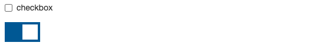
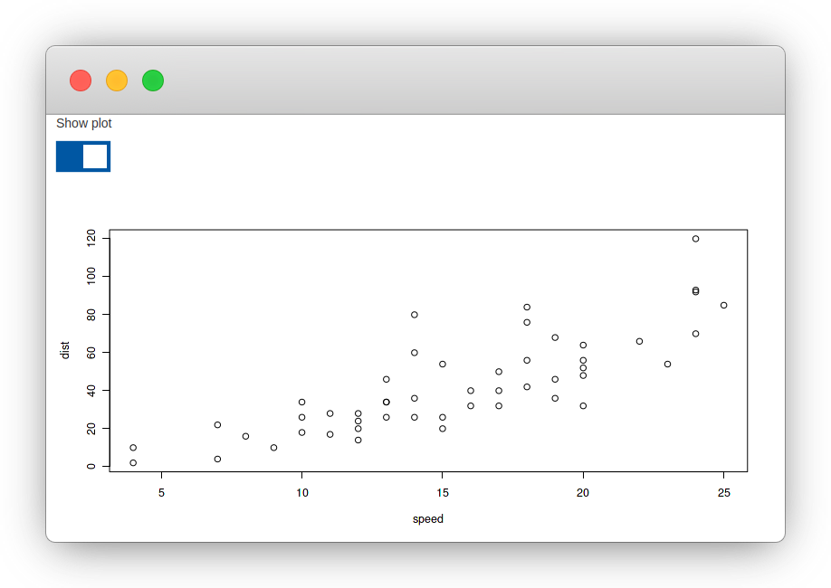

# Custom Inputs {#shiny-input}

```{r, include=FALSE}
source("utils.R")
```

Shiny comes with a variety of inputs ranging from buttons to text fields; these inputs send data from the client to the R server. Custom inputs are in fact, no different than from Shiny's out-of-the-box inputs, they work in the same way and are built on the same system.

To explain and demonstrate how to build such a custom input, we shall build a switch input, which is essentially a fancy-looking checkbox that can be toggled on and off.

Custom Shiny inputs very much resemble Shiny outputs though they consist of a single R function (e.g.: `selectInput`), which generates the HTML and attaches necessary dependencies. When run from the R console, such functions will reveal the HTML they generate.

```r
shiny::textInput("theId", "The label")   
```

```html
<div class="form-group shiny-input-container">
  <label class="control-label" for="theId">The label</label>
  <input id="theId" type="text" class="form-control" value=""/>
</div>
```

The R function is paired with a JavaScript input binding akin to the output binding used in the previous chapter.

## Setup {#shiny-input-setup}

Let us set up the necessary files and project structure. Below an asset directory is created. In it, we place a JavaScript file where the binding will be coded, as well as a CSS file that will style the switch input, an `app.R` file is also created to hold the R code and application. 

```r
# create directory for application
dir.create("switch/assets", recursive = TRUE)

# create R, JS, and CSS files
file.create("app.R")
file.create("switch/assets/binding.js")
file.create("switch/assets/styles.css")
```

This should create the following directory structure.

```
.
├── app.R
└── assets
    ├── binding.js
    └── styles.css
```

## Switch Input HTML and Style {#shiny-input-intro}

We will use [w3schools](https://www.w3schools.com/howto/howto_css_switch.asp)' switch input template.

The HTML of the input looks like so.

```html
<label class="switch">
  <input type="checkbox">
  <span class="slider"></span>
</label>
```

While the CSS which stylises the checkbox input into a switch is the following.

```css
.switch {
  position: relative;
  display: inline-block;
  width: 60px;
  height: 34px;
}

.switch input { 
  opacity: 0;
  width: 0;
  height: 0;
}

.slider {
  position: absolute;
  cursor: pointer;
  top: 0;
  left: 0;
  right: 0;
  bottom: 0;
  background-color: #ccc;
  -webkit-transition: .4s;
  transition: .4s;
}

.slider:before {
  position: absolute;
  content: "";
  height: 26px;
  width: 26px;
  left: 4px;
  bottom: 4px;
  background-color: white;
  -webkit-transition: .4s;
  transition: .4s;
}

input:checked + .slider {
  background-color: #0462a1;
}

input:focus + .slider {
  box-shadow: 0 0 1px #0462a1;
}

input:checked + .slider:before {
  -webkit-transform: translateX(26px);
  -ms-transform: translateX(26px);
  transform: translateX(26px);
}
```

The above CSS should be placed in the previously created `assets/styles.css` file.

```{r checkbox-switch, fig.pos="H", echo=FALSE, fig.cap='Checkbox and styled switch input'}

```

## Generate Input HTML {#shiny-input-html}

Let us start with the R function to be used in the Shiny UI. The `<input>` it generates bears a `switchInput` class, which will be used to identify all switch inputs from JavaScript. This was also done in the custom output. The function accepts an `id` argument; this is also common across all inputs and outputs as a unique identifier is required in order to retrieve the input JavaScript-side. 

```r
# app.R
switchInput <- function(id) {

  tags$input(
    id = id, 
    type = "checkbox", 
    class = "switchInput"
  )

}
```

The function should also accept a customary label and a `checked` argument to define the initial state of the switch.

```r
# app.R
switchInput <- function(id, label, checked = TRUE) {

  input <- tags$input(
    id = id, 
    type = "checkbox", 
    class = "switchInput"
  )

  if(checked)
    input <- htmltools::tagAppendAttributes(input, checked = NA)

  form <- tagList(
    p(label),
    tags$label(
      class = "switch",
      input,
      tags$span(class = "slider")
    )
  )

  return(form)
}
```

As for the custom outputs, the dependencies (CSS and JavaScript binding) can piggy back on the generated HTML.

```r
# app.R
switchInput <- function(id, label, checked = TRUE) {

  input <- tags$input(
    id = id, 
    type = "checkbox", 
    class = "switchInput"
  )

  if(checked)
    input <- htmltools::tagAppendAttributes(input, checked = NA)

  form <- tagList(
    p(label),
    tags$label(
      class = "switch",
      input,
      tags$span(class = "slider")
    )
  )

  path <- normalizePath("./assets")

  deps <- htmltools::htmlDependency(
    name = "switchInput",
    version = "1.0.0",
    src = c(file = path),
    script = "binding.js",
    stylesheet = "styles.css"
  )

  htmltools::attachDependencies(form, deps)
}
```

## JavaScript Input Binding {#shiny-input-binding}

The JavaScript input binding is instantiated from `Shiny.InputBinding`, this is similar to output bindings which are instantiated from `Shiny.OutputBinding`.

```js
var switchInput = new Shiny.InputBinding();
```

Then again the binding is "extended." This consists of adding several methods.

- `find` returns all the relevant inputs.
- `getId` returns the unique identifier of the input.
- `getValue` returns the value of the input to be sent to the server.
- `setValue` is used to set the value of the input.
- `receiveMessage` is used to receive messages from the server.
- `subscribe` tells Shiny when and how to send the updated input value to the server.
- `unsubscribe` removes event handlers and stops Shiny from sending updated values to the server. 

### Find Inputs {#shiny-input-find}

The `find` method looks for all the relevant HTML elements in the document (`scope`) and returns them as an array. Many other methods we are about to implement will accept `el` as an argument; this will ultimately be one of the elements returned by `find`.

Generally, the `find` method is used in conjunction with a `class`; hence the `<input>` generated by `switchInput` bears a class of the same name `switchInput`.

```js
var switchInput = new Shiny.InputBinding();

$.extend(switchInput, {
  // find inputs
  find: function(scope) {
    return $(scope).find(".switchInput");
  }
});
```

### Get Input Id {#shiny-input-get-id}

The `getId` method is exactly what it appears to be; it returns the `id` of the element. It looks for that id as `data-input-id` attribute, and if that is not found returns the `id`; this can be observed in the [source code](https://github.com/rstudio/shiny/blob/master/srcjs/input_binding.js#L9) (below).

```js
this.getId = function(el) {
  return el['data-input-id'] || el.id;
};
```

Since the default works, there is no need to use it for the switch input.

### Get Input Value {#shiny-input-get-value}

That retrieves the value of the input; this is often the attribute of the same name (`value="something"`), which can be obtained with the jQuery `val()` method. The switch is an input of type `checkbox` and therefore uses the `checked` prop. 

```js
var switchInput = new Shiny.InputBinding();

$.extend(switchInput, {
  find: function(scope) {
    return $(scope).find(".switchInput");
  },
  // retrieve value
  getValue: function(el) {
    return $(el).prop("checked");
  }
});
```

The value of the `checked` prop is boolean, `true` if checked and `false` if unchecked.

```{block, type='rmdnote'}
Ensure the `getValue` method actually `return`s the value.
```

### Set Input Value {#shiny-input-set-value}

The `setValue` method sets the value of the input; hence it also accepts the `value` object: the actual value to which the input should be set. Then again, most inputs will likely use the `value` attribute, which can be set in jQuery with `val(newValue)`, but the checkbox uses the `checked` prop.

```js
var switchInput = new Shiny.InputBinding();

$.extend(switchInput, {
  find: function(scope) {
    return $(scope).find(".switchInput");
  },
  getValue: function(el) {
    return $(el).prop("checked");
  },
  // check or uncheck the switch
  setValue: function(el, value) {
    $(el).prop("checked", value).change();
  }
});
```

Note the use of the `change` method, which ensures the event is fired. Otherwise the input is checked or unchecked, but the `change` event is not fired, and this will cause problems later on as we rely on this event.

### Receive Input Messages {#shiny-input-receive-msg}

The `setValue` method previously defined is only beneficial when combined with `receiveMessage`; the latter handles messages sent to the input, and these are generally sent from the server via functions the likes of `updateSelectInput`. Internally it uses the `setValue` method to define the value of the input received from the server. Note that the `value` is, therefore, a serialised JSON\index{JSON} input coming from the R server and can be of any complexity you desire. Below we use it such that it expects a simple boolean as the checkbox (switch) can be either on (`true`) or off (`false`).

```js
var switchInput = new Shiny.InputBinding();

$.extend(switchInput, {
  find: function(scope) {
    return $(scope).find(".switchInput");
  },
  getValue: function(el) {
    return $(el).prop("checked");
  },
  setValue: function(el, value) {
    $(el).prop("checked", value).change();
  },
  // handle messages from the server
  receiveMessage: function(el, value){
    this.setValue(el, value);
  }
});
```

### Subscribe and Unsubscribe Inputs {#shiny-input-sub-unsub}

Finally, a crucial method is `subscribe`. This is run when the input is registered (more on that later) and is used to determine when Shiny sends new values of the input back to the server. This method also accepts a `callback`, which is the same function that tells Shiny to update the value. This callback function accepts a single boolean value, which the [source code](https://github.com/rstudio/shiny/blob/master/srcjs/input_binding.js#L18) states is used to enable debouncing or throttling. This is covered in the next section on rate policy.

This method often consists of an event listener that observes changes on the input to send it to the server. In layman terms, when the switch input changes (on to off or vice versa) run the `callback` function, which sends the data to the server.

```js
var switchInput = new Shiny.InputBinding();

$.extend(switchInput, {
  find: function(scope) {
    return $(scope).find(".switchInput");
  },
  getValue: function(el) {
    return $(el).prop("checked");
  },
  setValue: function(el, value) {
    $(el).prop("checked", value).change();
  },
  receiveMessage: function(el, value){
    this.setValue(el, value);
  },
  subscribe: function (el, callback) {
    $(el).on("change.switchInput", function(){
      callback(true);
    })
  },
  unsubscribe: function(el) {
    $(el).off(".switchInput");
  }
});
```

Note that in the `subscribe` method we listen for `change`s on the input; hence the `setValue` also uses jQuery's `change` method; it ensures this event is fired and that Shiny will subsequently pick it up. 

```{block, type='rmdnote'}
Make sure the `setValue` method triggers the event observed in `subscribe`
```

### Input Rate Policy {#shiny-input-rate-policy}

The rate policy determines how frequently the binding should send new input values back to the server. The `getRatePolicy` method should return an object that describes a JSON array with two variables: `policy` and `delay`.

__direct__

The `direct` policy tells Shiny to sends any new value directly, however often this occurs. Therefore, this policy does not make use of `delay`.

```json
{
  policy: "direct"
}
```

__debounce__

The `debounce` policy tells Shiny to ignore all new values until no new values have been received for `delay` milliseconds.

```json
{
  policy: "debounce",
  delay: 2500
}
```

__throttle__

The `throttle` policy means that no more than one value will be sent per `delay` milliseconds.

```json
{
  policy: "throttle",
  delay: 1000
}
```

A switch input is not expected to change frequently, but it's nonetheless good practice to throttle it to ensure the server does not receive too many requests. This will admittedly be more relevant to inputs that see a higher rate of change like text fields, which unless debounced send every keystroke to the server.

```js
var switchInput = new Shiny.InputBinding();

$.extend(switchInput, {
  find: function(scope) {
    return $(scope).find(".switchInput");
  },
  getValue: function(el) {
    return $(el).prop("checked");
  },
  setValue: function(el, value) {
    $(el).prop("checked", value).change();
  },
  receiveMessage: function(el, value){
    this.setValue(el, value);
  },
  subscribe: function (el, callback) {
    $(el).on("change.switchInput", function(){
      callback(true);
    })
  },
  unsubscribe: function(el) {
    $(el).off(".switchInput");
  },
  // throttle
  getRatePolicy: function(){
    return {
      policy: 'throttle',
      delay: 1000
    }
  }
});
```

### Registering the Input Binding {#shiny-input-register}

Finally, like the custom output, the input can be registered with Shiny. It too takes a unique identifier as a second argument.

```js
var switchInput = new Shiny.InputBinding();

$.extend(switchInput, {
  find: function(scope) {
    return $(scope).find(".switchInput");
  },
  getValue: function(el) {
    return $(el).prop("checked");
  },
  setValue: function(el, value) {
    $(el).prop("checked", value).change();
  },
  receiveMessage: function(el, value){
    this.setValue(el, value);
  },
  subscribe: function (el, callback) {
    $(el).on("change.switchInput", function(){
      callback(true);
    })
  },
  unsubscribe: function(el) {
    $(el).off(".switchInput");
  },
  getRatePolicy: function(){
    return {
      policy: 'throttle',
      delay: 1000
    }
  }
});

Shiny.inputBindings.register(switchInput, 'john.switch');
```

This wraps up a custom input: it can now be used in a shiny application

```r
library(shiny)

ui <- fluidPage(
  switchInput("switch", "Show plot", FALSE),
  plotOutput("plot")
)

server <- function(input, output, session){

  output$plot <- renderPlot({
    print(input$switch)

    if(!input$switch)
      return()

    plot(cars)
  })
}

shinyApp(ui, server)
```

```{r switch-example, fig.pos="H", echo=FALSE, fig.cap='Switch input example'}

```

## Update Input {#shiny-input-update}

The JavaScript binding was provided with the required methods to receive updates from the server to change the value of the switch input, but the R function that sends those updates is yet to be written.

```r
update_switch_input <- function(id, value, 
  session = shiny::getDefaultReactiveDomain()){
  session$sendInputMessage(id, value)
}
```

This pattern was used previously, albeit using `sendCustomMessage`; with `sendInputMessage` the message can be sent straight to the `receiveMessage` handler of the input using 1) the `id` of the input and 2) the data one wants to send.

We can adapt the application to use this button.

```r
library(shiny)

ui <- fluidPage(
  actionButton("chg", "Switch ON"),
  switchInput("switch", "Switch input", FALSE),
  plotOutput("plot")
)

server <- function(input, output, session){

  output$plot <- renderPlot({
    print(input$switch)
    
    if(!input$switch)
      return()

    plot(cars)
  })

  observeEvent(input$chg, {
    update_switch_input("switch", TRUE, session)
  })
}

shinyApp(ui, server)
```

The diagram below attempts to summarize the various elements that were put together and used in the last application.

It all starts from the `switchInput` function, which generates the HTML\index{HTML} defining the switch input and its initial state. In the `subscribe` method, an event listener checks for changes on this HTML element (`$(el).on('change', ...)`). Every time it changes (check/uncheck) it fires the Shiny `callback`, which sends the value of the input obtained from `getValue` through the WebSocket\index{WebSocket}. When the value of the input is changed from the server this value travels through the WebSocket\index{WebSocket} to the front end, where `receiveMessage` uses `setValue` to programmatically change the check-box, which incidentally triggers the change event, and back we go.

```{r shiny-input-diagram, fig.pos="H", echo=FALSE, fig.align='center', out.width="100%", fig.dim=c(3, 6), fig.cap='Shiny input visualised'}
d <- DiagrammeR::grViz("
digraph {
  graph [rankdir = LR]
  node [shape=record fontsize=12];

  subgraph cluster_r {
    node [color=royalBlue];
    'update_switch_input'
    'switchInput'
    'Input list'

    label = 'R server'
  }

  subgraph cluster_js {
    node [color=gold];
    'receiveMessage'
    'setValue'
    'HTML input'
    'subscribe'
    'getValue'

    label = 'Front-end'
  }

  edge [fontsize=10]
  'update_switch_input' -> 'receiveMessage' [xlabel='websocket']
  'receiveMessage' -> 'setValue' [label='value']
  'switchInput' -> 'HTML input' 
  'setValue' -> 'HTML input' [label='value']
  'HTML input' -> 'subscribe' [label='event listener']
  'subscribe' -> 'getValue' [label='callback']
  'getValue' -> 'Input list' [label='websocket']
}
", width = "100%", height = 250)

include_widget(d, '04-shiny-input.png')
```

## Exercise {#shiny-input-excercise}

- Add a `toggle_switch_input` function that toggles between states so it turns it off when it's on and vice versa
- Bring support for [Bootstrap 3 text input addon](https://getbootstrap.com/docs/3.3/components/#input-groups-basic)
