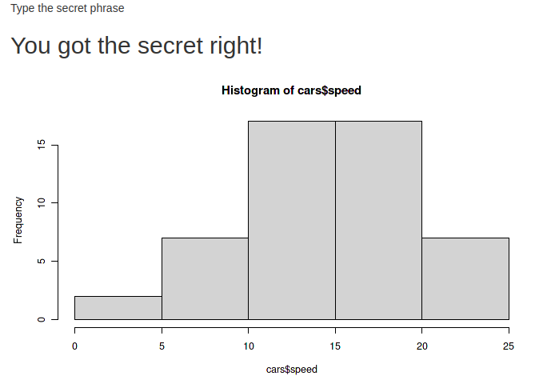

# Discover Webpack and NPM {#webpack-intro-discover}

In this chapter we discover how to feature webpack and NPM in a very simple shiny project, the idea is not to build a complex application, only to discover how one might go about bringing them into an R project and observe some of their benefits (and potential issues).

There is a lot of depth to NPM and webpack, we only touch upon the surface here so we can obtain a basic setup for a shiny application. We'll eventually go into slightly more details as this part of the book progress but it will by no means fully explore the realm of webpack. It's always a good idea to take a look at the [official documentation](https://webpack.js.org/) in order to get a better picture of the technology.

## Installation {#webpack-intro-install}

As Node's Package Manager a working installation of node.js is required: NPM ships with it. A bit like R in a sense where the package manager also comes with the language, install R and you can install packages from CRAN with `install.packages`. The same applies here, install Node and you can install NPM packages from the command line.

```{block, type='rmdnote'}
We are only going to use Node.js _indirectly_, some of its functionalities and its package manager. This is not about building Node applications.
```

Below are some directions on how to install node.js, in the event this does not work or you encounter issues please refer to the [official website](https://nodejs.org/en/).

### Mac OS {#webpack-intro-install-mac}

On Mac OS, the easiest way is via homebrew.

```
brew update
brew install node
```

Otherwise there is also an [installer](https://nodejs.org/en/download/) available.

### Ubuntu {#webpack-intro-install-ubuntu}

With Ubuntu one can install it straight from the package manager.

```
sudo apt install nodejs
```

### Windows {#webpack-intro-install-windows}

Download and install the official [executable](https://nodejs.org/en/download/) or use [chocolatey](https://chocolatey.org/).

```
# for full install with npm
cinst nodejs.install
```

Or use [scoop](https://scoop.sh/).

```
scoop install nodejs
```

### Other {#webpack-intro-install-other}

If you are on another OS or Linux distro check the official, very concise [guide](https://nodejs.org/en/download/package-manager/) to install from various package managers.

## Setup the app {#webpack-intro-setup}

Let us first put together a simple shiny application that which will serve as a basis for including webpack and npm. Create a new directory and in it place a file called `app.R` containing a very simple application.

```r
library(shiny)

ui <- fluidPage(
  h1("A shiny app")
)

server <- function(...) {}

shinyApp(ui, server)
```

## Initialise NPM {#webpack-intro-init-npm}

With a simple application one can initialise NPM. This could be translated into the equivalent of starting a new project in R. This is done from the command line, _from the root of the directory_ that you want to use as project.

Whereas in R we previously used the usethis package to create packages with `create_package` or projects with `create_project`, NPM does not create the initial empty directory where the project will be created, you have to create the directory first then initialise a new project.

An npm project can be initialised with the command `npm init`, which when run prompts the user with a few questions, such as the name of the project, the license to use, etc. These have little importance for what we do here but will matter if you decide to publish the package on NPM. One can also pass the "yes" flag to the function in order to skip those questions: `npm init -y`.

This creates a `package.json` file which is loosely equivalent to the `DESCRIPTION` of an R package, it includes information on the dependencies of the project, the version of the project, and more.

We will revisit this file later in the chapter, at this stage just ensure you have run `npm init` (with or without the `-y` flag).

## Installing NPM packages {#webpack-intro-install-pkgs}

Unless the R programmer uses packages such as renv [@R-renv] or packrat [@R-packrat] then packages are installed globally on the machine, running `install.packages("dplyr")` installs a single version of dplyr across the entire machine. Because CRAN is strict and its packages subsequently stable it tends not to be too much of an issue. Packages submitted to CRAN are checked for reverse dependencies (other packages that depend on it) to see if the submission could cause issues.

However, NPM does no such thing with packages that are submitted, therefore the developer has to be more careful about dependencies. These may change abruptly (breaking changes), the same library on two different versions may work differently. Thus it makes sense that NPM out-of-the-box comes with better encapsulation of projects than R. It is _not recommended,_ to install NPM packages globally. NPM projects (directory where `npm init` was run) come bundled with the equivalent of renv/packrat.

Installing Node packages also takes place at the command line with the `install` command followed by the name of the package to install, e.g.: `npm install nameOfPackage`. 

As mentioned it is rarely a good idea to install packages globally at the exception of very few packages such as command line applications used across the machine. As an example the [docsify-cli](https://docsify.js.org/) package for documentation generation can safely be installed globally as it is used at the command line in projects that don't necessarily use NPM. This can be achieved with the `-g` flag that stands for "global:" `npm install docsify-cli -g`.

The two other scopes are only slightly different from one another but that difference is rather important. NPM allows distinguishing between packages that are needed to develop the project and packages that are needed in the final product being build. R does not make this distinction but it could perhaps be somewhat useful, for instance throughout the book we used the usethis package to develop packages from setting up the project to adding packages to `DESCRIPTION` file, and more. Perhaps one would like to make this a "developer" dependency so that other developers that pull the package have usethis installed and readily available. The advantage is that dependency is not included in the final product, that is, in this example usethis is not required to use the package built and therefore is not installed by the user.

As stated in the previous chapter file size matters in JavaScript it is therefore important that those dependencies used only for development are not included in the final JavaScript file we create. With NPM this can be done by using the `--save-dev` flag, e.g.: `npm install webpack --save-dev` to install webpack. This is incidentally how it will be eventually installed as it is needed to prepare the final product (minify, bundle, etc.) but is not a dependency of that final bundled file.

Finally, there are the "true" dependencies, those that are needed in the output we're creating. For instance were we to rebuild the gio widget with NPM we could install it with `npm install giojs --save` because this dependency will be required in the output file we produce.

Before moving on to the next section let us install webpack and its command line interface as developer dependencies.

```bash
npm install webpack webpack-cli --save-dev
```

Notice that this updated the `package.json` file, created the `package-lock.json` file as well as a `node_modules` directory to obtain the following structure.

```
.
├── app.R
├── node_modules
├── package-lock.json
└── package.json
```

The directory `node_modules` actually holds all the dependencies, it will grow in size as you add more, it's important that this directory is not pushed to whatever version control system you happen use (Github, Bitbucket, Gitlab). 

```{block, type='rmdnote'}
Do not commit `node_modules` to git
```

The dependencies are any way not needed as one can pull the project without the `node_modules` then from the root of the project run `npm install` as-is without package names to install the dependencies that are listed in the `package.json` file. We can indeed observe that this file was updated to include `webpack` and `webpack-cli` as `devDependencies`, at the bottom of the file.

```json
{
  "name": "name-of-your-project",
  "version": "1.0.0",
  "description": "",
  "main": "index.js",
  "scripts": {
    "test": "echo \"Error: no test specified\" && exit 1"
  },
  "keywords": [],
  "author": "",
  "license": "ISC",
  "devDependencies": {
    "webpack": "^5.2.0",
    "webpack-cli": "^4.1.0"
  }
}
```

The `package-lock.json` file is automatically generated and _should not be edited manually,_ it describes the exact tree of all the dependencies. If you installed a package by mistake you can uninstall it with `npm uninstall nameOfPage`.

## Entry point & output {#webpack-intro-entry-points}

In general, an NPM project with webpack will make use of a `src` directory where the source code is placed and a `dist` directory (for distributed) where the bundled source code will be placed, we'll see how to change these defaults later on. It will eventually be necessary as the `src` directory in R packages is reserved for compiled code (e.g.: C++) and therefore cannot be used to place JavaScript files. It will not be a problem here as we are not building a package.

```r
dir.create("src")
```

Webpack will then require at least one "entry point." An entry point is an input file in the `src` directory that webpack will use as source to produce the bundle. Let's create the go-to "hello world" of JavaScript, the snippet below creates the `index.js` file with a basic alert. 

```r
writeLines("alert('hello webpack!')", "src/index.js") 
```

The next section on configuration will detail precisely how to indicate to webpack that this is indeed the entry point to use.

## Configuration file {#webpack-intro-conf}

Webpack comes with its own configuration file, `webpack.config.js` though for larger project it is advised to split it into multiple configuration files (more on that later). This file can include numerous options, plugins, and other settings to customise how webpack transforms the entry point into an output only some of which will be explored in this book as there are too many to cover.

The simplest file one may create is the one below. At the bare minimum the configuration file will need to have an entry point specified, in this case the `index.js` file previously created. If no `output` path is specified then webpack will produce it at `dist/main.js` automatically.

```js
// webpack.config.js
module.exports = {
  entry: './src/index.js'
};
```

The `module.exports` line may confuse as this was not covered yet; it will be very soon.

## NPM scripts {#webpack-intro-npm-scripts}

NPM scripts allow automating development tasks such are running unit tests, serving files, and more, we'll set it up to run webpack. The scripts are placed in the `package.json` file and are terminal commands that run in the terminal.

By default `npm-init` creates the following `test` script which simply echoes (prints) a message stating that no unit tests were set up.

```json
"scripts": {
  "test": "echo \"Error: no test specified\" && exit 1"
}
```

This script can be run from the terminal by typing `npm run test`. Those commands always follow the same pattern: `npm run` followed by the name of the script, in this case `test`.

Adding the script to run webpack is very straightforward, we can add an entry called `build` that runs `webpack`.

```json
"scripts": {
  "test": "echo \"Error: no test specified\" && exit 1",
  "build": "webpack"
}
```

## Source maps {#webpack-intro-webpack-mode}

We could be tempted to leave it here but we'll change this up a bit so we can run webpack on two different modes; one for production and one for development. As explained webpack will take the entry points to produce bundled, minified, transformed outputs. 

Since the output of webpack is any number of files bundled into one it can make debugging more complicated as it makes it moe difficult to trace back the source of an error or warning that might occur. When files `a.js`, `b.js`, and `c.js` are bundled into `dist/main.js` the stack trace will point to errors in `dist/main.js` which is not helpful as the developer needs to know in which original file the bug lies. 

Therefore webpack comes with a "development" mode that allows including the "source map" that map the compiled code to the original source files. This way when an error or warning is raised JavaScript is able to point to the original line that causes it.

There are again many different ways to set this up in the configuration file as the source map can be placed in the bundled file itself, in another, and more. However, the easiest is probably to use webpack's "development" mode as opposed to the default "production" mode. The source maps are again optional as these make the output larger in size and one wants to keep this output as small as possible in order for it to load faster in web browsers. Those will thus only be used while developing the project in order to trace back errors and warnings but will not be included in the final output for production.

Below we modify the scripts placed in the `package.json` file so two different scripts can be run: one for development and another for production.

```json
"scripts": {
  "test": "echo \"Error: no test specified\" && exit 1",
  "build-prod": "webpack --mode=production",
  "build-dev": "webpack --mode=development"
}
```

## Bundle {#webpack-intro-bundle}

One can then bundle the code using the scripts that we defined to produce the output bundle. Since we have not specified any `output` in webpack's configuration file it will produce it at the default location `dist/main.js`.

```bash
npm run build-prod
```

We can then include the output of webpack in the shiny application to test that all works well.

```r
library(shiny)

mainJs <- htmltools::htmlDependency(
  name = "main",
  version = "1.0.0",
  src = "./dist",
  script = c(file = "main.js")
)

ui <- fluidPage(
  mainJs,
  h1("A shiny app")
)

server <- function(...) {}

shinyApp(ui, server)
```

Running the above should present the `alert()` that was placed in the `index.js` original source file.

This makes for a great start but is not exactly interesting, fails to take advantage of webpack's modularization since there is only a single source file, and it does not make use of dependencies.

## Internal Dependencies {#webpack-intro-internal-dependencies}

Let's install a dependency and make use of it in our shiny application. We'll install [mousetrap](https://github.com/ccampbell/mousetrap) a library to handle key strokes. We're going to use it to hide the UI of the shiny application behind some kind of top secret password; it will only be revealed when the secret phrase has been typed. This can be done by observing a specific set of key strokes with mousetrap and set a shiny input value. Though it is certainly not a  real world example, it is educational and quite a bit of fun.

The first thing to do is to install the mousetrap dependency, as indicated on the Github page it can be obtained from NPM.

```bash
npm install mousetrap --save
```

Note that we use `--save` as mousetrap will need to be included in the output we create, it's not a library we import for development purposes.

## External Dependencies {#webpack-intro-external-dependencies}

If dependencies with webpack have to be installed from NPM it begs the question; what about dependencies that are already included in the project and are not available on NPM.

For instance, this project is intended to work with a shiny application which comes bundled with jQuery, and the shiny JavaScript library. Thankfully webpack comes with a simple mechanism to handle these cases. External dependencies can be added to the configuration file under `externals`.

```js
module.exports = {
  entry: './src/index.js',
  externals: {
    shiny: 'Shiny'
  }
};
```

The above will allow import `shiny` in scripts, so let's delve into the import/export mechanism.

## Import & Export {#webpack-intro-import-export}

In order to demonstrate how webpack enables modularising code, not everything will be written in the `index.js` file. We can create another file, `secret.js`, that will contain the code to handle the key strokes via mousetrap and then import that file in `index.js`.

```r
file.create("src/secret.js")
```

Before we place code in `secret.js` we will have it imported in `index.js`. Importing and exporting files can follow different syntaxes all of which cannot be covered here, it's somewhat outside the scope of this book. Here we will use [CommonJS](https://en.wikipedia.org/wiki/CommonJS) syntax using `require`. To draw parallel to R think about `require` like a hybrid version of the function of the same name in R and `source`. In R we can import other R files with `source("script.R")` and import packages with `require(dplyr)` though using `library(dplyr)` is preferred.

The `require` function works very much the same way, it is used below to import the `secret.js` file but can also be used to import packages. We thus modify the `index.js` file so it imports `secret.js`, note that it uses `./` to indicate the path and is necessary, `require` will not work without it.

```js
// src/index.js
require('./secret.js')
```

## Finalise {#webpack-intro-import-final}

In the `secret.js` file we can now make use of mousetrap, the library is also imported with `require` as detailed on the project's Github page. It is used to bind key strokes (`secret`) to a callback function which sets the shiny input `secret` to `TRUE`.

Since `shiny` was added as external dependency it can also be imported with `require` as it is needed for `setInputValue`.

```js
// src/secret.js
var Shiny = require('shiny')
var Mousetrap = require('mousetrap');

Mousetrap.bind('s e c r e t', function() { 
  Shiny.setInputValue('secret', true);
});
```

This can then be bundled with `npm run bundle-prod` and used in the shiny application which we modify so it listens to the `secret` input set and only when that input is set does it render a plot and a message.

```r
library(shiny)

mainJs <- htmltools::htmlDependency(
  name = "main",
  version = "1.0.0",
  src = "./dist",
  script = c(file = "main.js")
)

ui <- fluidPage(
  mainJs,
  p("Type the secret phrase"),
  uiOutput("hello"),
  plotOutput("plot")
)

server <- function(input, output) {
  output$hello <- renderUI({
    req(input$secret)
    h2("You got the secret right!")
  })

  output$plot <- renderPlot({
    req(input$secret)
    hist(cars$speed)
  })
}

shinyApp(ui, server)
```

Once the application is launched the user can type the phrase `secret` to see the content of the application.

```{r mousetrap, echo=FALSE, fig.cap='Mousetrap example'}

```

That is it for this chapter, as stated multiple times there is far more depth to webpack but this is outside the scope of this book rather in the next chapter we discover an easier way to set up such projects and make R and webpack work in a more seamless fashion.
