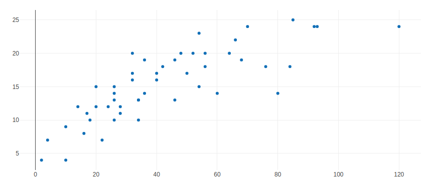
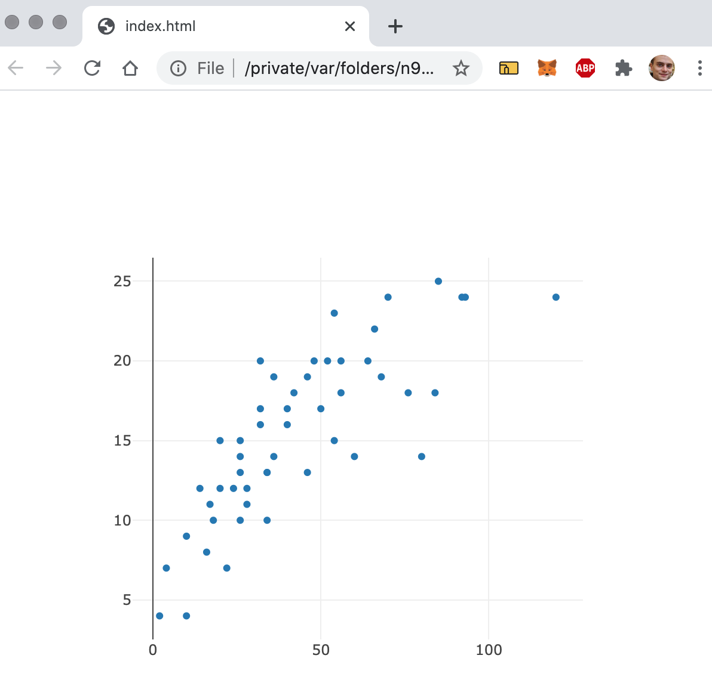

# (PART) Examples {-}

# Ploty {#widgets-ex-plotly}

**This chapter is likely to go away, I don't think it's necessary**

In this chapter we build a widget for plotly.js, or a tiny part of it; it'll allow drawing a scatter and line plot and have some additional functionalities in shiny. The aim of this chapter is to demonstrate how easily one can transfer take aways from building the gio widget to build another.

## Discover Plotly {#widgets-ex-plotly-discover}

Below is a basic example from the [plotly website](https://plotly.com/javascript/line-and-scatter/). We will aim to reproduce it using htmlwidgets before improving upon it.

```html
<!DOCTYPE html>
<html xmlns="http://www.w3.org/1999/xhtml" lang="" xml:lang="">

<head>
  <!-- Import library -->
  <script src="plotly-latest.min.js"></script>
</head>

<body>
  <!-- div to hold visualisation -->
  <div id="chart" style="width:600px;height:250px;"></div>

  <!-- Script to create visualisation -->
  <script>
    var trace1 = {
      x: [1, 2, 3, 4],
      y: [10, 15, 13, 17],
      mode: 'markers',
      type: 'scatter'
    };

    var trace2 = {
      x: [2, 3, 4, 5],
      y: [16, 5, 11, 9],
      mode: 'lines',
      type: 'scatter'
    };

    var data = [trace1, trace2, trace3];

    Plotly.newPlot('chart', data);
    );
  </script>
</body>

</html>
```

The aim is to obtain an R interface resembling the already existing R package. It'll allow initialising the visualisation with the `plotly` function and add a line or scatter plot with `plot_line` and `plot_marker`.

```r
plotly(data = cars) %>% 
  plot_marker(x = "dist", y = "speed")
```

## Basics of Plotly {#widgets-ex-plotly-basics}

The story starts like all other widgets: create a package and scaffold the widget. We name the package plotlier so as to not override the local installation of the actual plotly package. We also add the magrittr pipe (`%>%`) while we're at it.

```r
usethis::create_package("plotlier") # create package
usethis::scaffoldWidget("plotly") # scaffold plotly
usethis::use_pipe() # export pipe
```

Then we download the dependency from the CDN, the latest version at the time of writing this is `1.54.2`, and edit the `plotly.yml` file to point to the downloaded file.

```r
dir.create("inst/htmlwidgets/plotly", recursive = TRUE)
url <- "https://cdn.plot.ly/plotly-1.54.2.min.js"
download.file(url, "inst/htmlwidgets/plotly/plotly.min.js")
```

```yaml
dependencies:
 - name: plotly
   version: 1.54.2
   src: htmlwidgets/plotly
   script: plotly.min.js
```

We start by editing the `plotly` function to accept a data frame which will be stored in the `x` object. The data will not be used in this very function but will be required when adding a line or marker plot.

```r
#' @export
plotly <- function(data, width = NULL, height = NULL, 
  elementId = NULL) {

  # forward options using x
  x = list(
    data = data,
    options = list()
  )

  # create widget
  htmlwidgets::createWidget(
    name = 'plotly',
    x,
    width = width,
    height = height,
    package = 'plotlier',
    elementId = elementId
  )
}
```

The JavaScript would look like the code below. It's actually much easier than what had to be written for gio.js as the function to generate a new plot accepts 1) the id of the `<div>` where the plot should be created and 2) a JSON object of options (containing the data) which describes the plot.

```js
HTMLWidgets.widget({

  name: 'plotly',

  type: 'output',

  factory: function(el, width, height) {

    return {

      renderValue: function(x) {

        // create plot
        Plotly.newPlot(el.id, x.options);

      },

      resize: function(width, height) {

        // TODO: code to re-render the widget with a new size

      }

    };
  }
});
```

Then it's a matter of reproducing the JSON that defines what plotly describes as a "trace" and what more or less corresponds to a "geom" in ggplot2. A trace for a scatter plot is defined with the JSON below, which we can read in R to understand the shape of the list to reproduce.

```{r}
jsonlite::fromJSON('{
	"x": [1, 2, 3, 4],
	"y": [10, 15, 13, 17],
	"mode": "markers",
	"type": "scatter"
}')
```

We can then create a function that takes the name of the x and y columns to fetch from the data which is accessible from the plotly object with `p$x$data`

```r
#' @export
plot_marker <- function(p, x, y){
  layer <- list(
    x = p$x$data[[x]],
    y = p$x$data[[y]],
    type = "scatter",
    mode = "markers"
  )

  p$x$options <- append(p$x$options, list(layer))
  return(p)
}
```

At this stage the functions `devtools::document` and `devtools::load_all` can be run so the package can be tested.

```r
library(plotlier)

plotly(cars) %>% 
  plot_marker("dist", "speed")
```



## JavaScript to R {#widgets-ex-plotly-js-to-r}

We can now look up plotly's documentation on [callback](https://plotly.com/javascript/plotlyjs-events/) to send data to the R server when a point is clicked.

```js
...
renderValue: function(x) {

  Plotly.newPlot(el.id, x.options);

  plot.on('plotly_click', function(data){
    var coords = [data.points[0].x, data.points[0].y];
    Shiny.setInputValue(el.id + '_clicked', coords);
  });

}
...
```

Finally, we load the package's functions using devtools to test the input.

```r
library(shiny)
library(plotlier)

ui <- fluidPage(
  plotlyOutput("plot"),
  verbatimTextOutput("clicked")
)

server <- function(input, output){

  output$plot <- renderPlotly({
    plotly(cars) %>% 
      plot_marker("dist", "speed")
  })

  output$clicked <- renderPrint({
    print(input$plot_clicked)
  })

}

shinyApp(ui, server)
```

## R to JavaScript {#widgets-ex-plotly-r-to-js}

Here we implement an example of passing data from R to JavaScript, name the JavaScript `addTraces` function which allows dynamically adding traces to the chart without redrawing it in its entirety.

The JavaScript `addTraces` function takes the id of the chart to add the trace to and a JSON object that defines the trace.

```js
// addTraces example
Plotly.addTraces('plot', {y: [2,1,2]});
```

We start, as done previously, by defining a "proxy," a function that returns an object containing information necessary to add traces to the chart, namely the `id` of the chart to apply to and the `session` object which will be used to send the data.

```r
#' @export
plotlyProxy <- function(id, 
  session = shiny::getDefaultReactiveDomain()){
  list(
    id = id,
    session = session
  )
}
```

We then create a function that creates the trace and sends that data, together with the plot `id`, to JavaScript as a message of type "add-traces."

```r
#' @export
plot_add_marker <- function(proxy, data, x, y){
  data <- list(
    x = data[[x]],
    y = data[[y]],
    type = "scatter",
    mode = "markers"
  )

  msg <- list(id = proxy$id, data = data)
  proxy$session$sendCustomMessage("add-traces", msg)
  return(proxy)
}
```

Finally, we add a message handler to handle the data sent to `add-traces` and use the JavaScript method `addTraces` to add a trace to the plot.

```js
if(HTMLWidgets.shinyMode){

  Shiny.addCustomMessageHandler(
    type = 'add-traces', function(msg){
      Plotly.addTraces(msg.id, msg.data);
    }
  )

}
```

After installing the package, one can use the new proxy function in a shiny application, below we provide a button that adds a trace of random data to the chart.

```r
library(shiny)
library(plotlier)

df <- data.frame(x = 1:10, y = runif(10))

ui <- fluidPage(
  actionButton("add", "Add random trace"),
  plotlyOutput("plot")
)

server <- function(input, output){

  output$plot <- renderPlotly({
    df %>% 
      plotly() %>% 
      plot_line("x", "y")
  })

  proxy <- plotlyProxy("plot")

  observeEvent(input$add, {
    random <- data.frame(x = runif(10, 1, 10), y = runif(10))
    
    plot_add_marker(
      proxy,
      random,
      "x", "y"
    )
  })

}

shinyApp(ui, server)
```


## Size & Resize {#widgets-ex-plotly-sizing}

At this stage the plotlier package does yet provide responsive visualisation: resizing the screen does not resize the visualisation. In order to ensure that it is we have to define a default width that is not defined in pixel but percentage (such as 100%) and implement the resize method.

As mentioned in a previous chapter, the default size can be changed with the `sizingPolicy` function, below we set it to `100%`.

```r
# create widget
htmlwidgets::createWidget(
  name = 'plotly',
  x,
  width = width,
  height = height,
  package = 'plotlier',
  elementId = elementId,
  preRenderHook = render_plotlier,
  sizingPolicy = sizingPolicy(
    defaultWidth = "100%"
  )
)
```

Next we can use the plotly function `relayout` to resize the visualisation when the size of its container changes.

```js
resize: function(width, height) {
  Plotly.relayout(el.id, {width: width, height: height});
}
```

One can test this by resizing the browser or RStudio viewer window.

```r
plotly(cars) %>%  
      plot_marker("dist", "speed")
```



## Performance & Security {#widgets-ex-plotly-perf-security}

The package stores the data passed to the `plotly` function in the widget object, however, as explained in a previous chapter this is insecure and a drain on performances. First, this data serialised to JSON but not used in JavaScript and thus leads to unnecessary computations. Second, this data is visible on the resulting visualisation which may cause security concerns given the user may not deliberately use all the data in the visualisation. This can be remedied to by use the `preRenderHook`.

```r
render_plotlier <- function(p){
  p$x$data <- NULL
  return(p)
}
```

The function define above can then be used in the `htmlwidgets::createWidget` function so it is run just before the visualisation renders.

```r
htmlwidgets::createWidget(
  name = 'plotly',
  x,
  width = width,
  height = height,
  package = 'plotlier',
  elementId = elementId,
  preRenderHook = render_plotlier
)
```
