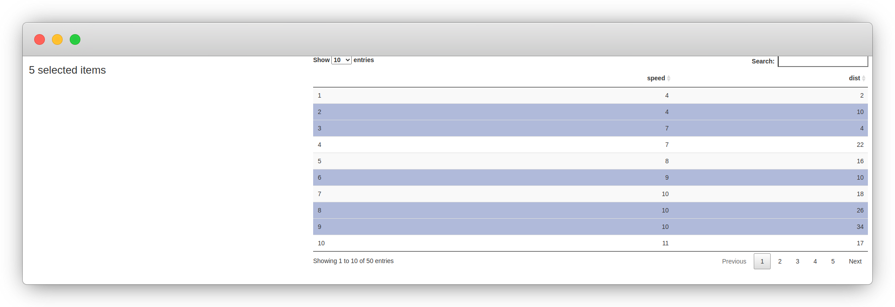
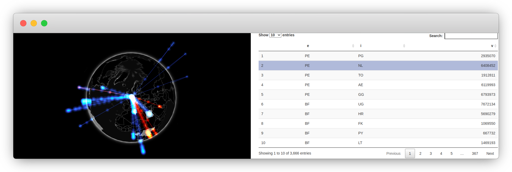

# Linking Widgets {#linking-widgets}


Widgets can be linked with one another using the crosstalk [@R-crosstalk] package, a fantastic add-on for htmlwidgets that implements inter-widget interactions, namely selection and filtering. This, in effect, allows the selection or filtering of data points in one widget to be mirrored in another. This is enabled with the creation of "shared datasets" that can be used across widgets: outputs that share datasets share interactions.

Crosstalk provides a straightforward interface to the users and instead requires effort from developers for their widgets to support shared datasets.


## Crosstalk Examples {#linking-widgets-examples}

Both the plotly and DT packages support crosstalk, therefore using a shared dataset we can produce a scatter plot with the former and a table with the latter, so that selection of data in one is reflected in the other.

As alluded to earlier on, this can be achieved by using a shared dataset, which can be created with the `SharedData` R6 class from the crosstalk package. This dataset is then used as one would use a standard dataframe in plotly and DT. The `bscols` function is just a helper to create columns from HTML elements (see Figure \@ref(fig:crosstalk-1)). It is ideal for examples, but one should not have to use it in Shiny\index{Shiny}---crosstalk will work without `bscols`.

```r
library(DT)
library(plotly)
library(crosstalk)

shared <- SharedData$new(cars)

bscols(
  plot_ly(shared, x = ~speed, y=~dist),
  datatable(shared, width = "100%")
)
```

<div class="figure" style="text-align: center">

<p class="caption">(\#fig:crosstalk-1)Crosstalk example</p>
</div>

Basic usage of crosstalk datasets in shiny (Figure \@ref(fig:crosstalk-shiny)) is also straightforward since it accepts reactive expressions to create shared datasets. Note that it takes the expression itself (`expression`) not the output of the expression (`expression()`); the crosstalk documentation explains it best:

> If this feels foreign to you, think of how you pass a function name, not a function call, to `lapply`; that’s exactly analogous to what we’re doing here. 
> 
> --- Official crosstalk documentation

```r
library(DT)
library(shiny)
library(plotly)
library(crosstalk)

ui <- fluidPage(
  selectInput(
    "specie", "Specie", 
    choices = c("setosa", "versicolor", "virginica")
  ),
  fluidRow(
    column(6, DTOutput("table")),
    column(6, plotlyOutput("plot"))
  )
)

server <- function(input, output) {
  reactive_data <- reactive({
    iris[iris$Species == input$specie, ]
  })

  sd <- SharedData$new(reactive_data)

  output$table <- renderDT({
    datatable(sd)
  }, server = FALSE)

  output$plot <- renderPlotly({
    plot_ly(sd, x = ~Sepal.Length, y = ~Sepal.Width)
  })
}

shinyApp(ui, server)
```

<div class="rmdnote">
<p>When working with shiny create the shared dataset in the server function or some things that follow might not work as expected.</p>
</div>

One can also use the `data` method on the crosstalk object in reactive expressions, which allows accessing the Javascript selection where crosstalk is not directly supported, like below in a custom UI block. Note that the argument `withSelection` is set to `TRUE` in order to retrieve the selection state of the rows. 

```r
library(DT)
library(shiny)
library(crosstalk)

ui <- fluidPage(
  fluidRow(
    column(4, uiOutput("text")),
    column(8, DTOutput("table"))
  )
)

server <- function(input, output) {
  sd <- SharedData$new(cars)

  output$text <- renderUI({
    # get selected rows
    n_selected <- sd$data(withSelection = TRUE) %>% 
      dplyr::filter(selected_ == TRUE) %>% 
      nrow()

    h3(n_selected, "selected items")
    
  })

  output$table <- renderDT({
    datatable(sd)
  }, server = FALSE)
}

shinyApp(ui, server)
```

<div class="figure" style="text-align: center">

<p class="caption">(\#fig:crosstalk-shiny)Shiny with crosstalk</p>
</div>

Using crosstalk with shiny one can also change the selection server-side with the `selection` method, passing it the keys to select.

```r
library(DT)
library(shiny)
library(crosstalk)

ui <- fluidPage(
  fluidRow(
    column(4, actionButton("random", "Select a random row")),
    column(8, DTOutput("table"))
  )
)

server <- function(input, output) {
  sd <- SharedData$new(cars)

  output$table <- renderDT({
    datatable(sd)
  }, server = FALSE)

  selected <- c()
  observeEvent(input$random, {
    smp <- c(1:50)[!1:50 %in% selected]
    selected <<- append(selected, sample(smp, 1))
    sd$selection(selected)
  })
}

shinyApp(ui, server)
```

## Crosstalk Requirements {#linking-widgets-req}

Crosstalk will not work well with every widget and every dataset. In some cases, it might not even be a good idea to support it at all.

Crosstalk works best on rectangular data: dataframes or objects that resemble dataframes like `tibble` or `SpatialPolygonsDataFrame`. This is important as crosstalk will treat the data row-wise, where each row is an observation that is ultimately selected, or filtered. If the underlying data is not tabular (e.g.: trees), then one might eventually encounter mismatches between widgets as they go out of sync.

Other than tabular data, crosstalk will require the widget to have the necessary functions or methods to dispatch the selection and filtering that crosstalk enables; that is, the widget must be able to filter as well as highlight and fade selected data points as crosstalk itself does not provide this.

## How it Works {#linking-widgets-inner-workings}

As will be discovered later when support for crosstalk is brought to gio, minimal changes of the R code is required. As might be expected, crosstalk enables the communication between widgets via JavaScript. Hence much of what must be adapted by widgets developers happens in JavaScript too as shown in Figure \@ref(fig:crosstalk-diagram).

<div class="figure" style="text-align: center">

```{=html}
<div id="htmlwidget-730ed54ee2177bdd1cf6" style="width:100%;height:250px;" class="grViz html-widget"></div>
<script type="application/json" data-for="htmlwidget-730ed54ee2177bdd1cf6">{"x":{"diagram":"\ndigraph G {\n\n  graph [compound=true rankdir = LR]\n  node [shape=record fontsize=10];\n\n  # r stuff\n  subgraph cluster_1 { \n    \"Widget 1\" \"Widget 2\";\n    label = \"JavaScript\";\n    color=gold;\n  }\n\n  # js\n  subgraph cluster_0 {\n    node [width = 0.9]\n    Dataframe \"Shared Dataset\"; \n    label=\"R\";\n    color=royalBlue;\n  }\n\n  \"Dataframe\" -> \"Shared Dataset\";\n  \"Widget 1\" -> \"Widget 2\" [dir=both color=dimGray];\n\n  # connect subgraphs\n  \"Shared Dataset\" -> \"Widget 1\" [lhead=cluster_1 ltail=cluster_0];\n}\n","config":{"engine":"dot","options":null}},"evals":[],"jsHooks":[]}</script>
```

<p class="caption">(\#fig:crosstalk-diagram)Crosstalk visualised</p>
</div>

Indeed the bi-directional communication between widgets works in the RStudio viewer, R markdown, Shiny, and elsewhere, clearly indicating that all of it is taking place in the browser. 

### Keys {#linking-widgets-keys}

This internally works with `key`s that are assigned to every row of the dataframe, which enable crosstalk to track which are selected or filtered.

When creating shared datasets crosstalk will by default use the row names of the data.frame, and if these are not available, the `SharedData` function will create row numbers.


```r
sd_cars <- SharedData$new(cars[1:2,])
```

You can therefore _mentally represent_ the above-shared dataset as the following table. Note the emphasis; internally crosstalk does not actually add a column to the dataset: it leaves it as-is.


|key | speed| dist|
|:---|-----:|----:|
|1   |     4|    2|
|2   |     4|   10|
|3   |     7|    4|
|4   |     7|   22|
|5   |     8|   16|

The keys assigned can be retrieve with the `key` method on the shared dataset itself.


```r
sd_cars$key()
#> [1] "1" "2"
```

Otherwise these keys can be explicitly set by the user when creating the package.


```r
# assign keys
df <- data.frame(x = runif(5))
sd <- SharedData$new(df, key = letters[1:5])
sd$key()
#> [1] "a" "b" "c" "d" "e"
```

### Communication Lines {#linking-widgets-communication-lines}

In a sense, while crosstalk establishes lines of communication to transport `key`s between widgets, developers of the respective widgets must handle what `key`s are sent to other widgets and what to do with incoming `key`s (that are selected or filtered in other widgets). There are two such lines of communication, one for `key`s of rows to be filtered, meant to narrow down the selection of data points displayed on a widget, and another for selection (what crosstalk refers to as "linked brushing") to highlight specific data points (fading out other data points).

In JavaScript, a widget "receives" the keys of selected and filtered data points and must, when filtering or selection is observed, "send" said selected or filtered keys to other widgets. 

### Groups {#linking-widgets-groups}

Internally crosstalk knows what to share across widgets; with `group`s that share `key`s and are isolated from each other so one can use multiple different shared datasets without them interfering with each other (see Figure \@ref(fig:crosstalk-groups-diagram)). 

<div class="figure" style="text-align: center">

```{=html}
<div id="htmlwidget-e0490ccb372f4392a777" style="width:100%;height:250px;" class="grViz html-widget"></div>
<script type="application/json" data-for="htmlwidget-e0490ccb372f4392a777">{"x":{"diagram":"\ndigraph G {\n\n  subgraph cluster_g1 {\n    node [shape=record fontsize=7]\n    d1 [label=\"Dataset\"]\n    d3 [label=\"Dataset\"]\n    k1 [label=\"Keys\"]\n    label=\"Group 1\"\n    fontsize=9\n    color=royalBlue\n  }\n\n  subgraph cluster_g2 {\n    node [shape=record fontsize=7]\n    d2 [label=\"Dataset\"] \n    k2 [label=\"Keys\"]\n    label=\"Group 2\"\n    fontsize=9\n    color=royalBlue\n  }\n\n  node [shape=record fontsize=7 color=gold]\n  w1 [label=\"widget 1\"]\n  w2 [label=\"widget 2\"]\n  w3 [label=\"widget 3\"]\n  w4 [label=\"widget 4\"]\n  w5 [label=\"widget 5\"]\n\n  w1 -> k1 [dir=both arrowsize=.5]\n  w2 -> k1 [dir=both arrowsize=.5]\n  w3 -> k2 [dir=both arrowsize=.5]\n  w4 -> k2 [dir=both arrowsize=.5]\n  w5 -> k2 [dir=both arrowsize=.5]\n\n  d2 -> k2 [arrowsize=.5]\n  d1 -> k1 [arrowsize=.5]\n  d3 -> k1 [arrowsize=.5]\n\n}\n","config":{"engine":"dot","options":null}},"evals":[],"jsHooks":[]}</script>
```

<p class="caption">(\#fig:crosstalk-groups-diagram)Crosstalk groups visualised</p>
</div>

<div class="rmdnote">
<p>Crosstalk groups share keys.</p>
</div>

Therefore, the code below creates two shared datasets that are linked and share keys as they fall in the same `group` even though they are separate R objects.

```r
shared_cars <- SharedData$new(mtcars, group = "cars")
shared_cars_head <- SharedData$new(head(mtcars), group = "cars")
```

## Crosstalk with Gio {#linking-widgets-gio}

The application of crosstalk to the gio library is somewhat amiss, but this makes it rather more instructive as it requires thinking beyond the mere implementation of the crosstalk and is an exercise the reader will likely have to do when incorporating it to other widgets. As mentioned before, in order for crosstalk to be properly implemented a widget must be able to select and deselect, as well as filter and unfilter data points, and this is not entirely the case of gio. 

First, gio's underlying data is somewhat uncommon: it is a network defined only by its edges (the arcs leaving and coming into countries). Second, those edges themselves cannot be selected; as we've observed previously what edges are drawn on the globe cannot directly be defined; the selected country can be changed, which only by proxy changes the edges shown on the globe. Third, while gio supports changing which country is selected (by clicking on the globe), it does not allow unselecting a country; with gio.js a country is always selected.

The way crosstalk can work with gio is by setting the keys of the shared dataset to the country ISO codes that gio uses. Since data gio accepts consists of edges, this ISO code could correspond to either the source or the target country.


```r
# keys = target
shared_arcs <- SharedData$new(arcs, key = arcs$e)
# keys = source
shared_arcs <- SharedData$new(arcs, key = arcs$i)
```

This constraint would have to be documented and communicated to the users of the package as otherwise, gio's implementation of crosstalk will not work.

Were the constraint of having to specify the keys removed, the gio package would have to interpret the keys. For instance, the widget would receive a selection, say `3` indicating that the third edge was selected in another widget; gio, not being able to highlight the edge, would have to decide whether to highlight either the country where the edge comes from or the country where the edge goes to. Though this could be implemented, it would be vastly more laborious and be more limited as the choice of country to highlight would no longer up to the user.

## R code {#linking-widgets-r}

In any event, let us start by making the required changes to the R code first. The only changes that need to be made are in the `gio` function as it is the only one that currently accepts a dataframe and thus may receive a shared dataset.


```r
class(shared_arcs)
#> [1] "SharedData" "R6"
```

Shared datasets are R6 classes and therefore cannot simply be treated as dataframes. The `gio` function needs to check whether the `data` object it received is a shared dataset with `is.SharedData` and, if so, use its methods to extract data from it, namely:

- The original dataset with `origData`
- The group to which the dataset belongs with `groupName`
- The keys that were assigned to every row of the dataset with `key`

The `origData` method is needed to extract the original dataframe from the shared dataset. That is, of course, necessary as the `gio` function still needs to obtain and serialise the arcs to display on the globe.


```r
# original data
shared_arcs$origData()
#>    e  i       v
#> 1 CN US 3300000
#> 2 CN RU   10000
```

The `gio` function also has to extract the group to which the dataset belongs; this will be necessary on the JavaScript-side to tell crosstalk which group one is working with. Note that it was randomly generated since none were specified when the shared dataset was created.


```r
# groupName
shared_arcs$groupName()
#> [1] "SharedData0f46e958"

# keys
shared_arcs$key()
#> [1] "US" "RU"
```

The methods `origData` and `groupName` must be used in every widget, the `key` method may not be of use to every widget, it can be immensely useful if the visualisation\index{visualisation} library also comes with a key/id system so one can use it internally. Gio.js does not, and we thus will not be using it. The name of the group is passed to the `x` object, so it is accessible JavaScript-side where it is needed; we also add the JavaScript dependency required to run crosstalk with `crosstalkLibs`.

```r
gio <- function(data, width = NULL, height = NULL, 
  elementId = NULL) {

  # defaults to NULL
  group <- NULL
  deps <- NULL

  # uses crosstalk
  if (crosstalk::is.SharedData(data)) {
    group <- data$groupName()
    data <- data$origData()
    deps <- crosstalk::crosstalkLibs()
  }

  # forward options using x
  x = list(
    data = data,
    style = "default",
    crosstalk = list(group = group) # pass group
  )

  attr(x, 'TOJSON_ARGS') <- list(dataframe = "rows")

  # create widget
  htmlwidgets::createWidget(
    name = 'gio',
    x,
    width = width,
    height = height,
    package = 'gio',
    elementId = elementId,
    sizingPolicy = htmlwidgets::sizingPolicy(
      padding = 0,
      browser.fill = TRUE,
      defaultWidth = "100%"
    ),
    preRenderHook = render_gio,
    # add crosstalk dependency
    dependencies = deps
  )
}
```

<div class="rmdnote">
<p>One could improve upon this section by using creating methods on the <code>gio</code> function. It would make for cleaner code, but this is outside the scope of this book.</p>
</div>

## JavaScript Code {#linking-widgets-js}

What is left to do is to adapt the JavaScript code. As a reminder, it must accept the keys selected in other widgets and share the selected key with other widgets. 

First, we create the selection handler in the `factory` function; this is done by instantiating a new class from `crosstalk.SelectionHandle`.

```js
var sel_handle = new crosstalk.SelectionHandle();
```

Once the selection handle created it can be used in the `renderValue` function to set the group that was collected from R.

```js
sel_handle.setGroup(x.crosstalk.group);
```

### Send Selected Keys {#linking-widgets-send-keys}

In order for gio to share the selected country with other widgets, it would first have to know which country is selected. This can be achieved with a callback function that gio supports.

Most JavaScript visualisation libraries will support callbacks or events that are triggered when the user interacts with the visualisation so one can have arbitrary code run when, for example, a user clicks a point on a scatter plot, or when the user clicks the legend of a chart. What these callback functions will be and how they work will entirely depend on the library at hand. 

In gio.js this callback function is fired when a country is selected on the globe, it accepts two objects: one containing data on the country selected and another containing data on the related countries (the arcs coming and leaving the selected country). 

The [documentation of gio.js](https://giojs.org/html/docs/callbackPicked.html) gives the following example callback function.

```js
// define callback function
function callback (selectedCountry, relatedCountries) {
  console.log(selectedCountry);
  // console.log(relatedCountries);
}

// use callback function
controller.onCountryPicked(callback);
```

```json
{name: "LIBYA", lat: 25, lon: 17, center: n, ISOCode: "LY"}
```

This defines a function named `callback`, which takes the two objects as mentioned above and logs them in the JavaScript console. Then the function is passed to the `controller` via the `onCountryPicked` method, which will run it every time a country is selected by the user. 

This callback function will be useful to send the `key`s to other widgets: when a user selects China to send the `CN` key selection via crosstalk.

As mentioned at the beginning of this section, the keys used with the datasets for gio.js should be country ISO codes. Therefore one can consider the variable `selectedCountry.ISOCode` as selected `key`. The `set` method from the selection handle can be used to share the selected key with other widgets. Note that this method expects either a `null` value or an array; a scalar value will throw an error, hence `selectedCountry.ISOCode` is wrapped in square brackets.

```js
function callback (selectedCountry) {
  sel_handle.set([selectedCountry.ISOCode]);
}

controller.onCountryPicked(callback);
```

### Set Selected Keys {#linking-widgets-set-keys}

We have implemented the necessary to share the selected country with other widgets but are yet to implement the opposite; when users select a country in another widget, the selected country in gio should change too. Gio does provide a method called `switchCountry` to change the selected country programmatically. 

This can be achieved by listening to the `change` event on the selection handle previously created; below it is used to log the object `e` in order to inspect its properties.

```js
// placed in factory function
sel_handle.on("change", function(e) {
  console.log(e);
});
```

```json
{
  oldValue: [],
  sender: n {
    _eventRelay: e, 
    _emitter: t, 
    _group: "SharedDatac7682f87", 
    _var: r, 
    _varOnChangeSub: "sub1", 
    …
  },
  value: ["AE"]
}
```

1. `oldValue` - the value that was previously selected (if any); this may be useful if the widget wants to calculate differences between the currently and previously selected value.
2. `sender` - the selection handle instance that made the change. This is useful to compare against the selection handle of the widget and know whether this widget or another initiated the selection change. It is often used to clear the selection or filtering before applying a new one when the change comes from another widget.
3. `value` - the array of selected keys.

Therefore event listener could make use of gio.js' `switchCountry`. Note that 1) the selection cannot be cleared with gio.js, a country is always selected, and 2) one can only select one country a time, hence only accepting the first element of the selected keys with `e.value[0]`.

```js
// placed in factory function
sel_handle.on("change", function(e) {

  // selection comes from another widget
  if (e.sender !== sel_handle) {
    // clear the selection
    // not possible with gio.js
  }
  controller.switchCountry(e.value[0]);
});
```

## Using Crosstalk with Gio {#linking-widgets-using}

Finally, now that gio supports shared datasets, we can create a few examples to demonstrate how it can be used. 

The simplest way is probably to convert the edges to a shared dataset specifying either the source (`i`) or target (`e`) country codes as keys. However, this is unlikely to be used this way out in the real world. In Figure \@ref(fig:crosstalk-gio-1), selecting an edge highlights a node, which is somewhat confusing.

```r
library(DT)
library(gio)
library(crosstalk)

url <- paste0(
  "https://raw.githubusercontent.com/JohnCoene/",
  "javascript-for-r/master/data/countries.json"
)
arcs <- jsonlite::fromJSON(url)

# Wrap data frame in SharedData
# key is importing country
sd <- SharedData$new(arcs, key = arcs$i)

bscols(
  gio(sd),
  datatable(sd, width="100%", selection = "single")
)
```

<div class="figure" style="text-align: center">

<p class="caption">(\#fig:crosstalk-gio-1)Gio with DT using crosstalk</p>
</div>

Thankfully we can use the `group` argument in order to create edges and nodes that share keys (see Figure \@ref(fig:crosstalk-gio-diagram)) and produce a more sensible link between widgets. 

<div class="figure" style="text-align: center">

```{=html}
<div id="htmlwidget-7396454db52b95c020b7" style="width:100%;height:415.296px;" class="grViz html-widget"></div>
<script type="application/json" data-for="htmlwidget-7396454db52b95c020b7">{"x":{"diagram":"\ndigraph {\n\n  graph[rankdir = TB]\n\n  subgraph cluster_0 {\n    label=\"sharedGroup\"\n    node [shape=record fontsize=10];\n    edges_sd nodes_sd\n    keys [color=royalBlue]\n    color=dimGray\n  }\n\n  node [shape=record fontsize=10 color=gold];\n  gio plotly\n\n  edges_sd -> keys [arrowsize=.5];\n  nodes_sd -> keys [arrowsize=.5];\n\n  gio -> keys [dir=both arrowsize=.5];\n  plotly -> keys [dir=both arrowsize=.5 constraint=false];\n}\n","config":{"engine":"dot","options":null}},"evals":[],"jsHooks":[]}</script>
```

<p class="caption">(\#fig:crosstalk-gio-diagram)Crosstalk with gio</p>
</div>

Below we create two shared datasets with the same group name, one for the edges and another for the nodes to produce Figure \@ref(fig:crosstalk-gio-2). Use one for the gio visualisation and the other for the plotly graph.

```r
library(gio)
library(plotly)
library(crosstalk)

url <- paste0(
  "https://raw.githubusercontent.com/JohnCoene/",
  "javascript-for-r/master/data/countries.json"
)
arcs <- jsonlite::fromJSON(url)

# Wrap data frame in SharedData
edges_sd <- SharedData$new(
  arcs, key = arcs$i, group = "sharedGroup"
)

# create nodes
iso2c <- unique(arcs$i)
nodes <- data.frame(
  country = iso2c,
  y = rnorm(length(iso2c))
)
nodes_sd <- SharedData$new(
  nodes, key = nodes$country, 
  group = "sharedGroup"
)

bscols(
  plot_ly(data = nodes_sd, type = "bar", x = ~country, y = ~y) %>% 
    config(displayModeBar = FALSE),
  gio(edges_sd)
)
```

<div class="figure" style="text-align: center">

<p class="caption">(\#fig:crosstalk-gio-2)Gio and plotly using crosstalk and groups</p>
</div>
